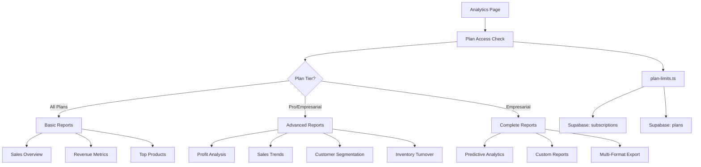

# Design Document: Advanced Analytics Reports

## Overview

This design implements a tiered analytics and reporting system for a SaaS ERP platform. The system provides three levels of reporting capabilities (Basic, Advanced, and Complete) that are gated by subscription plan (Trial, Básico, Pro, and Empresarial). The design follows the existing plan-limits pattern and integrates seamlessly with the current analytics infrastructure.

The implementation focuses on:
- Server-side access control functions following the existing `plan-limits.ts` pattern
- Progressive UI rendering that shows/hides report sections based on plan tier
- Efficient data computation using database aggregation
- Reusable chart components from the existing analytics page
- Mobile-responsive design consistent with the current UI

## Architecture

### High-Level Architecture



### Component Structure

```
app/dashboard/analytics/
  └── page.tsx (Enhanced with tiered sections)

lib/
  ├── utils/
  │   └── plan-limits.ts (Add new access functions)
  └── actions/
      └── analytics.ts (Add advanced analytics functions)

components/dashboard/
  ├── analytics/
  │   ├── basic-reports.tsx (Existing, refactored)
  │   ├── advanced-reports.tsx (New)
  │   ├── complete-reports.tsx (New)
  │   └── upgrade-prompt.tsx (New)
  └── charts/ (Reuse existing chart components)
```

## Components and Interfaces

### 1. Plan Access Control Functions

**Location:** `lib/utils/plan-limits.ts`

These functions follow the existing pattern established for `canAccessPurchaseOrders` and `canAccessSuppliers`.

```typescript
/**
 * Verifica si el plan tiene acceso a reportes avanzados
 */
export async function canAccessAdvancedReports(companyId: string): Promise<{
  allowed: boolean;
  message?: string;
}> {
  const limits = await getCurrentPlanLimits(companyId);
  
  // Pro and Empresarial plans have access
  const allowedPlans = ["Pro", "Empresarial"];
  const hasAccess = allowedPlans.includes(limits.planName);
  
  return {
    allowed: hasAccess,
    message: hasAccess 
      ? undefined 
      : "Los reportes avanzados están disponibles en el plan Pro o superior. Actualiza tu plan para acceder a esta funcionalidad.",
  };
}

/**
 * Verifica si el plan tiene acceso a reportes completos
 */
export async function canAccessCompleteReports(companyId: string): Promise<{
  allowed: boolean;
  message?: string;
}> {
  const limits = await getCurrentPlanLimits(companyId);
  
  // Only Empresarial plan has access
  const hasAccess = limits.planName === "Empresarial";
  
  return {
    allowed: hasAccess,
    message: hasAccess 
      ? undefined 
      : "Los reportes completos están disponibles en el plan Empresarial. Actualiza tu plan para acceder a esta funcionalidad.",
  };
}
```

### 2. Advanced Analytics Data Functions

**Location:** `lib/actions/analytics.ts`

These functions compute advanced analytics data for Pro and Empresarial users.

```typescript
/**
 * Calcula márgenes de ganancia por producto
 */
export async function getProfitMarginsByProduct(
  dateRange?: { start: Date; end: Date }
) {
  // Query sale_items with product cost data
  // Calculate: (revenue - cost) / revenue * 100
  // Group by product_id
  // Return sorted by profit margin descending
}

/**
 * Calcula márgenes de ganancia por categoría
 */
export async function getProfitMarginsByCategory(
  dateRange?: { start: Date; end: Date }
) {
  // Query sale_items joined with products and categories
  // Calculate aggregate profit margins per category
  // Return sorted by profit margin descending
}

/**
 * Calcula tendencias de ventas con comparaciones
 */
export async function getSalesTrends(
  period: 'month' | 'year'
) {
  // Query sales data for current and previous period
  // Calculate growth percentages
  // Return time series data with comparisons
}

/**
 * Segmenta clientes por comportamiento de compra
 */
export async function getCustomerSegmentation() {
  // Query customer purchase history
  // Segment by: frequency, recency, monetary value (RFM)
  // Return customer segments with counts and metrics
}

/**
 * Calcula rotación de inventario
 */
export async function getInventoryTurnover(
  dateRange?: { start: Date; end: Date }
) {
  // Query products with sales and stock data
  // Calculate: units sold / average inventory
  // Return products sorted by turnover rate
}

/**
 * Calcula métricas de rendimiento de proveedores
 * Solo disponible si el plan tiene acceso a proveedores
 */
export async function getSupplierPerformance(
  dateRange?: { start: Date; end: Date }
) {
  // Check supplier access first
  // Query purchase orders and supplier data
  // Calculate: on-time delivery rate, average lead time, quality metrics
  // Return suppliers sorted by performance score
}

/**
 * Genera analíticas de órdenes de compra
 * Solo disponible si el plan tiene acceso a órdenes de compra
 */
export async function getPurchaseOrderAnalytics(
  dateRange?: { start: Date; end: Date }
) {
  // Check purchase order access first
  // Query purchase orders with status and payment data
  // Calculate: total spend, average order value, fulfillment rate
  // Return aggregated metrics and trends
}
```

### 3. Complete Analytics Data Functions

**Location:** `lib/actions/analytics.ts`

These functions provide advanced business intelligence for Empresarial users.

```typescript
/**
 * Genera pronóstico de ventas basado en datos históricos
 */
export async function getSalesForecast(
  forecastDays: number = 30
) {
  // Query at least 90 days of historical sales data
  // Apply simple moving average or linear regression
  // Generate forecast for next N days
  // Return forecast data with confidence intervals
}

/**
 * Calcula métricas de analítica predictiva
 */
export async function getPredictiveAnalytics() {
  // Analyze historical patterns
  // Identify: trending products, at-risk customers, seasonal patterns
  // Return insights and recommendations
}

/**
 * Genera reportes consolidados multi-empresa
 * Solo para usuarios con acceso a múltiples empresas
 */
export async function getMultiCompanyReport(
  companyIds: string[]
) {
  // Validate user has access to all specified companies
  // Query aggregated data across companies
  // Return consolidated metrics and comparisons
}

/**
 * Ejecuta consulta de reporte personalizado
 */
export async function executeCustomReport(
  reportConfig: CustomReportConfig
) {
  // Validate report configuration
  // Build dynamic query based on user-defined parameters
  // Execute query with proper filtering and aggregation
  // Return formatted results
}

/**
 * Exporta datos de reporte en formato especificado
 */
export async function exportReport(
  reportData: any[],
  format: 'pdf' | 'excel' | 'csv',
  reportName: string
) {
  // Check export access
  // Format data according to export type
  // Generate file with proper headers and metadata
  // Return file buffer or download URL
}
```

### 4. UI Components

#### UpgradePrompt Component

**Location:** `components/dashboard/analytics/upgrade-prompt.tsx`

```typescript
interface UpgradePromptProps {
  currentPlan: string;
  requiredPlan: string;
  featureName: string;
  message: string;
}

export function UpgradePrompt({
  currentPlan,
  requiredPlan,
  featureName,
  message
}: UpgradePromptProps) {
  // Render overlay with:
  // - Lock icon
  // - Feature name
  // - Current plan badge
  // - Required plan badge
  // - Message
  // - "Actualizar Plan" button
  // - Mobile responsive layout
}
```

#### AdvancedReports Component

**Location:** `components/dashboard/analytics/advanced-reports.tsx`

```typescript
export function AdvancedReports() {
  // Render tabs for:
  // - Profit Margins (by product and category)
  // - Sales Trends (MoM and YoY)
  // - Customer Segmentation
  // - Inventory Turnover
  // - Supplier Performance (if available)
  // - Purchase Order Analytics (if available)
  
  // Use existing chart components (LineChart, BarChart, PieChart)
  // Implement loading states with skeletons
  // Handle errors with toast notifications
}
```

#### CompleteReports Component

**Location:** `components/dashboard/analytics/complete-reports.tsx`

```typescript
export function CompleteReports() {
  // Render sections for:
  // - Predictive Analytics dashboard
  // - Sales Forecast chart
  // - Custom Report Builder interface
  // - Multi-Company Consolidated view
  // - Advanced Filters (date range, categories, products)
  // - Export buttons (PDF, Excel, CSV)
  
  // Use existing chart components
  // Implement advanced filtering UI
  // Handle export operations with progress indicators
}
```

### 5. Enhanced Analytics Page

**Location:** `app/dashboard/analytics/page.tsx`

The existing analytics page will be enhanced to conditionally render report sections based on plan access.

```typescript
export default function AnalyticsPage() {
  const [hasAdvancedAccess, setHasAdvancedAccess] = useState(false);
  const [hasCompleteAccess, setHasCompleteAccess] = useState(false);
  const [currentPlan, setCurrentPlan] = useState("");
  
  useEffect(() => {
    // Check plan access on mount
    checkAccess();
  }, []);
  
  async function checkAccess() {
    // Get company ID from user profile
    // Call canAccessAdvancedReports()
    // Call canAccessCompleteReports()
    // Update state
  }
  
  return (
    <div>
      {/* Basic Reports - Always visible */}
      <BasicReports />
      
      {/* Advanced Reports - Conditional */}
      {hasAdvancedAccess ? (
        <AdvancedReports />
      ) : (
        <UpgradePrompt
          currentPlan={currentPlan}
          requiredPlan="Pro"
          featureName="Reportes Avanzados"
          message="..."
        />
      )}
      
      {/* Complete Reports - Conditional */}
      {hasCompleteAccess ? (
        <CompleteReports />
      ) : (
        <UpgradePrompt
          currentPlan={currentPlan}
          requiredPlan="Empresarial"
          featureName="Reportes Completos"
          message="..."
        />
      )}
    </div>
  );
}
```

## Data Models

### CustomReportConfig

```typescript
interface CustomReportConfig {
  name: string;
  description?: string;
  dataSource: 'sales' | 'products' | 'customers' | 'inventory' | 'suppliers' | 'purchase_orders';
  metrics: string[]; // e.g., ['total', 'quantity', 'average']
  dimensions: string[]; // e.g., ['date', 'category', 'customer']
  filters: ReportFilter[];
  dateRange?: {
    start: Date;
    end: Date;
  };
  groupBy?: string;
  sortBy?: {
    field: string;
    direction: 'asc' | 'desc';
  };
}

interface ReportFilter {
  field: string;
  operator: 'equals' | 'contains' | 'greater_than' | 'less_than' | 'between';
  value: any;
}
```

### ProfitMarginData

```typescript
interface ProfitMarginData {
  id: string;
  name: string;
  revenue: number;
  cost: number;
  profit: number;
  profitMargin: number; // percentage
  quantity: number;
}
```

### SalesTrendData

```typescript
interface SalesTrendData {
  period: string; // e.g., "2024-01" or "2024"
  currentValue: number;
  previousValue: number;
  growthPercentage: number;
  growthDirection: 'up' | 'down' | 'flat';
}
```

### CustomerSegment

```typescript
interface CustomerSegment {
  segmentName: string; // e.g., "High Value", "At Risk", "New"
  customerCount: number;
  totalRevenue: number;
  averageOrderValue: number;
  purchaseFrequency: number;
  lastPurchaseDays: number; // average days since last purchase
}
```

### InventoryTurnoverData

```typescript
interface InventoryTurnoverData {
  productId: string;
  productName: string;
  category: string;
  unitsSold: number;
  averageInventory: number;
  turnoverRate: number; // units sold / average inventory
  daysToSell: number; // 365 / turnover rate
  status: 'fast' | 'normal' | 'slow';
}
```

### SupplierPerformanceData

```typescript
interface SupplierPerformanceData {
  supplierId: string;
  supplierName: string;
  totalOrders: number;
  onTimeDeliveryRate: number; // percentage
  averageLeadTimeDays: number;
  totalSpend: number;
  qualityScore: number; // 0-100
  performanceScore: number; // composite score
}
```

### ForecastData

```typescript
interface ForecastData {
  date: string;
  forecastedValue: number;
  confidenceLower: number;
  confidenceUpper: number;
  historicalValue?: number; // for comparison
}
```

### ExportMetadata

```typescript
interface ExportMetadata {
  reportName: string;
  companyName: string;
  generatedAt: Date;
  generatedBy: string;
  dateRange?: {
    start: Date;
    end: Date;
  };
  filters?: Record<string, any>;
}
```


## Correctness Properties

*A property is a characteristic or behavior that should hold true across all valid executions of a system—essentially, a formal statement about what the system should do. Properties serve as the bridge between human-readable specifications and machine-verifiable correctness guarantees.*

### Property Reflection

After analyzing all acceptance criteria, I identified the following redundancies:
- Properties 1.1-1.4 (displaying individual basic report components) can be combined into a single property about basic reports being universally accessible
- Properties 2.4-2.12 (individual advanced report components) can be combined into a single property about advanced reports content
- Properties 3.4-3.13 (individual complete report components) can be combined into a single property about complete reports content
- Properties 4.1 and 4.2 can be combined into one property about canAccessAdvancedReports correctness
- Properties 4.3 and 4.4 can be combined into one property about canAccessCompleteReports correctness
- Properties 5.2-5.4 can be combined into one property about upgrade prompt content
- Properties 6.1-6.8 should remain separate as each tests a distinct calculation function

### Properties

**Property 1: Basic Reports Universal Access**

*For any* user regardless of Plan_Tier, accessing the analytics page should display all Basic_Reports components (sales overview, revenue metrics, top products, and basic statistics) without requiring plan validation.

**Validates: Requirements 1.1, 1.2, 1.3, 1.4, 1.5**

---

**Property 2: Advanced Reports Access Control**

*For any* user with Pro or Empresarial plan, accessing the analytics page should display the Advanced_Reports section, and *for any* user with Trial or Básico plan, the Advanced_Reports section should be hidden and replaced with an Upgrade_Prompt.

**Validates: Requirements 2.1, 2.2, 2.3**

---

**Property 3: Advanced Reports Content Completeness**

*For any* user with access to Advanced_Reports, the rendered section should include all specified report types: profit margin analysis (by product and category), sales trends (MoM and YoY), customer segmentation, customer behavior analysis, and inventory turnover reports. Additionally, if the user's plan includes supplier access, supplier performance metrics should be included, and if the plan includes purchase order access, purchase order analytics should be included.

**Validates: Requirements 2.4, 2.5, 2.6, 2.7, 2.8, 2.9, 2.10, 2.11, 2.12**

---

**Property 4: Complete Reports Access Control**

*For any* user with Empresarial plan, accessing the analytics page should display the Complete_Reports section, and *for any* user with Trial, Básico, or Pro plan, the Complete_Reports section should be hidden and replaced with an Upgrade_Prompt.

**Validates: Requirements 3.1, 3.2, 3.3**

---

**Property 5: Complete Reports Content Completeness**

*For any* user with access to Complete_Reports, the rendered section should include all specified features: predictive analytics, sales forecasting, multi-company consolidated reports, custom report builder, advanced date range selection, advanced filtering options, scheduled report generation, and export capabilities in PDF, Excel, and CSV formats.

**Validates: Requirements 3.4, 3.5, 3.6, 3.7, 3.8, 3.9, 3.10, 3.11, 3.12, 3.13**

---

**Property 6: canAccessAdvancedReports Function Correctness**

*For any* company with Pro or Empresarial plan, calling canAccessAdvancedReports should return `{allowed: true}`, and *for any* company with Trial or Básico plan, it should return `{allowed: false, message: <descriptive error>}`.

**Validates: Requirements 4.1, 4.2, 4.7**

---

**Property 7: canAccessCompleteReports Function Correctness**

*For any* company with Empresarial plan, calling canAccessCompleteReports should return `{allowed: true}`, and *for any* company with Trial, Básico, or Pro plan, it should return `{allowed: false, message: <descriptive error>}`.

**Validates: Requirements 4.3, 4.4, 4.7**

---

**Property 8: Upgrade Prompt Content Completeness**

*For any* locked Report_Section, the displayed Upgrade_Prompt should contain the required Plan_Tier for access, the user's current Plan_Tier, and a call-to-action button for upgrading.

**Validates: Requirements 5.1, 5.2, 5.3, 5.4**

---

**Property 9: Unlocked Sections Render Without Restrictions**

*For any* Report_Section that the user has access to based on their Plan_Tier, the section should render without Upgrade_Prompt overlays or access restrictions.

**Validates: Requirements 5.5**

---

**Property 10: Profit Margin Calculation Correctness**

*For any* product with sales data, the calculated profit margin should equal `((revenue - cost) / revenue) * 100`, where revenue is the sum of all sale totals for that product and cost is the sum of `(quantity_sold * product_cost)`.

**Validates: Requirements 6.1, 6.2**

---

**Property 11: Sales Trends Calculation Correctness**

*For any* time period (month or year), the calculated growth percentage should equal `((current_value - previous_value) / previous_value) * 100`, where current_value and previous_value are the aggregated sales for the respective periods.

**Validates: Requirements 6.3, 6.4**

---

**Property 12: Customer Segmentation Correctness**

*For any* customer, their segment assignment should be based on RFM analysis (Recency, Frequency, Monetary value), where customers are grouped by their purchase patterns, and each segment should have a count of customers and aggregated metrics.

**Validates: Requirements 6.5, 6.6**

---

**Property 13: Inventory Turnover Calculation Correctness**

*For any* product with inventory tracking enabled, the turnover rate should equal `units_sold / average_inventory`, where units_sold is the total quantity sold in the period and average_inventory is the mean stock quantity during that period.

**Validates: Requirements 6.7**

---

**Property 14: Supplier Performance Calculation Correctness**

*For any* supplier with purchase orders, the on-time delivery rate should equal `(on_time_orders / total_orders) * 100`, and the average lead time should equal the mean of `(received_date - order_date)` across all completed orders.

**Validates: Requirements 6.8**

---

**Property 15: Company Data Isolation**

*For any* analytics function, the returned data should only include records where the company_id matches the requesting user's company, ensuring no data leakage between companies.

**Validates: Requirements 6.9, 7.9**

---

**Property 16: Sales Forecast Data Requirement**

*For any* forecast generation request, the system should query at least 90 days of historical sales data before computing the forecast, and if insufficient data exists, should return an error indicating the minimum data requirement.

**Validates: Requirements 7.8**

---

**Property 17: Export Metadata Completeness**

*For any* report export operation, the generated file should include metadata containing the report name, company name, generation date, and if applicable, the date range and filters used.

**Validates: Requirements 7.10**

---

**Property 18: Plan-Based Data Fetching**

*For any* analytics page load, the system should only fetch data for report sections that the user's Plan_Tier grants access to, avoiding unnecessary database queries for locked features.

**Validates: Requirements 8.1**

---

## Error Handling

### Access Denied Errors

When a user attempts to access a feature not included in their plan:
1. The UI should display an Upgrade_Prompt instead of an error toast
2. The prompt should clearly indicate the required plan tier
3. The prompt should provide a clear path to upgrade (button linking to billing/plans page)

### Data Computation Errors

When analytics functions encounter errors:
1. Log the full error details to the server console for debugging
2. Return a user-friendly error message (not exposing sensitive details)
3. Display a toast notification with the error message
4. Render an empty state in the affected report section

### Missing Data Handling

When insufficient data exists for a report:
1. Display an empty state message explaining the situation
2. Provide guidance on what data is needed (e.g., "Need at least 90 days of sales data")
3. Do not crash or throw errors

### Export Failures

When export operations fail:
1. Display a specific error toast indicating the failure reason
2. Log the error details server-side
3. Allow the user to retry the operation
4. If the failure is due to plan restrictions, show the Upgrade_Prompt

### Database Query Timeouts

When analytics queries exceed 10 seconds:
1. Cancel the query to prevent resource exhaustion
2. Return a timeout error with a user-friendly message
3. Suggest the user narrow their date range or filters
4. Log the timeout for performance monitoring

## Testing Strategy

### Dual Testing Approach

This feature requires both unit tests and property-based tests to ensure comprehensive coverage:

**Unit Tests** will focus on:
- Specific examples of plan access checks (e.g., "Pro plan can access advanced reports")
- Edge cases like missing subscriptions, invalid company IDs
- Error conditions and error message formatting
- UI component rendering with specific props
- Integration between components

**Property-Based Tests** will focus on:
- Universal properties that hold across all plan tiers
- Calculation correctness across random input data
- Data isolation across random company IDs
- Access control correctness across all plan combinations

### Property-Based Testing Configuration

We will use **fast-check** (for TypeScript/JavaScript) as the property-based testing library. Each property test will:
- Run a minimum of 100 iterations to ensure thorough coverage
- Generate random test data (companies, plans, sales data, etc.)
- Verify the property holds for all generated inputs
- Tag each test with a comment referencing the design property

**Tag Format:**
```typescript
// Feature: advanced-analytics-reports, Property 1: Basic Reports Universal Access
```

### Test Organization

```
__tests__/
  ├── unit/
  │   ├── plan-limits.test.ts (Unit tests for access functions)
  │   ├── analytics-functions.test.ts (Unit tests for calculations)
  │   └── components.test.tsx (Unit tests for UI components)
  └── property/
      ├── access-control.property.test.ts (Properties 1-9, 18)
      ├── calculations.property.test.ts (Properties 10-14)
      └── data-isolation.property.test.ts (Properties 15-17)
```

### Key Test Scenarios

**Access Control Tests:**
- Verify each plan tier sees the correct report sections
- Verify upgrade prompts appear for locked features
- Verify access functions return correct values for all plan combinations

**Calculation Tests:**
- Verify profit margin calculations with various revenue/cost combinations
- Verify sales trend calculations with different time periods
- Verify customer segmentation with various purchase patterns
- Verify inventory turnover with different stock levels and sales volumes

**Data Isolation Tests:**
- Verify analytics functions only return data for the requesting company
- Verify multi-company reports only include authorized companies
- Verify no data leakage between companies

**UI Tests:**
- Verify report sections render correctly based on plan access
- Verify upgrade prompts display correct information
- Verify charts render with proper data
- Verify mobile responsiveness

**Error Handling Tests:**
- Verify graceful handling of missing data
- Verify proper error messages for access denied
- Verify timeout handling for long queries
- Verify export failure handling
