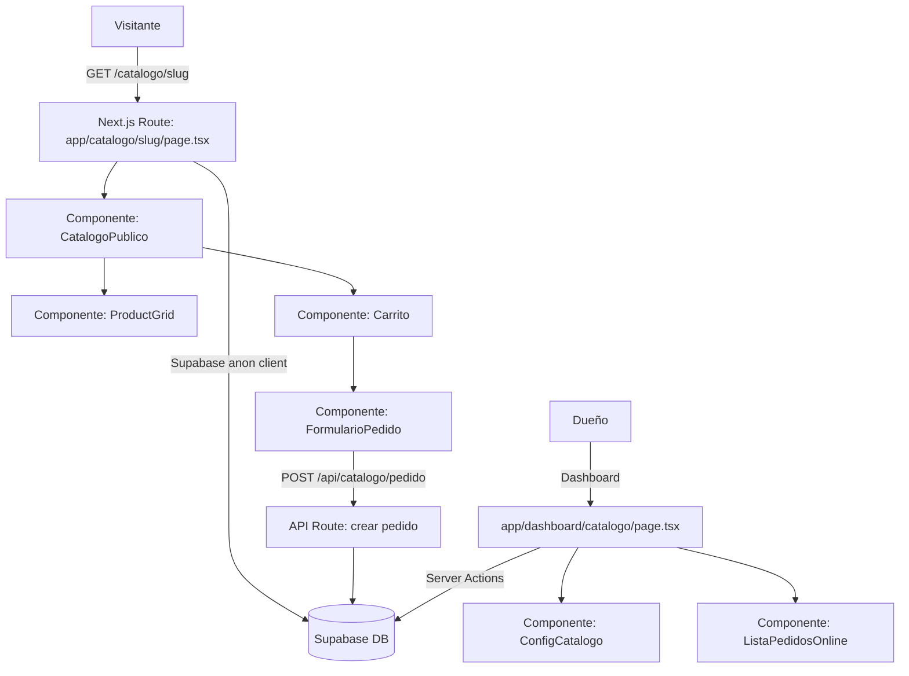
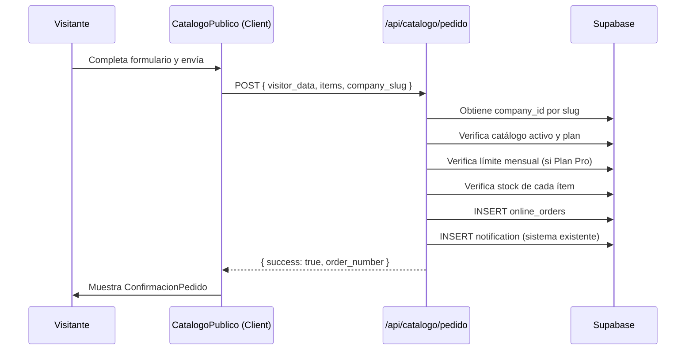

# Documento de Diseño: Catálogo Online / Link de Ventas

## Visión General

El Catálogo Online expone una página pública por empresa en la ruta `app.dominio.com/catalogo/[slug]`. Es una ruta de Next.js fuera del layout del dashboard, accesible sin autenticación. Usa Supabase con un cliente anónimo (o service role para lectura pública) y RLS configurado para permitir lectura de datos publicados.

El flujo tiene dos lados:
- **Lado público**: visitante navega, arma carrito (estado local/sessionStorage), completa formulario y envía pedido.
- **Lado dashboard**: dueño activa/desactiva catálogo, publica productos, ve y gestiona pedidos online.

---

## Arquitectura



### Decisiones de arquitectura

- La página pública `/catalogo/[slug]` es un **Server Component** de Next.js que hace el fetch inicial de productos y configuración de la empresa. El carrito y el formulario son **Client Components**.
- El carrito se mantiene en estado React local (no persistido en servidor) para evitar complejidad de sesiones anónimas.
- La creación del pedido se hace via **API Route** (`POST /api/catalogo/pedido`) para poder usar el service role de Supabase sin exponer la clave al cliente.
- La configuración del catálogo (activar/desactivar, publicar productos, personalización) usa **Server Actions** desde el dashboard.
- Las restricciones de plan se verifican tanto en el servidor (API Route) como en el cliente (UI condicional).

---

## Componentes e Interfaces

### Rutas nuevas

| Ruta | Tipo | Descripción |
|------|------|-------------|
| `app/catalogo/[slug]/page.tsx` | Server Component | Página pública del catálogo |
| `app/catalogo/[slug]/not-found.tsx` | Componente | Página 404 del catálogo |
| `app/dashboard/catalogo/page.tsx` | Server Component | Panel de gestión del catálogo |
| `app/api/catalogo/pedido/route.ts` | API Route | Endpoint para crear pedidos online |

### Componentes nuevos

| Componente | Ubicación | Descripción |
|-----------|-----------|-------------|
| `CatalogoPublico` | `components/catalogo/catalogo-publico.tsx` | Contenedor principal del catálogo público |
| `ProductoCard` | `components/catalogo/producto-card.tsx` | Tarjeta de producto en el catálogo |
| `VarianteSelectorCatalogo` | `components/catalogo/variante-selector.tsx` | Selector de variantes en el catálogo |
| `CarritoDrawer` | `components/catalogo/carrito-drawer.tsx` | Panel lateral del carrito |
| `FormularioPedido` | `components/catalogo/formulario-pedido.tsx` | Formulario de datos del visitante |
| `ConfirmacionPedido` | `components/catalogo/confirmacion-pedido.tsx` | Pantalla de confirmación post-pedido |
| `ConfigCatalogo` | `components/dashboard/catalogo/config-catalogo.tsx` | Configuración del catálogo en dashboard |
| `ProductosPublicadosTable` | `components/dashboard/catalogo/productos-publicados-table.tsx` | Tabla para publicar/despublicar productos |
| `PedidosOnlineTable` | `components/dashboard/catalogo/pedidos-online-table.tsx` | Lista de pedidos online recibidos |
| `DetallePedidoOnline` | `components/dashboard/catalogo/detalle-pedido-online.tsx` | Modal de detalle de un pedido online |

### Server Actions nuevas

| Función | Archivo | Descripción |
|---------|---------|-------------|
| `toggleCatalogo` | `lib/actions/catalogo.ts` | Activa/desactiva el catálogo de la empresa |
| `toggleProductoPublicado` | `lib/actions/catalogo.ts` | Publica/despublica un producto |
| `getCatalogoConfig` | `lib/actions/catalogo.ts` | Obtiene configuración del catálogo |
| `getPedidosOnline` | `lib/actions/catalogo.ts` | Lista pedidos online del dashboard |
| `confirmarPedidoOnline` | `lib/actions/catalogo.ts` | Confirma un pedido online |
| `rechazarPedidoOnline` | `lib/actions/catalogo.ts` | Rechaza un pedido online |
| `guardarPersonalizacion` | `lib/actions/catalogo.ts` | Guarda color y logo (Plan Empresarial) |
| `getCatalogoPublico` | `lib/actions/catalogo-publico.ts` | Obtiene datos públicos del catálogo (sin auth) |

---

## Modelos de Datos

### Tabla: `catalog_settings` (nueva)

Almacena la configuración del catálogo por empresa.

```sql
CREATE TABLE catalog_settings (
  id            uuid PRIMARY KEY DEFAULT gen_random_uuid(),
  company_id    uuid NOT NULL REFERENCES companies(id) ON DELETE CASCADE,
  is_active     boolean NOT NULL DEFAULT false,
  primary_color varchar(7) DEFAULT '#3B82F6',  -- hex color
  logo_url      text,
  created_at    timestamptz DEFAULT now(),
  updated_at    timestamptz DEFAULT now(),
  UNIQUE(company_id)
);
```

### Tabla: `online_orders` (nueva)

Almacena los pedidos recibidos desde el catálogo público.

```sql
CREATE TABLE online_orders (
  id              uuid PRIMARY KEY DEFAULT gen_random_uuid(),
  company_id      uuid NOT NULL REFERENCES companies(id) ON DELETE CASCADE,
  order_number    text NOT NULL,           -- ej: "PO-0001"
  status          text NOT NULL DEFAULT 'pendiente'
                  CHECK (status IN ('pendiente', 'confirmado', 'rechazado')),
  visitor_name    text NOT NULL,
  visitor_phone   text NOT NULL,
  visitor_address text,
  visitor_notes   text,
  items           jsonb NOT NULL,          -- snapshot de ítems al momento del pedido
  subtotal        numeric(12,2) NOT NULL,
  total           numeric(12,2) NOT NULL,
  currency        text NOT NULL DEFAULT 'ARS',
  confirmed_at    timestamptz,
  rejected_at     timestamptz,
  created_at      timestamptz DEFAULT now(),
  updated_at      timestamptz DEFAULT now()
);

CREATE INDEX idx_online_orders_company_id ON online_orders(company_id);
CREATE INDEX idx_online_orders_status ON online_orders(status);
CREATE INDEX idx_online_orders_created_at ON online_orders(created_at DESC);
```

### Campo nuevo en tabla `products`

```sql
ALTER TABLE products ADD COLUMN IF NOT EXISTS published boolean NOT NULL DEFAULT false;
CREATE INDEX idx_products_published ON products(company_id, published) WHERE published = true;
```

### Estructura del campo `items` (JSONB)

```typescript
interface OnlineOrderItem {
  product_id: string;
  product_name: string;
  variant_id: string | null;
  variant_name: string | null;
  quantity: number;
  unit_price: number;
  subtotal: number;
}
```

### Tipos TypeScript nuevos

```typescript
// lib/types/catalogo.ts

export interface CatalogSettings {
  id: string;
  company_id: string;
  is_active: boolean;
  primary_color: string;
  logo_url: string | null;
  created_at: string;
  updated_at: string;
}

export interface OnlineOrder {
  id: string;
  company_id: string;
  order_number: string;
  status: 'pendiente' | 'confirmado' | 'rechazado';
  visitor_name: string;
  visitor_phone: string;
  visitor_address: string | null;
  visitor_notes: string | null;
  items: OnlineOrderItem[];
  subtotal: number;
  total: number;
  currency: string;
  confirmed_at: string | null;
  rejected_at: string | null;
  created_at: string;
  updated_at: string;
}

export interface OnlineOrderItem {
  product_id: string;
  product_name: string;
  variant_id: string | null;
  variant_name: string | null;
  quantity: number;
  unit_price: number;
  subtotal: number;
}

export interface CartItem {
  product_id: string;
  product_name: string;
  product_image: string | null;
  variant_id: string | null;
  variant_name: string | null;
  unit_price: number;
  quantity: number;
  max_stock: number;
}

export interface CatalogoPublicoData {
  company: {
    id: string;
    name: string;
    slug: string;
    logo_url: string | null;
  };
  settings: CatalogSettings;
  products: CatalogoProduct[];
  plan_tier: 'basico' | 'profesional' | 'empresarial';
  orders_this_month: number; // para verificar límite Pro
}

export interface CatalogoProduct {
  id: string;
  name: string;
  description: string | null;
  price: number;
  currency: string;
  image_url: string | null;
  stock_quantity: number;
  has_variants: boolean;
  variants: CatalogoVariant[];
}

export interface CatalogoVariant {
  id: string;
  variant_name: string;
  price: number | null;
  stock_quantity: number;
}

export type PlanTier = 'basico' | 'profesional' | 'empresarial';
```

---

## Lógica de Restricciones por Plan

La función `getPlanTier` mapea el nombre del plan a un tier:

```typescript
function getPlanTier(planName: string): PlanTier {
  const name = planName.toLowerCase();
  if (name.includes('empresarial')) return 'empresarial';
  if (name.includes('profesional')) return 'profesional';
  return 'basico';
}
```

| Funcionalidad | Básico | Profesional | Empresarial |
|--------------|--------|-------------|-------------|
| Ver catálogo | ✅ | ✅ | ✅ |
| Carrito + pedidos | ❌ | ✅ (50/mes) | ✅ (ilimitado) |
| Personalización | ❌ | ❌ | ✅ |

El límite de 50 pedidos/mes del Plan Profesional se verifica en la API Route contando los pedidos del mes calendario en curso:

```sql
SELECT COUNT(*) FROM online_orders
WHERE company_id = $1
  AND created_at >= date_trunc('month', now())
  AND created_at < date_trunc('month', now()) + interval '1 month'
  AND status != 'rechazado';
```

---

## Flujo de Creación de Pedido



---

## Seguridad y RLS

### Políticas RLS para `catalog_settings`

```sql
-- Solo el dueño puede leer/escribir su configuración
CREATE POLICY "catalog_settings_company_access" ON catalog_settings
  FOR ALL USING (
    company_id IN (
      SELECT company_id FROM profiles WHERE id = auth.uid()
    )
  );

-- Lectura pública para el catálogo (anon)
CREATE POLICY "catalog_settings_public_read" ON catalog_settings
  FOR SELECT USING (is_active = true);
```

### Políticas RLS para `online_orders`

```sql
-- El dueño puede leer/actualizar sus pedidos
CREATE POLICY "online_orders_company_access" ON online_orders
  FOR ALL USING (
    company_id IN (
      SELECT company_id FROM profiles WHERE id = auth.uid()
    )
  );

-- Inserción pública (anon puede crear pedidos)
CREATE POLICY "online_orders_public_insert" ON online_orders
  FOR INSERT WITH CHECK (true);
```

### Campo `published` en `products`

```sql
-- Lectura pública de productos publicados
CREATE POLICY "products_public_read" ON products
  FOR SELECT USING (published = true AND is_active = true);
```

La API Route `/api/catalogo/pedido` usa el **service role** de Supabase para poder leer datos de empresa y escribir pedidos sin depender de RLS anon.

---

## Manejo de Errores

| Situación | Respuesta |
|-----------|-----------|
| Slug no existe | HTTP 404, página `not-found.tsx` |
| Catálogo inactivo | HTTP 404, página `not-found.tsx` |
| Suscripción vencida | HTTP 404, página `not-found.tsx` |
| Plan Básico intenta pedir | HTTP 403, mensaje en UI |
| Límite Pro alcanzado | HTTP 429, mensaje en UI |
| Stock insuficiente al confirmar | HTTP 409, mensaje con detalle |
| Campos obligatorios vacíos | Validación client-side + server-side |
| Error de base de datos | HTTP 500, mensaje genérico |

---

## Propiedades de Corrección

*Una propiedad es una característica o comportamiento que debe cumplirse en todas las ejecuciones válidas del sistema. Las propiedades sirven como puente entre las especificaciones legibles por humanos y las garantías de corrección verificables automáticamente.*

### Propiedades de corrección

**Propiedad 1: Solo productos publicados aparecen en el catálogo**
*Para todo* slug de empresa con catálogo activo, todos los productos retornados por `getCatalogoPublico` deben tener `published = true` e `is_active = true`.
**Valida: Requisito 2.1**

**Propiedad 2: El carrito respeta el stock disponible**
*Para todo* ítem en el Carrito, la cantidad del ítem debe ser menor o igual al stock disponible del producto o variante correspondiente.
**Valida: Requisito 3.6**

**Propiedad 3: El total del carrito es consistente**
*Para todo* Carrito con N ítems, el total general debe ser igual a la suma de (cantidad × precio_unitario) de cada ítem.
**Valida: Requisito 3.4**

**Propiedad 4: El snapshot de ítems en el pedido es consistente**
*Para todo* Pedido_Online creado, la suma de los subtotales de los ítems en el campo `items` (JSONB) debe ser igual al campo `total` del pedido.
**Valida: Requisito 4.3**

**Propiedad 5: El límite mensual del Plan Profesional se respeta**
*Para toda* empresa con Plan_Profesional, el conteo de pedidos no rechazados en el mes calendario en curso debe ser menor o igual a 50 antes de permitir crear un nuevo pedido.
**Valida: Requisito 4.7, 6.2**

**Propiedad 6: El catálogo inactivo no expone datos**
*Para toda* empresa con catálogo inactivo (`is_active = false`), la ruta pública debe retornar HTTP 404 y no exponer ningún producto ni dato de la empresa.
**Valida: Requisito 1.3, 2.6**

**Propiedad 7: Agregar el mismo ítem incrementa cantidad, no duplica**
*Para todo* Carrito y producto/variante ya presente en él, agregar ese mismo producto/variante debe resultar en un único ítem con cantidad incrementada, no en dos ítems separados.
**Valida: Requisito 3.2**

---

## Estrategia de Testing

### Testing dual: unitario + basado en propiedades

**Tests unitarios** (`__tests__/lib/actions/catalogo.unit.test.ts`):
- Validación del formulario de pedido (campos obligatorios)
- Mapeo de nombre de plan a tier (`getPlanTier`)
- Cálculo de número de pedido secuencial
- Casos borde: carrito vacío, stock = 0, slug inexistente

**Tests de propiedades** (`__tests__/lib/actions/catalogo.property.test.ts`):
- Librería: **fast-check** (ya usada en el proyecto)
- Mínimo 100 iteraciones por propiedad
- Cada test referencia la propiedad del diseño con el tag:
  `Feature: catalogo-online, Property N: <texto>`

**Cobertura por propiedad**:

| Propiedad | Tipo de test | Descripción del generador |
|-----------|-------------|--------------------------|
| P1: Solo publicados | property | Generar lista mixta de productos, verificar filtro |
| P2: Carrito respeta stock | property | Generar ítems con stock aleatorio, verificar límite |
| P3: Total del carrito | property | Generar ítems con precios/cantidades aleatorias, verificar suma |
| P4: Snapshot consistente | property | Generar pedidos con ítems aleatorios, verificar total |
| P5: Límite mensual Pro | property | Generar conteos entre 0-60, verificar bloqueo en ≥50 |
| P6: Catálogo inactivo | example | Verificar 404 con catálogo inactivo |
| P7: Agregar mismo ítem | property | Generar carrito con ítems repetidos, verificar deduplicación |
