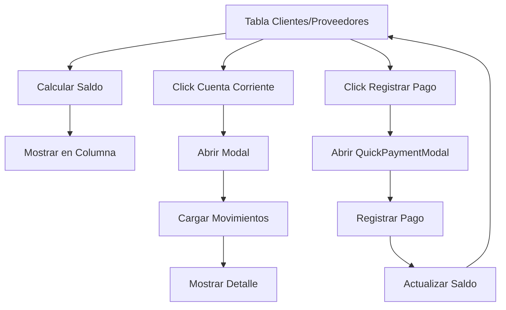

# Design Document

## Overview

Este diseño implementa la funcionalidad de cuenta corriente con detalle individual para Clientes y Proveedores en el sistema ERP. La solución agrega tres elementos principales a las tablas existentes:

1. **Columna "Saldo"**: Muestra el saldo actual calculado en tiempo real
2. **Botón "Cuenta corriente"**: Abre un modal con el detalle de movimientos
3. **Botón "Registrar pago"**: Abre el modal de pago rápido existente

La implementación reutiliza la lógica existente en `lib/actions/accounts-settlement.ts` y el componente `quick-payment-modal.tsx` para mantener consistencia y evitar duplicación de código.

## Architecture

### Component Structure

```
app/dashboard/customers/page.tsx (modificado)
├── CustomerAccountModal (nuevo)
│   └── AccountMovementsList (nuevo)
└── QuickPaymentModal (existente, reutilizado)

app/dashboard/suppliers/page.tsx (modificado)
├── SupplierAccountModal (nuevo)
│   └── AccountMovementsList (nuevo)
└── QuickPaymentModal (existente, adaptado)

lib/actions/
├── accounts-settlement.ts (existente, reutilizado)
├── customers.ts (modificado)
└── suppliers.ts (modificado)
```

### Data Flow



## Components and Interfaces

### 1. Nuevas Funciones en `lib/actions/customers.ts`

```typescript
// Obtener saldo de un cliente
export async function getCustomerBalance(customerId: string): Promise<number> {
  // Obtener ventas del cliente
  const sales = await getSalesByCustomer(customerId);
  
  // Calcular saldo usando lógica existente
  const totalPending = sales
    .filter(s => s.payment_status === 'pending' || s.payment_status === 'partial')
    .reduce((sum, sale) => {
      const balance = calculateBalance(sale.total, sale.payments || []);
      return sum + balance;
    }, 0);
  
  return totalPending;
}

// Obtener movimientos de cuenta corriente de un cliente
export async function getCustomerAccountMovements(customerId: string): Promise<AccountMovement[]> {
  // Obtener ventas con pagos
  const sales = await getSalesByCustomer(customerId);
  
  // Transformar a movimientos
  const movements: AccountMovement[] = [];
  
  for (const sale of sales) {
    // Agregar movimiento de venta
    movements.push({
      id: sale.id,
      type: 'sale',
      date: new Date(sale.sale_date),
      reference: sale.sale_number,
      description: 'Venta',
      debit: sale.total,
      credit: 0,
      balance: calculateBalance(sale.total, sale.payments || []),
    });
    
    // Agregar movimientos de pagos
    for (const payment of sale.payments || []) {
      movements.push({
        id: payment.id,
        type: 'payment',
        date: new Date(payment.payment_date),
        reference: payment.reference_number || '-',
        description: `Pago - ${payment.payment_method}`,
        debit: 0,
        credit: payment.amount,
        balance: 0, // Se calculará después
      });
    }
  }
  
  // Ordenar por fecha descendente
  movements.sort((a, b) => b.date.getTime() - a.date.getTime());
  
  // Calcular balance acumulado
  let runningBalance = 0;
  for (let i = movements.length - 1; i >= 0; i--) {
    runningBalance += movements[i].debit - movements[i].credit;
    movements[i].balance = runningBalance;
  }
  
  return movements;
}

// Tipo para movimientos de cuenta
export interface AccountMovement {
  id: string;
  type: 'sale' | 'payment';
  date: Date;
  reference: string;
  description: string;
  debit: number;
  credit: number;
  balance: number;
}
```

### 2. Nuevas Funciones en `lib/actions/suppliers.ts`

```typescript
// Obtener saldo de un proveedor
export async function getSupplierBalance(supplierId: string): Promise<number> {
  // Obtener órdenes de compra del proveedor
  const orders = await getPurchaseOrdersBySupplier(supplierId);
  
  // Calcular saldo usando lógica existente
  const totalPending = orders
    .filter(o => o.payment_status === 'pending' || o.payment_status === 'partial')
    .reduce((sum, order) => {
      const balance = calculateBalance(order.total, order.payments || []);
      return sum + balance;
    }, 0);
  
  return totalPending;
}

// Obtener movimientos de cuenta corriente de un proveedor
export async function getSupplierAccountMovements(supplierId: string): Promise<AccountMovement[]> {
  // Obtener órdenes de compra con pagos
  const orders = await getPurchaseOrdersBySupplier(supplierId);
  
  // Transformar a movimientos
  const movements: AccountMovement[] = [];
  
  for (const order of orders) {
    // Agregar movimiento de compra
    movements.push({
      id: order.id,
      type: 'purchase',
      date: new Date(order.order_date),
      reference: order.order_number,
      description: 'Compra',
      debit: order.total,
      credit: 0,
      balance: calculateBalance(order.total, order.payments || []),
    });
    
    // Agregar movimientos de pagos
    for (const payment of order.payments || []) {
      movements.push({
        id: payment.id,
        type: 'payment',
        date: new Date(payment.payment_date),
        reference: payment.reference_number || '-',
        description: `Pago - ${payment.payment_method}`,
        debit: 0,
        credit: payment.amount,
        balance: 0, // Se calculará después
      });
    }
  }
  
  // Ordenar por fecha descendente
  movements.sort((a, b) => b.date.getTime() - a.date.getTime());
  
  // Calcular balance acumulado
  let runningBalance = 0;
  for (let i = movements.length - 1; i >= 0; i--) {
    runningBalance += movements[i].debit - movements[i].credit;
    movements[i].balance = runningBalance;
  }
  
  return movements;
}

// Tipo para movimientos de cuenta
export interface AccountMovement {
  id: string;
  type: 'purchase' | 'payment';
  date: Date;
  reference: string;
  description: string;
  debit: number;
  credit: number;
  balance: number;
}
```

### 3. Componente `CustomerAccountModal`

```typescript
// components/dashboard/customer-account-modal.tsx
"use client";

import { useState, useEffect } from "react";
import { getCustomerAccountMovements, getCustomerBalance } from "@/lib/actions/customers";
import type { AccountMovement } from "@/lib/actions/customers";
import {
  Dialog,
  DialogContent,
  DialogDescription,
  DialogHeader,
  DialogTitle,
} from "@/components/ui/dialog";
import {
  Table,
  TableBody,
  TableCell,
  TableHead,
  TableHeader,
  TableRow,
} from "@/components/ui/table";
import { Badge } from "@/components/ui/badge";
import { Loader2 } from "lucide-react";

interface CustomerAccountModalProps {
  customerId: string;
  customerName: string;
  open: boolean;
  onOpenChange: (open: boolean) => void;
}

export function CustomerAccountModal({
  customerId,
  customerName,
  open,
  onOpenChange,
}: CustomerAccountModalProps) {
  const [movements, setMovements] = useState<AccountMovement[]>([]);
  const [balance, setBalance] = useState(0);
  const [loading, setLoading] = useState(true);

  useEffect(() => {
    if (open) {
      loadData();
    }
  }, [open, customerId]);

  const loadData = async () => {
    setLoading(true);
    const [movementsData, balanceData] = await Promise.all([
      getCustomerAccountMovements(customerId),
      getCustomerBalance(customerId),
    ]);
    setMovements(movementsData);
    setBalance(balanceData);
    setLoading(false);
  };

  return (
    <Dialog open={open} onOpenChange={onOpenChange}>
      <DialogContent className="max-w-4xl max-h-[80vh] overflow-y-auto">
        <DialogHeader>
          <DialogTitle>Cuenta Corriente - {customerName}</DialogTitle>
          <DialogDescription>
            Detalle de movimientos y saldo actual
          </DialogDescription>
        </DialogHeader>

        {/* Saldo destacado */}
        <div className="rounded-lg border p-4 bg-muted/50">
          <div className="flex justify-between items-center">
            <span className="text-sm text-muted-foreground">Saldo Actual:</span>
            <span className={`text-2xl font-bold ${balance > 0 ? 'text-green-600' : balance < 0 ? 'text-red-600' : ''}`}>
              ${balance.toFixed(2)}
            </span>
          </div>
        </div>

        {/* Tabla de movimientos */}
        {loading ? (
          <div className="flex justify-center py-8">
            <Loader2 className="h-8 w-8 animate-spin text-muted-foreground" />
          </div>
        ) : movements.length === 0 ? (
          <div className="text-center py-8 text-muted-foreground">
            No hay movimientos registrados
          </div>
        ) : (
          <div className="overflow-x-auto">
            <Table>
              <TableHeader>
                <TableRow>
                  <TableHead>Fecha</TableHead>
                  <TableHead>Referencia</TableHead>
                  <TableHead>Descripción</TableHead>
                  <TableHead className="text-right">Debe</TableHead>
                  <TableHead className="text-right">Haber</TableHead>
                  <TableHead className="text-right">Saldo</TableHead>
                </TableRow>
              </TableHeader>
              <TableBody>
                {movements.map((movement) => (
                  <TableRow key={`${movement.type}-${movement.id}`}>
                    <TableCell>
                      {movement.date.toLocaleDateString('es-AR')}
                    </TableCell>
                    <TableCell>{movement.reference}</TableCell>
                    <TableCell>
                      <Badge variant={movement.type === 'sale' ? 'default' : 'secondary'}>
                        {movement.description}
                      </Badge>
                    </TableCell>
                    <TableCell className="text-right">
                      {movement.debit > 0 ? `$${movement.debit.toFixed(2)}` : '-'}
                    </TableCell>
                    <TableCell className="text-right">
                      {movement.credit > 0 ? `$${movement.credit.toFixed(2)}` : '-'}
                    </TableCell>
                    <TableCell className="text-right font-medium">
                      ${movement.balance.toFixed(2)}
                    </TableCell>
                  </TableRow>
                ))}
              </TableBody>
            </Table>
          </div>
        )}
      </DialogContent>
    </Dialog>
  );
}
```

### 4. Componente `SupplierAccountModal`

```typescript
// components/dashboard/supplier-account-modal.tsx
"use client";

import { useState, useEffect } from "react";
import { getSupplierAccountMovements, getSupplierBalance } from "@/lib/actions/suppliers";
import type { AccountMovement } from "@/lib/actions/suppliers";
import {
  Dialog,
  DialogContent,
  DialogDescription,
  DialogHeader,
  DialogTitle,
} from "@/components/ui/dialog";
import {
  Table,
  TableBody,
  TableCell,
  TableHead,
  TableHeader,
  TableRow,
} from "@/components/ui/table";
import { Badge } from "@/components/ui/badge";
import { Loader2 } from "lucide-react";

interface SupplierAccountModalProps {
  supplierId: string;
  supplierName: string;
  open: boolean;
  onOpenChange: (open: boolean) => void;
}

export function SupplierAccountModal({
  supplierId,
  supplierName,
  open,
  onOpenChange,
}: SupplierAccountModalProps) {
  const [movements, setMovements] = useState<AccountMovement[]>([]);
  const [balance, setBalance] = useState(0);
  const [loading, setLoading] = useState(true);

  useEffect(() => {
    if (open) {
      loadData();
    }
  }, [open, supplierId]);

  const loadData = async () => {
    setLoading(true);
    const [movementsData, balanceData] = await Promise.all([
      getSupplierAccountMovements(supplierId),
      getSupplierBalance(supplierId),
    ]);
    setMovements(movementsData);
    setBalance(balanceData);
    setLoading(false);
  };

  return (
    <Dialog open={open} onOpenChange={onOpenChange}>
      <DialogContent className="max-w-4xl max-h-[80vh] overflow-y-auto">
        <DialogHeader>
          <DialogTitle>Cuenta Corriente - {supplierName}</DialogTitle>
          <DialogDescription>
            Detalle de movimientos y saldo actual
          </DialogDescription>
        </DialogHeader>

        {/* Saldo destacado */}
        <div className="rounded-lg border p-4 bg-muted/50">
          <div className="flex justify-between items-center">
            <span className="text-sm text-muted-foreground">Saldo Actual:</span>
            <span className={`text-2xl font-bold ${balance > 0 ? 'text-red-600' : balance < 0 ? 'text-green-600' : ''}`}>
              ${balance.toFixed(2)}
            </span>
          </div>
          {balance > 0 && (
            <p className="text-xs text-muted-foreground mt-2">
              Monto pendiente de pago al proveedor
            </p>
          )}
        </div>

        {/* Tabla de movimientos */}
        {loading ? (
          <div className="flex justify-center py-8">
            <Loader2 className="h-8 w-8 animate-spin text-muted-foreground" />
          </div>
        ) : movements.length === 0 ? (
          <div className="text-center py-8 text-muted-foreground">
            No hay movimientos registrados
          </div>
        ) : (
          <div className="overflow-x-auto">
            <Table>
              <TableHeader>
                <TableRow>
                  <TableHead>Fecha</TableHead>
                  <TableHead>Referencia</TableHead>
                  <TableHead>Descripción</TableHead>
                  <TableHead className="text-right">Debe</TableHead>
                  <TableHead className="text-right">Haber</TableHead>
                  <TableHead className="text-right">Saldo</TableHead>
                </TableRow>
              </TableHeader>
              <TableBody>
                {movements.map((movement) => (
                  <TableRow key={`${movement.type}-${movement.id}`}>
                    <TableCell>
                      {movement.date.toLocaleDateString('es-AR')}
                    </TableCell>
                    <TableCell>{movement.reference}</TableCell>
                    <TableCell>
                      <Badge variant={movement.type === 'purchase' ? 'default' : 'secondary'}>
                        {movement.description}
                      </Badge>
                    </TableCell>
                    <TableCell className="text-right">
                      {movement.debit > 0 ? `$${movement.debit.toFixed(2)}` : '-'}
                    </TableCell>
                    <TableCell className="text-right">
                      {movement.credit > 0 ? `$${movement.credit.toFixed(2)}` : '-'}
                    </TableCell>
                    <TableCell className="text-right font-medium">
                      ${movement.balance.toFixed(2)}
                    </TableCell>
                  </TableRow>
                ))}
              </TableBody>
            </Table>
          </div>
        )}
      </DialogContent>
    </Dialog>
  );
}
```

### 5. Modificaciones en `app/dashboard/customers/page.tsx`

Agregar:
- Columna "Saldo" en la tabla/grid de clientes
- Botón "Cuenta corriente" para cada cliente
- Botón "Registrar pago" para cada cliente
- Estado para controlar los modales

```typescript
// Agregar imports
import { CustomerAccountModal } from "@/components/dashboard/customer-account-modal";
import { QuickPaymentModal } from "@/components/dashboard/quick-payment-modal";
import { getCustomerBalance } from "@/lib/actions/customers";
import { DollarSign, FileText, CreditCard } from "lucide-react";

// Agregar estados
const [customerBalances, setCustomerBalances] = useState<Record<string, number>>({});
const [selectedCustomerForAccount, setSelectedCustomerForAccount] = useState<Customer | null>(null);
const [selectedCustomerForPayment, setSelectedCustomerForPayment] = useState<Customer | null>(null);
const [accountModalOpen, setAccountModalOpen] = useState(false);
const [paymentModalOpen, setPaymentModalOpen] = useState(false);

// Cargar saldos al cargar clientes
useEffect(() => {
  if (customers.length > 0) {
    loadCustomerBalances();
  }
}, [customers]);

const loadCustomerBalances = async () => {
  const balances: Record<string, number> = {};
  await Promise.all(
    customers.map(async (customer) => {
      const balance = await getCustomerBalance(customer.id);
      balances[customer.id] = balance;
    })
  );
  setCustomerBalances(balances);
};

// Handlers para modales
const handleOpenAccountModal = (customer: Customer) => {
  setSelectedCustomerForAccount(customer);
  setAccountModalOpen(true);
};

const handleOpenPaymentModal = (customer: Customer) => {
  setSelectedCustomerForPayment(customer);
  setPaymentModalOpen(true);
};

const handlePaymentSuccess = () => {
  setPaymentModalOpen(false);
  loadCustomers(); // Recargar para actualizar saldos
};

// Modificar el Card de cada cliente para incluir:
// 1. Mostrar saldo
// 2. Botones de acción
```

### 6. Modificaciones en `app/dashboard/suppliers/page.tsx`

Agregar:
- Columna "Saldo" en la tabla de proveedores
- Botón "Cuenta corriente" para cada proveedor
- Botón "Registrar pago" para cada proveedor
- Estado para controlar los modales

```typescript
// Agregar imports
import { SupplierAccountModal } from "@/components/dashboard/supplier-account-modal";
import { QuickPaymentModal } from "@/components/dashboard/quick-payment-modal";
import { getSupplierBalance } from "@/lib/actions/suppliers";
import { DollarSign, FileText, CreditCard } from "lucide-react";

// Agregar estados
const [supplierBalances, setSupplierBalances] = useState<Record<string, number>>({});
const [selectedSupplierForAccount, setSelectedSupplierForAccount] = useState<Supplier | null>(null);
const [selectedSupplierForPayment, setSelectedSupplierForPayment] = useState<Supplier | null>(null);
const [accountModalOpen, setAccountModalOpen] = useState(false);
const [paymentModalOpen, setPaymentModalOpen] = useState(false);

// Cargar saldos al cargar proveedores
useEffect(() => {
  if (suppliers.length > 0) {
    loadSupplierBalances();
  }
}, [suppliers]);

const loadSupplierBalances = async () => {
  const balances: Record<string, number> = {};
  await Promise.all(
    suppliers.map(async (supplier) => {
      const balance = await getSupplierBalance(supplier.id);
      balances[supplier.id] = balance;
    })
  );
  setSupplierBalances(balances);
};

// Handlers para modales
const handleOpenAccountModal = (supplier: Supplier) => {
  setSelectedSupplierForAccount(supplier);
  setAccountModalOpen(true);
};

const handleOpenPaymentModal = (supplier: Supplier) => {
  setSelectedSupplierForPayment(supplier);
  setPaymentModalOpen(true);
};

const handlePaymentSuccess = () => {
  setPaymentModalOpen(false);
  loadSuppliers(); // Recargar para actualizar saldos
};

// Agregar columna "Saldo" en TableHead y TableCell
// Agregar botones de acción en cada fila
```

## Data Models

### AccountMovement Interface

```typescript
export interface AccountMovement {
  id: string;
  type: 'sale' | 'purchase' | 'payment';
  date: Date;
  reference: string;
  description: string;
  debit: number;
  credit: number;
  balance: number;
}
```

Este tipo representa un movimiento individual en la cuenta corriente. Los campos son:

- `id`: Identificador único del movimiento
- `type`: Tipo de movimiento (venta, compra o pago)
- `date`: Fecha del movimiento
- `reference`: Número de referencia (número de venta, orden o pago)
- `description`: Descripción legible del movimiento
- `debit`: Monto en el debe (ventas/compras)
- `credit`: Monto en el haber (pagos)
- `balance`: Saldo acumulado después del movimiento

### Extensión de Customer y Supplier

No se requieren cambios en las tablas de base de datos. Los saldos se calculan en tiempo real a partir de las ventas/compras y pagos existentes.

## Correctness Properties

*Una propiedad es una característica o comportamiento que debe mantenerse verdadero en todas las ejecuciones válidas de un sistema - esencialmente, una declaración formal sobre lo que el sistema debe hacer. Las propiedades sirven como puente entre las especificaciones legibles por humanos y las garantías de correctness verificables por máquinas.*

### Property Reflection

Después de analizar los criterios de aceptación, identifiqué las siguientes redundancias:

- **Propiedades 1.1 y 2.1** (cálculo y muestra de saldo): Ambas verifican lo mismo pero para diferentes entidades. Se pueden combinar en una propiedad genérica sobre cálculo de saldos.
- **Propiedades 1.2, 1.4, 2.2, 2.4, 9.1, 9.4** (formato monetario): Todas verifican aspectos del formato monetario. Se pueden consolidar en una propiedad sobre formato consistente.
- **Propiedades 3.3, 3.4, 4.3, 4.4** (contenido del modal): Verifican que el modal muestra información correcta. Se pueden combinar en una propiedad sobre integridad de datos del modal.
- **Propiedades 3.5 y 4.5** (ordenamiento): Ambas verifican ordenamiento descendente por fecha. Se pueden combinar en una propiedad genérica.
- **Propiedades 5.1, 5.2, 5.3** (formato de movimientos): Todas verifican que los movimientos contienen los campos requeridos. Se pueden combinar en una propiedad sobre completitud de datos.
- **Propiedades 6.5 y 7.5** (actualización de saldo): Ambas verifican que el saldo se actualiza después de un pago. Se pueden combinar en una propiedad sobre actualización de estado.

### Correctness Properties

Property 1: Cálculo correcto de saldo
*Para cualquier* cliente o proveedor con transacciones y pagos, el saldo calculado debe ser igual a la suma de transacciones pendientes menos la suma de pagos realizados.
**Validates: Requirements 1.5, 2.5**

Property 2: Formato monetario consistente
*Para cualquier* valor monetario mostrado en el sistema, debe incluir separador de miles, dos decimales, símbolo de moneda de la empresa, y signo negativo cuando corresponda.
**Validates: Requirements 1.2, 1.4, 2.2, 2.4, 9.1, 9.4, 9.5**

Property 3: Movimientos ordenados cronológicamente
*Para cualquier* lista de movimientos de cuenta corriente, todos los movimientos deben estar ordenados por fecha en orden descendente (más reciente primero).
**Validates: Requirements 3.5, 4.5**

Property 4: Completitud de datos en movimientos
*Para cualquier* movimiento mostrado en la cuenta corriente, debe contener todos los campos requeridos según su tipo (fecha, referencia, descripción, montos).
**Validates: Requirements 5.1, 5.2, 5.3**

Property 5: Saldo acumulado correcto
*Para cualquier* secuencia de movimientos, el saldo acumulado después de cada movimiento debe ser igual al saldo anterior más el débito menos el crédito del movimiento actual.
**Validates: Requirements 5.5**

Property 6: Actualización de saldo después de pago
*Para cualquier* cliente o proveedor, cuando se registra un nuevo pago, el saldo mostrado debe actualizarse para reflejar el pago realizado.
**Validates: Requirements 6.5, 7.5**

Property 7: Integridad de datos en modal
*Para cualquier* cliente o proveedor, cuando se abre el modal de cuenta corriente, debe mostrar el nombre correcto de la entidad y su saldo actual calculado.
**Validates: Requirements 3.3, 3.4, 4.3, 4.4**

Property 8: Paginación de movimientos extensos
*Para cualquier* cuenta corriente con más de 50 movimientos, el sistema debe implementar paginación para mostrar los movimientos en páginas.
**Validates: Requirements 10.5**


## Error Handling

### 1. Errores de Carga de Datos

**Escenario**: Fallo al cargar saldos o movimientos desde la base de datos.

**Manejo**:
- Mostrar mensaje de error amigable al usuario
- Registrar error en logs para debugging
- Permitir reintentar la operación
- No bloquear la UI completamente (mostrar estado de error parcial)

```typescript
try {
  const balance = await getCustomerBalance(customerId);
  setBalance(balance);
} catch (error) {
  console.error('Error loading customer balance:', error);
  toast.error('Error al cargar el saldo. Por favor, intenta nuevamente.');
  setBalance(0); // Valor por defecto
}
```

### 2. Errores de Cálculo

**Escenario**: Datos inconsistentes que causan errores en cálculos de saldo.

**Manejo**:
- Validar datos antes de realizar cálculos
- Usar valores por defecto seguros (0) cuando faltan datos
- Registrar advertencias sobre datos inconsistentes
- Mostrar indicador visual de datos incompletos

```typescript
export function calculateBalance(total: number, payments: { amount: number }[]): number {
  if (!total || isNaN(total)) {
    console.warn('Invalid total value:', total);
    return 0;
  }
  
  const paid = (payments || []).reduce((sum, p) => {
    const amount = Number(p.amount);
    return sum + (isNaN(amount) ? 0 : amount);
  }, 0);
  
  return total - paid;
}
```

### 3. Errores de Permisos

**Escenario**: Usuario sin permisos para ver cuentas corrientes o registrar pagos.

**Manejo**:
- Verificar permisos antes de mostrar botones
- Mostrar mensaje claro si se intenta acceder sin permisos
- Ocultar funcionalidad no disponible según el plan

```typescript
const canViewAccounts = await checkPermission('view_accounts');
if (!canViewAccounts) {
  return <div>No tienes permisos para ver cuentas corrientes</div>;
}
```

### 4. Errores de Red

**Escenario**: Pérdida de conexión durante operaciones.

**Manejo**:
- Mostrar indicador de carga mientras se espera respuesta
- Timeout razonable (5 segundos) para operaciones
- Mensaje claro sobre problemas de conexión
- Opción de reintentar

```typescript
const loadDataWithTimeout = async () => {
  const timeoutPromise = new Promise((_, reject) => 
    setTimeout(() => reject(new Error('Timeout')), 5000)
  );
  
  try {
    const data = await Promise.race([
      getCustomerAccountMovements(customerId),
      timeoutPromise
    ]);
    setMovements(data);
  } catch (error) {
    if (error.message === 'Timeout') {
      toast.error('La operación está tardando demasiado. Verifica tu conexión.');
    } else {
      toast.error('Error de conexión. Por favor, intenta nuevamente.');
    }
  }
};
```

### 5. Errores de Formato

**Escenario**: Valores monetarios inválidos o formatos incorrectos.

**Manejo**:
- Validar y sanitizar valores antes de mostrar
- Usar funciones de formato consistentes
- Manejar casos especiales (null, undefined, NaN)

```typescript
export function formatCurrency(value: number | null | undefined, currency: string = 'ARS'): string {
  if (value === null || value === undefined || isNaN(value)) {
    return `$0.00 ${currency}`;
  }
  
  return `$${value.toFixed(2).replace(/\B(?=(\d{3})+(?!\d))/g, ',')} ${currency}`;
}
```

## Testing Strategy

### Dual Testing Approach

La estrategia de testing combina pruebas unitarias y pruebas basadas en propiedades para lograr cobertura completa:

- **Unit tests**: Verifican ejemplos específicos, casos edge y condiciones de error
- **Property tests**: Verifican propiedades universales a través de muchos inputs generados

Ambos tipos de pruebas son complementarios y necesarios para garantizar la correctness del sistema.

### Unit Testing

**Objetivo**: Verificar comportamientos específicos y casos edge.

**Herramientas**: Jest + React Testing Library

**Casos a testear**:

1. **Cálculo de saldo con datos específicos**
   - Cliente sin ventas → saldo = 0
   - Cliente con 1 venta sin pagos → saldo = total venta
   - Cliente con 1 venta y pago parcial → saldo = total - pago
   - Cliente con 1 venta y pago completo → saldo = 0
   - Cliente con pago adelantado → saldo negativo

2. **Formato de valores monetarios**
   - Valor 0 → "$0.00"
   - Valor 1000 → "$1,000.00"
   - Valor negativo -500 → "-$500.00"
   - Valor con muchos decimales 123.456789 → "$123.46"

3. **Ordenamiento de movimientos**
   - Lista vacía → []
   - Lista con 1 movimiento → [movimiento]
   - Lista con movimientos desordenados → lista ordenada por fecha desc

4. **Renderizado de componentes**
   - Modal se abre correctamente
   - Modal muestra nombre del cliente/proveedor
   - Modal muestra saldo
   - Botones están presentes en la tabla

5. **Manejo de errores**
   - Error al cargar saldos → muestra mensaje de error
   - Datos inválidos → usa valores por defecto
   - Sin permisos → oculta funcionalidad

**Ejemplo de unit test**:

```typescript
describe('getCustomerBalance', () => {
  it('should return 0 for customer with no sales', async () => {
    const balance = await getCustomerBalance('customer-without-sales');
    expect(balance).toBe(0);
  });

  it('should calculate balance correctly with partial payment', async () => {
    // Setup: customer with 1 sale of $1000 and payment of $300
    const balance = await getCustomerBalance('customer-with-partial-payment');
    expect(balance).toBe(700);
  });

  it('should return negative balance for advance payment', async () => {
    // Setup: customer with payment of $500 but no sales
    const balance = await getCustomerBalance('customer-with-advance');
    expect(balance).toBe(-500);
  });
});
```

### Property-Based Testing

**Objetivo**: Verificar propiedades universales con inputs generados aleatoriamente.

**Herramientas**: fast-check (biblioteca de PBT para TypeScript)

**Configuración**: Mínimo 100 iteraciones por propiedad

**Propiedades a testear**:

1. **Property 1: Cálculo correcto de saldo**
   ```typescript
   // Feature: cuenta-corriente-detalle-individual, Property 1: Cálculo correcto de saldo
   it('should calculate balance correctly for any transactions and payments', () => {
     fc.assert(
       fc.property(
         fc.array(fc.record({ total: fc.float(), payments: fc.array(fc.record({ amount: fc.float() })) })),
         (transactions) => {
           for (const transaction of transactions) {
             const calculatedBalance = calculateBalance(transaction.total, transaction.payments);
             const expectedBalance = transaction.total - transaction.payments.reduce((sum, p) => sum + p.amount, 0);
             expect(calculatedBalance).toBeCloseTo(expectedBalance, 2);
           }
         }
       ),
       { numRuns: 100 }
     );
   });
   ```

2. **Property 2: Formato monetario consistente**
   ```typescript
   // Feature: cuenta-corriente-detalle-individual, Property 2: Formato monetario consistente
   it('should format any monetary value consistently', () => {
     fc.assert(
       fc.property(
         fc.float({ min: -1000000, max: 1000000 }),
         (value) => {
           const formatted = formatCurrency(value);
           // Verificar que tiene símbolo de moneda
           expect(formatted).toMatch(/\$/);
           // Verificar que tiene dos decimales
           expect(formatted).toMatch(/\.\d{2}/);
           // Verificar signo negativo si corresponde
           if (value < 0) {
             expect(formatted).toMatch(/-/);
           }
         }
       ),
       { numRuns: 100 }
     );
   });
   ```

3. **Property 3: Movimientos ordenados cronológicamente**
   ```typescript
   // Feature: cuenta-corriente-detalle-individual, Property 3: Movimientos ordenados cronológicamente
   it('should order any list of movements by date descending', () => {
     fc.assert(
       fc.property(
         fc.array(fc.record({ date: fc.date(), id: fc.string() })),
         (movements) => {
           const sorted = sortMovementsByDate(movements);
           for (let i = 0; i < sorted.length - 1; i++) {
             expect(sorted[i].date.getTime()).toBeGreaterThanOrEqual(sorted[i + 1].date.getTime());
           }
         }
       ),
       { numRuns: 100 }
     );
   });
   ```

4. **Property 5: Saldo acumulado correcto**
   ```typescript
   // Feature: cuenta-corriente-detalle-individual, Property 5: Saldo acumulado correcto
   it('should calculate running balance correctly for any sequence of movements', () => {
     fc.assert(
       fc.property(
         fc.array(fc.record({ debit: fc.float({ min: 0 }), credit: fc.float({ min: 0 }) })),
         (movements) => {
           let expectedBalance = 0;
           const movementsWithBalance = calculateRunningBalance(movements);
           
           for (let i = 0; i < movementsWithBalance.length; i++) {
             expectedBalance += movementsWithBalance[i].debit - movementsWithBalance[i].credit;
             expect(movementsWithBalance[i].balance).toBeCloseTo(expectedBalance, 2);
           }
         }
       ),
       { numRuns: 100 }
     );
   });
   ```

### Integration Testing

**Objetivo**: Verificar la integración entre componentes y el flujo completo.

**Casos a testear**:

1. **Flujo completo de visualización de cuenta corriente**
   - Cargar tabla de clientes
   - Click en botón "Cuenta corriente"
   - Modal se abre con datos correctos
   - Movimientos se muestran ordenados

2. **Flujo completo de registro de pago**
   - Cargar tabla de clientes
   - Click en botón "Registrar pago"
   - Modal de pago se abre
   - Registrar pago
   - Saldo se actualiza en la tabla

3. **Integración con sistema de cuentas existente**
   - Verificar que se usan las funciones de `accounts-settlement.ts`
   - Verificar que los cálculos son consistentes con el módulo de liquidación

### Test Coverage Goals

- **Unit tests**: 80% de cobertura de código
- **Property tests**: 100% de las propiedades de correctness
- **Integration tests**: Flujos críticos de usuario

### Continuous Testing

- Ejecutar tests en cada commit (CI/CD)
- Ejecutar property tests con más iteraciones (1000+) en builds nocturnos
- Monitorear performance de tests para detectar regresiones
