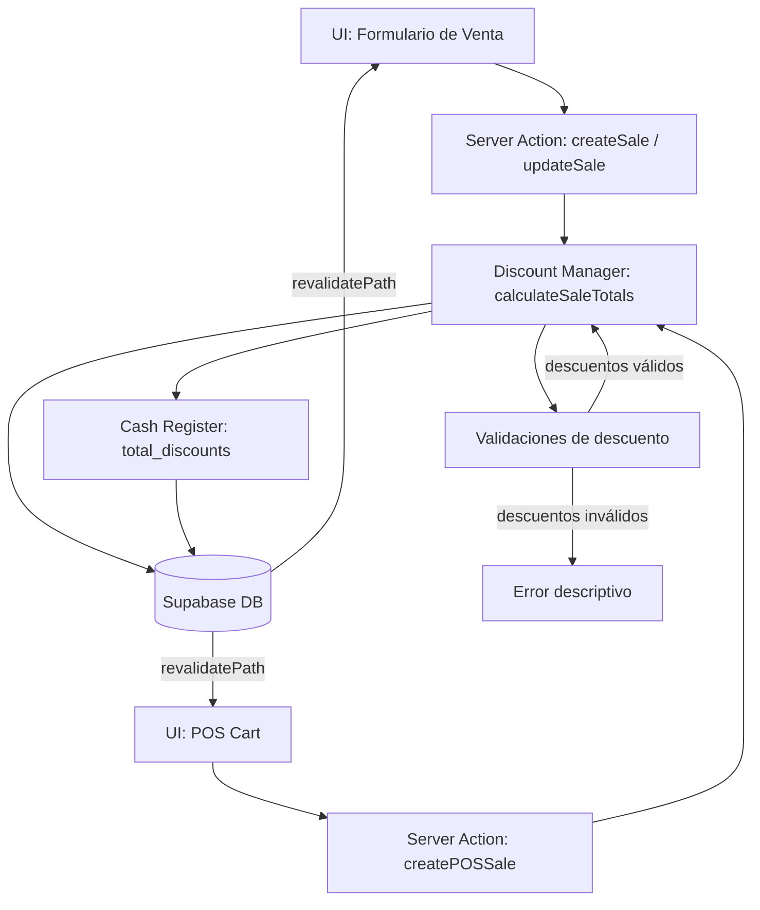

# Diseño: Descuentos en Ventas

## Visión General

El módulo de Descuentos en Ventas extiende el sistema de ventas existente para soportar dos niveles de descuento:

1. **Descuento por ítem**: aplicado a cada `SaleItem` individualmente, expresado como porcentaje o monto fijo.
2. **Descuento global**: aplicado sobre el subtotal de la venta completa (después de descuentos por ítem), expresado como porcentaje o monto fijo.

El flujo de cálculo es:

```
Para cada ítem:
  subtotal_ítem = precio_unitario × cantidad
  descuento_ítem = subtotal_ítem × (discount_percent / 100)   [si es porcentaje]
                 = discount_fixed                              [si es monto fijo]
  subtotal_descontado_ítem = subtotal_ítem − descuento_ítem
  tax_ítem = subtotal_descontado_ítem × (tax_rate / 100)
  total_ítem = subtotal_descontado_ítem + tax_ítem

subtotal_venta = Σ subtotal_descontado_ítem
discount_amount = subtotal_venta × (global_percent / 100)     [si es porcentaje]
                = global_fixed                                 [si es monto fijo]
tax_amount = Σ tax_ítem
total_venta = subtotal_venta − discount_amount + tax_amount
```

El diseño se integra con los módulos existentes: `sales`, `sale_items`, `pos`, `cash_register` y `analytics`. No requiere nuevas tablas — los campos necesarios ya existen en el esquema (`sale_items.discount_percent`, `sales.discount_amount`). Solo se extiende la lógica de cálculo y validación, y se agrega soporte para descuento de tipo `fixed` y descuento global en el POS.

---

## Arquitectura



El módulo sigue el patrón arquitectónico del proyecto: Server Actions de Next.js que interactúan directamente con Supabase. La lógica de cálculo y validación de descuentos se extrae en funciones puras (`lib/utils/discount-calculator.ts`) para facilitar el testing.

---

## Componentes e Interfaces

### Utilidades puras (`lib/utils/discount-calculator.ts`)

```typescript
// Calcula el descuento aplicado a un ítem
calculateItemDiscount(
  unitPrice: number,
  quantity: number,
  discountPercent: number
): number

// Calcula los totales de un ítem con descuento
calculateItemTotals(item: SaleItemFormData): ItemTotals

// Valida el descuento de un ítem
validateItemDiscount(
  unitPrice: number,
  quantity: number,
  discountPercent: number
): { valid: boolean; error?: string }

// Calcula el descuento global sobre el subtotal de la venta
calculateGlobalDiscount(
  subtotal: number,
  discountType: DiscountType,
  discountValue: number
): number

// Valida el descuento global
validateGlobalDiscount(
  subtotal: number,
  discountType: DiscountType,
  discountValue: number
): { valid: boolean; error?: string }

// Calcula todos los totales de la venta
calculateSaleTotals(
  items: SaleItemFormData[],
  globalDiscountType: DiscountType,
  globalDiscountValue: number
): SaleTotals
```

### Server Actions modificadas

**`lib/actions/sales.ts`** — `createSale` y `updateSale`:
- Reciben `global_discount_type` y `global_discount_value` en `SaleFormData`
- Llaman a `calculateSaleTotals` para calcular `subtotal`, `discount_amount`, `tax_amount`, `total`
- Validan descuentos antes de persistir

**`lib/actions/pos.ts`** — `createPOSSale` y `validatePOSCart`:
- `POSSaleRequest` ya incluye `discount_type` y `discount_value` para el descuento global
- Se extiende para soportar `discount_percent` por ítem en `POSCartItem`
- `validatePOSCart` valida que el descuento global no supere el subtotal

### Componentes UI modificados

- `app/dashboard/sales/new/page.tsx` — Agregar campo de descuento global (tipo + valor)
- `components/dashboard/pos/shopping-cart.tsx` — Agregar input de descuento por ítem y descuento global
- `components/dashboard/pos/payment-modal.tsx` — Mostrar desglose con descuentos
- `app/dashboard/sales/[id]/page.tsx` — Mostrar desglose de descuentos en detalle de venta
- `components/dashboard/invoice-print.tsx` — Incluir descuentos en el ticket/factura impresa

---

## Modelos de Datos

No se requieren nuevas tablas. Los campos ya existen en el esquema:

### Campos existentes utilizados

**`sale_items.discount_percent`** (`NUMERIC(5,2)`): porcentaje de descuento por ítem. Ya existe en la estructura actual.

**`sales.discount_amount`** (`NUMERIC(12,2)`): monto absoluto del descuento global. Ya existe en la estructura actual.

### Extensiones de tipos TypeScript (`lib/types/erp.ts`)

```typescript
export type DiscountType = 'percentage' | 'fixed';

// Extensión de SaleFormData
export interface SaleFormData {
  // ... campos existentes ...
  global_discount_type?: DiscountType;   // Nuevo: tipo de descuento global
  global_discount_value?: number;        // Nuevo: valor del descuento global
}

// Extensión de SaleItemFormData
export interface SaleItemFormData {
  // ... campos existentes (discount_percent ya existe) ...
  discount_type?: DiscountType;          // Nuevo: tipo de descuento por ítem
  discount_fixed?: number;               // Nuevo: monto fijo de descuento por ítem
}

// Resultado del cálculo de totales
export interface ItemTotals {
  subtotal: number;        // precio_unitario × cantidad (sin descuento)
  discount_amount: number; // monto de descuento aplicado
  subtotal_net: number;    // subtotal − discount_amount
  tax_amount: number;      // subtotal_net × tax_rate
  total: number;           // subtotal_net + tax_amount
}

export interface SaleTotals {
  subtotal: number;        // Σ subtotal_net de ítems
  discount_amount: number; // descuento global aplicado
  tax_amount: number;      // Σ tax_amount de ítems
  total: number;           // subtotal − discount_amount + tax_amount
}
```

### Extensión de tipos POS (`lib/types/pos.ts`)

```typescript
// Extensión de POSCartItem
export interface POSCartItem {
  // ... campos existentes ...
  discount_percent: number;              // Ya existe — descuento por ítem en %
  discount_type?: DiscountType;          // Nuevo: tipo de descuento por ítem
  discount_fixed?: number;               // Nuevo: monto fijo de descuento por ítem
}

// POSSaleRequest ya incluye discount_type y discount_value para el descuento global
```

### Script SQL de migración

No se requiere migración de esquema. Los campos `discount_percent` en `sale_items` y `discount_amount` en `sales` ya existen. Solo se agrega el campo `total_discounts` al cierre de caja para auditoría:

```sql
-- scripts/231_add_total_discounts_to_closures.sql
ALTER TABLE cash_register_closures
  ADD COLUMN IF NOT EXISTS total_discounts NUMERIC(12,2) NOT NULL DEFAULT 0;
```

---

## Propiedades de Corrección

*Una propiedad es una característica o comportamiento que debe ser verdadero en todas las ejecuciones válidas del sistema — esencialmente, una declaración formal sobre lo que el sistema debe hacer. Las propiedades sirven como puente entre las especificaciones legibles por humanos y las garantías de corrección verificables por máquinas.*

### Propiedad 1: Validación de rango de descuentos

*Para todo* descuento de tipo `percentage`, el valor debe estar en el rango [0, 100] para ser aceptado; cualquier valor fuera de ese rango debe ser rechazado con un error. *Para todo* descuento de tipo `fixed`, el valor debe estar en el rango [0, subtotal_aplicable] para ser aceptado; cualquier valor negativo o que supere el subtotal debe ser rechazado.

**Valida: Requisitos 1.1, 1.2, 1.7, 1.8, 2.1, 2.2, 2.7, 2.8, 6.1, 6.2**

---

### Propiedad 2: Cálculo correcto del subtotal por ítem con descuento

*Para todo* ítem de venta con precio unitario `p`, cantidad `q`, porcentaje de descuento `d` (en [0, 100]), el subtotal neto del ítem debe ser exactamente `p × q × (1 − d/100)`, y el impuesto debe calcularse sobre ese subtotal neto.

**Valida: Requisitos 1.3, 1.4, 1.5, 1.6**

---

### Propiedad 3: Cálculo correcto del total de la venta

*Para toda* venta con un conjunto de ítems y un descuento global, el `total` de la venta debe ser exactamente igual a `(Σ subtotal_neto_ítem) − discount_amount + (Σ tax_amount_ítem)`, donde `discount_amount` se calcula sobre el subtotal de ítems según el tipo de descuento global.

**Valida: Requisitos 2.3, 2.4, 2.5, 4.1, 4.2, 4.3, 4.4**

---

### Propiedad 4: Invariante de total positivo

*Para toda* venta válida (con descuentos dentro de los rangos permitidos), el `total` calculado debe ser estrictamente mayor a cero.

**Valida: Requisitos 2.6, 3.6, 4.7**

---

### Propiedad 5: Persistencia de descuentos (round-trip)

*Para toda* venta creada con descuentos por ítem y/o descuento global, al consultar la venta persistida en la base de datos, los campos `sale_items.discount_percent` y `sales.discount_amount` deben contener exactamente los valores que se enviaron al crear la venta.

**Valida: Requisitos 3.5, 4.5, 4.6**

---

### Propiedad 6: Atomicidad ante descuentos inválidos

*Para toda* venta que contenga al menos un descuento inválido (fuera de rango, negativo, o que resulte en total ≤ 0), el sistema debe rechazar la operación completa y no persistir ningún cambio en la base de datos.

**Valida: Requisitos 6.3**

---

### Propiedad 7: Descuento cero es idempotente

*Para todo* ítem o venta donde el descuento aplicado es 0 (ya sea `percentage = 0` o `fixed = 0`), el subtotal y total calculados deben ser idénticos a los calculados sin descuento.

**Valida: Requisitos 6.4, 6.5**

---

### Propiedad 8: Total de descuentos en cierre de caja

*Para todo* cierre de caja que incluya ventas con descuentos, el campo `total_discounts` del cierre debe ser exactamente igual a la suma de los `discount_amount` de todas las ventas del período cubierto por ese cierre.

**Valida: Requisito 5.5**

---

## Manejo de Errores

| Escenario | Respuesta del sistema |
|---|---|
| Porcentaje de descuento < 0 o > 100 | `{ error: "El porcentaje de descuento debe estar entre 0 y 100" }` |
| Monto fijo de descuento negativo | `{ error: "El monto de descuento no puede ser negativo" }` |
| Descuento fijo por ítem supera el subtotal del ítem | `{ error: "El descuento no puede superar el precio del ítem" }` |
| Descuento global fijo supera el subtotal de la venta | `{ error: "El descuento global no puede superar el subtotal de la venta" }` |
| Total de venta resulta ≤ 0 | `{ error: "El total de la venta debe ser mayor a cero" }` |
| Valor de descuento no numérico | `{ error: "El valor del descuento debe ser un número válido" }` |
| Usuario no autenticado | `{ error: "No autenticado" }` |

Todos los errores de validación se evalúan antes de cualquier operación de base de datos. Los errores se retornan en español al cliente.

---

## Estrategia de Testing

### Testing Unitario

Los tests unitarios cubren casos específicos y condiciones de borde en `lib/utils/discount-calculator.ts`:

- Descuento 0% → precio sin cambios
- Descuento 100% → subtotal neto = 0 (pero total > 0 si hay impuesto... validar que se rechaza)
- Descuento fijo igual al subtotal del ítem → subtotal neto = 0
- Descuento fijo = 0 → precio sin cambios
- Combinación de descuento por ítem + descuento global
- Venta con múltiples ítems con distintos descuentos
- Descuento global porcentaje sobre venta con ítems ya descontados

### Testing Basado en Propiedades (Property-Based Testing)

Se usa **fast-check** (ya instalado en el proyecto) con un mínimo de 100 iteraciones por propiedad.

Cada test de propiedad referencia su propiedad del documento de diseño con el tag:
`Feature: descuentos-ventas, Property N: <texto>`

**Propiedad 1** — Validación de rango: generar porcentajes aleatorios (incluyendo negativos y > 100) y montos fijos (incluyendo negativos y mayores al subtotal), verificar que los válidos son aceptados y los inválidos rechazados.

**Propiedad 2** — Cálculo de subtotal por ítem: generar ítems con precio, cantidad y porcentaje de descuento aleatorios válidos, verificar que `subtotal_neto = precio × cantidad × (1 − d/100)` y que `tax = subtotal_neto × tax_rate`.

**Propiedad 3** — Cálculo de total de venta: generar ventas con múltiples ítems y descuento global aleatorio válido, verificar que `total = subtotal − discount_amount + tax_amount`.

**Propiedad 4** — Total positivo: generar ventas con descuentos válidos (dentro de rango), verificar que `total > 0` siempre.

**Propiedad 5** — Round-trip de persistencia: generar ventas con descuentos aleatorios válidos, crear la venta, consultar la venta persistida, verificar que `discount_percent` por ítem y `discount_amount` global coinciden con los valores enviados.

**Propiedad 6** — Atomicidad: generar ventas con al menos un descuento inválido, verificar que `createSale` retorna error y no persiste ningún cambio.

**Propiedad 7** — Idempotencia de descuento cero: generar ítems y ventas con descuento = 0, verificar que los totales son idénticos a los calculados sin descuento.

**Propiedad 8** — Total de descuentos en cierre: generar conjuntos de ventas con descuentos aleatorios, calcular el cierre de caja, verificar que `total_discounts = Σ discount_amount`.

Los tests de propiedad se ubican en `__tests__/lib/actions/descuentos-ventas.property.test.ts`.
Los tests unitarios se ubican en `__tests__/lib/utils/discount-calculator.unit.test.ts`.
