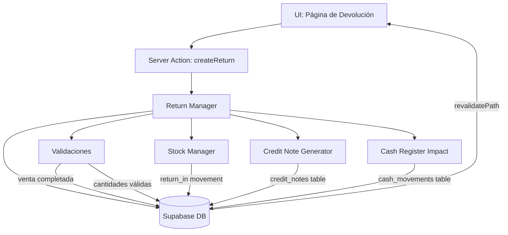

# Diseño: Devoluciones y Cambios de Ventas

## Visión General

El módulo de Devoluciones y Cambios de Ventas permite registrar devoluciones totales o parciales de ventas completadas. El flujo principal es:

1. El empleado selecciona una venta completada y elige los ítems a devolver con sus cantidades.
2. El sistema valida la operación (stock, montos, estado de la venta).
3. Se ejecuta una transacción atómica que: crea el registro de devolución, genera la nota de crédito, repone el stock y registra el impacto en caja.
4. El empleado elige el método de devolución: efectivo, transferencia o crédito al cliente.

El diseño se integra con los módulos existentes: `sales`, `stock_movements`, `sale_payments`, `customers` y `cash_register`.

---

## Arquitectura



El módulo sigue el mismo patrón arquitectónico del proyecto: Server Actions de Next.js que interactúan directamente con Supabase. No hay API REST separada.

---

## Componentes e Interfaces

### Server Actions (`lib/actions/returns.ts`)

```typescript
// Crea una devolución completa (transacción atómica)
createReturn(input: CreateReturnInput): Promise<{ data?: Return; error?: string }>

// Obtiene el listado de devoluciones con filtros
getReturns(filters?: ReturnFilters): Promise<Return[]>

// Obtiene el detalle de una devolución
getReturn(id: string): Promise<ReturnWithDetails | null>

// Obtiene las devoluciones asociadas a una venta
getReturnsBySale(saleId: string): Promise<Return[]>

// Obtiene el crédito disponible de un cliente
getCustomerCredit(customerId: string): Promise<number>
```

### Componentes UI

- `app/dashboard/returns/page.tsx` — Listado de devoluciones con filtros
- `app/dashboard/returns/new/page.tsx` — Formulario de nueva devolución
- `app/dashboard/returns/[id]/page.tsx` — Detalle de una devolución
- `components/dashboard/return-form.tsx` — Formulario reutilizable
- `components/dashboard/return-items-table.tsx` — Tabla de ítems a devolver
- `components/dashboard/return-summary.tsx` — Resumen de montos y método

La página de detalle de venta (`app/dashboard/sales/[id]/page.tsx`) se actualiza para mostrar las devoluciones asociadas y un botón "Registrar Devolución".

---

## Modelos de Datos

### Tabla: `sale_returns`

```sql
CREATE TABLE sale_returns (
  id              UUID PRIMARY KEY DEFAULT gen_random_uuid(),
  company_id      UUID NOT NULL REFERENCES companies(id),
  sale_id         UUID NOT NULL REFERENCES sales(id),
  return_number   TEXT NOT NULL,           -- Ej: DEV-0001
  return_date     TIMESTAMPTZ NOT NULL DEFAULT now(),
  total_amount    NUMERIC(12,2) NOT NULL,
  refund_method   TEXT NOT NULL CHECK (refund_method IN ('cash', 'transfer', 'customer_credit')),
  reason          TEXT NOT NULL CHECK (reason IN ('defective_product','wrong_product','customer_changed_mind','damaged_in_transit','other')),
  reason_notes    TEXT,                    -- Requerido cuando reason = 'other'
  status          TEXT NOT NULL DEFAULT 'completed' CHECK (status IN ('completed', 'cancelled')),
  created_by      UUID REFERENCES auth.users(id),
  created_at      TIMESTAMPTZ NOT NULL DEFAULT now(),
  updated_at      TIMESTAMPTZ NOT NULL DEFAULT now()
);
```

### Tabla: `sale_return_items`

```sql
CREATE TABLE sale_return_items (
  id              UUID PRIMARY KEY DEFAULT gen_random_uuid(),
  return_id       UUID NOT NULL REFERENCES sale_returns(id) ON DELETE CASCADE,
  sale_item_id    UUID NOT NULL REFERENCES sale_items(id),
  product_id      UUID REFERENCES products(id),
  variant_id      UUID REFERENCES product_variants(id),
  product_name    TEXT NOT NULL,
  variant_name    TEXT,
  quantity        INTEGER NOT NULL CHECK (quantity > 0),
  unit_price      NUMERIC(12,2) NOT NULL,
  tax_rate        NUMERIC(5,2) NOT NULL DEFAULT 0,
  discount_percent NUMERIC(5,2) NOT NULL DEFAULT 0,
  subtotal        NUMERIC(12,2) NOT NULL,
  tax_amount      NUMERIC(12,2) NOT NULL,
  total           NUMERIC(12,2) NOT NULL,
  created_at      TIMESTAMPTZ NOT NULL DEFAULT now()
);
```

### Tabla: `credit_notes`

```sql
CREATE TABLE credit_notes (
  id              UUID PRIMARY KEY DEFAULT gen_random_uuid(),
  company_id      UUID NOT NULL REFERENCES companies(id),
  return_id       UUID NOT NULL REFERENCES sale_returns(id),
  sale_id         UUID NOT NULL REFERENCES sales(id),
  customer_id     UUID REFERENCES customers(id),
  note_number     TEXT NOT NULL,           -- Ej: NC-0001
  amount          NUMERIC(12,2) NOT NULL,
  status          TEXT NOT NULL DEFAULT 'pending' CHECK (status IN ('pending', 'applied')),
  applied_at      TIMESTAMPTZ,
  created_at      TIMESTAMPTZ NOT NULL DEFAULT now(),
  updated_at      TIMESTAMPTZ NOT NULL DEFAULT now()
);
```

### Tabla: `customer_credits`

```sql
CREATE TABLE customer_credits (
  id              UUID PRIMARY KEY DEFAULT gen_random_uuid(),
  company_id      UUID NOT NULL REFERENCES companies(id),
  customer_id     UUID NOT NULL REFERENCES customers(id),
  credit_note_id  UUID REFERENCES credit_notes(id),
  amount          NUMERIC(12,2) NOT NULL,  -- Positivo = crédito disponible
  description     TEXT,
  created_at      TIMESTAMPTZ NOT NULL DEFAULT now()
);
```

### Cambios en tablas existentes

**`sales.payment_status`**: Se agrega el valor `'partial_refund'` al CHECK constraint existente.

**`stock_movements.movement_type`**: Ya incluye `'return_in'` y `'return_out'` — no requiere cambios.

**`stock_movements`**: Se agrega columna `return_id UUID REFERENCES sale_returns(id)` para vincular movimientos de stock a devoluciones.

### Tipos TypeScript (`lib/types/erp.ts`)

```typescript
export interface SaleReturn {
  id: string;
  company_id: string;
  sale_id: string;
  return_number: string;
  return_date: string;
  total_amount: number;
  refund_method: 'cash' | 'transfer' | 'customer_credit';
  reason: 'defective_product' | 'wrong_product' | 'customer_changed_mind' | 'damaged_in_transit' | 'other';
  reason_notes: string | null;
  status: 'completed' | 'cancelled';
  created_by: string | null;
  created_at: string;
  updated_at: string;
  sale?: Sale;
  items?: SaleReturnItem[];
  credit_note?: CreditNote;
}

export interface SaleReturnItem {
  id: string;
  return_id: string;
  sale_item_id: string;
  product_id: string | null;
  variant_id: string | null;
  product_name: string;
  variant_name: string | null;
  quantity: number;
  unit_price: number;
  tax_rate: number;
  discount_percent: number;
  subtotal: number;
  tax_amount: number;
  total: number;
  created_at: string;
}

export interface CreditNote {
  id: string;
  company_id: string;
  return_id: string;
  sale_id: string;
  customer_id: string | null;
  note_number: string;
  amount: number;
  status: 'pending' | 'applied';
  applied_at: string | null;
  created_at: string;
  updated_at: string;
}

export interface CreateReturnInput {
  sale_id: string;
  items: CreateReturnItemInput[];
  refund_method: 'cash' | 'transfer' | 'customer_credit';
  reason: 'defective_product' | 'wrong_product' | 'customer_changed_mind' | 'damaged_in_transit' | 'other';
  reason_notes?: string;
}

export interface CreateReturnItemInput {
  sale_item_id: string;
  quantity: number;
}

export interface ReturnFilters {
  saleId?: string;
  dateFrom?: string;
  dateTo?: string;
  reason?: string;
  refundMethod?: string;
}
```

---

## Propiedades de Corrección

*Una propiedad es una característica o comportamiento que debe ser verdadero en todas las ejecuciones válidas del sistema — esencialmente, una declaración formal sobre lo que el sistema debe hacer. Las propiedades sirven como puente entre las especificaciones legibles por humanos y las garantías de corrección verificables por máquinas.*

### Propiedad 1: Conservación del stock tras devolución

*Para todo* producto con seguimiento de inventario, si se registra una devolución de N unidades, el stock del producto después de la devolución debe ser exactamente igual al stock antes de la devolución más N.

**Valida: Requisitos 2.1, 2.2, 2.5**

---

### Propiedad 2: El monto de la nota de crédito iguala la suma de los ítems devueltos

*Para toda* devolución con uno o más ítems, el campo `total_amount` de la devolución y el campo `amount` de la nota de crédito generada deben ser iguales a la suma de los campos `total` de cada `SaleReturnItem`.

**Valida: Requisitos 3.2, 3.3**

---

### Propiedad 3: Las cantidades devueltas nunca superan las vendidas

*Para todo* ítem de venta, la suma de las cantidades devueltas en todas las devoluciones asociadas a ese ítem debe ser menor o igual a la cantidad original vendida.

**Valida: Requisito 1.3, 8.1**

---

### Propiedad 4: Rechazo de devoluciones sobre ventas no completadas

*Para toda* venta con estado distinto de `completed`, cualquier intento de crear una devolución debe retornar un error y no persistir ningún cambio en la base de datos.

**Valida: Requisito 1.6, 8.3**

---

### Propiedad 5: Atomicidad de la transacción de devolución

*Para toda* devolución que falla en cualquier paso (stock, nota de crédito, movimiento de caja), el estado de la base de datos debe ser idéntico al estado previo al intento — ningún cambio parcial debe persistir.

**Valida: Requisito 8.3**

---

### Propiedad 6: El crédito al cliente refleja el monto de la nota de crédito

*Para todo* método de devolución `customer_credit`, el incremento en el saldo de crédito del cliente debe ser exactamente igual al `total_amount` de la devolución.

**Valida: Requisito 4.2**

---

### Propiedad 7: Rechazo de devolución con monto cero o negativo

*Para todo* conjunto de ítems de devolución donde la suma de cantidades × precio unitario sea ≤ 0, el sistema debe rechazar la operación con un error descriptivo.

**Valida: Requisito 8.5**

---

### Propiedad 8: Movimiento de stock vinculado a la devolución

*Para toda* devolución exitosa de un producto con `track_inventory = true`, debe existir exactamente un movimiento de stock de tipo `return_in` en `stock_movements` con `return_id` igual al ID de la devolución creada.

**Valida: Requisitos 2.4, 2.5**

---

## Manejo de Errores

| Escenario | Respuesta del sistema |
|---|---|
| Venta no encontrada o de otra empresa | `{ error: "Venta no encontrada" }` |
| Venta con estado `draft` o `cancelled` | `{ error: "Solo se pueden devolver ventas completadas" }` |
| Cantidad a devolver supera la disponible | `{ error: "La cantidad a devolver supera la disponible para [producto]" }` |
| Devolución total ya procesada | `{ error: "Esta venta ya fue devuelta en su totalidad" }` |
| Método `customer_credit` sin cliente | `{ error: "Se requiere un cliente asociado para aplicar crédito" }` |
| Motivo `other` sin descripción | `{ error: "Debe ingresar una descripción cuando el motivo es 'Otro'" }` |
| Fallo en transacción (cualquier paso) | Rollback completo + `{ error: "Error al procesar la devolución. No se realizaron cambios." }` |
| Usuario no autenticado | `{ error: "No autenticado" }` |

Todos los errores se loguean con `console.error` para diagnóstico. Los errores de Supabase se mapean a mensajes en español antes de retornarlos al cliente.

---

## Estrategia de Testing

### Testing Unitario

Los tests unitarios cubren casos específicos y condiciones de borde:

- Devolución de venta con estado `draft` → error esperado
- Devolución con cantidad mayor a la vendida → error esperado
- Devolución con motivo `other` sin `reason_notes` → error esperado
- Método `customer_credit` sin cliente en la venta → error esperado
- Cálculo correcto de `total_amount` con descuentos e impuestos
- Número de devolución con formato `DEV-XXXX`
- Número de nota de crédito con formato `NC-XXXX`

### Testing Basado en Propiedades (Property-Based Testing)

Se usa **fast-check** (ya instalado en el proyecto) con un mínimo de 100 iteraciones por propiedad.

Cada test de propiedad referencia su propiedad del documento de diseño con el tag:
`Feature: devoluciones-cambios-ventas, Property N: <texto>`

**Propiedad 1** — Conservación de stock: generar producto con stock aleatorio, devolver cantidad aleatoria válida, verificar `stock_after = stock_before + quantity`.

**Propiedad 2** — Monto de nota de crédito: generar ítems de devolución con precios, descuentos e impuestos aleatorios, verificar que `credit_note.amount === sum(items.total)`.

**Propiedad 3** — Cantidades no superan vendidas: generar venta con ítems de cantidades aleatorias, intentar devolver cantidades que superen las vendidas, verificar rechazo.

**Propiedad 4** — Rechazo de ventas no completadas: generar ventas con estados `draft` y `cancelled`, verificar que `createReturn` retorna error sin efectos secundarios.

**Propiedad 6** — Crédito al cliente: generar devoluciones con método `customer_credit` y montos aleatorios, verificar que el incremento en `customer_credits` iguala `total_amount`.

**Propiedad 7** — Rechazo de monto cero/negativo: generar ítems con cantidad 0, verificar rechazo.

**Propiedad 8** — Movimiento de stock vinculado: para toda devolución exitosa con producto trackeable, verificar existencia de exactamente un `stock_movement` de tipo `return_in` con el `return_id` correcto.

Los tests de propiedad se ubican en `__tests__/lib/actions/returns.property.test.ts`.
Los tests unitarios se ubican en `__tests__/lib/actions/returns.unit.test.ts`.
