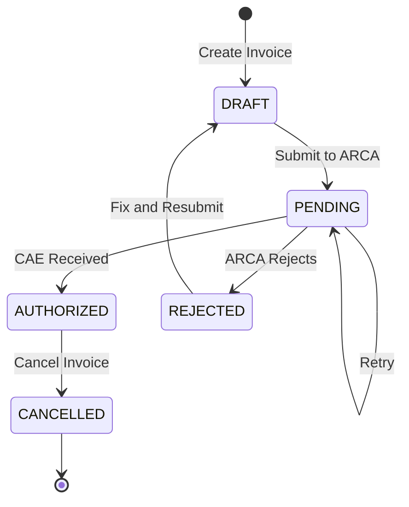

# Design Document: Facturación Electrónica ARCA

## Overview

Este diseño implementa un módulo de facturación electrónica para Argentina que se integra con la API de ARCA (Agencia de Recaudación y Control Aduanero). El sistema permite generar comprobantes electrónicos válidos fiscalmente, obtener códigos de autorización (CAE), y gestionar el ciclo completo de facturación incluyendo facturas, notas de crédito y débito.

El diseño sigue una arquitectura de capas que separa la lógica de negocio, la comunicación con ARCA, y la persistencia de datos. Se implementa un sistema robusto de manejo de errores con reintentos automáticos y logs de auditoría completos.

## Architecture

### Layered Architecture

```
┌─────────────────────────────────────────┐
│         Presentation Layer              │
│  (UI Components, PDF Generation)        │
└─────────────────────────────────────────┘
                  ↓
┌─────────────────────────────────────────┐
│         Business Logic Layer            │
│  (Invoice Generation, Validation)       │
└─────────────────────────────────────────┘
                  ↓
┌─────────────────────────────────────────┐
│         Integration Layer               │
│  (ARCA API Client, Retry Logic)         │
└─────────────────────────────────────────┘
                  ↓
┌─────────────────────────────────────────┐
│         Data Access Layer               │
│  (Database, Audit Logs)                 │
└─────────────────────────────────────────┘
```

### Key Design Decisions

1. **Asynchronous Processing**: Las solicitudes a ARCA se procesan de forma asíncrona para no bloquear la UI
2. **Retry Strategy**: Implementación de backoff exponencial para reintentos (1s, 2s, 4s, 8s, 16s)
3. **State Machine**: Los comprobantes siguen un estado bien definido (draft → pending → authorized/rejected → anulado)
4. **Audit Trail**: Todos los eventos se registran en una tabla de auditoría inmutable
5. **Certificate Security**: Los certificados se almacenan encriptados usando AES-256

## Components and Interfaces

### 1. ARCA API Client

Componente responsable de la comunicación con la API de ARCA.

```typescript
interface ARCAClient {
  // Autenticación con certificado digital
  authenticate(certificate: Certificate, privateKey: string): Promise<AuthToken>
  
  // Solicitar autorización de comprobante
  requestCAE(invoice: InvoiceRequest): Promise<CAEResponse>
  
  // Consultar estado de comprobante
  queryInvoiceStatus(cae: string, invoiceNumber: string): Promise<InvoiceStatus>
  
  // Anular comprobante
  cancelInvoice(cae: string, invoiceNumber: string): Promise<CancelResponse>
  
  // Obtener último número de comprobante autorizado
  getLastAuthorizedNumber(pointOfSale: number, invoiceType: InvoiceType): Promise<number>
}

interface Certificate {
  pfxData: Buffer
  password: string
}

interface AuthToken {
  token: string
  expiresAt: Date
}

interface InvoiceRequest {
  pointOfSale: number
  invoiceType: InvoiceType
  invoiceNumber: number
  issueDate: Date
  customer: CustomerFiscalData
  items: InvoiceItem[]
  concept: InvoiceConcept
  currency: Currency
  exchangeRate?: number
}

interface CAEResponse {
  cae: string
  caeExpirationDate: Date
  invoiceNumber: number
  success: boolean
  errors?: string[]
}

interface InvoiceStatus {
  cae: string
  authorized: boolean
  authorizationDate: Date
  cancelled: boolean
  cancellationDate?: Date
}
```

### 2. Invoice Generator

Componente que genera comprobantes electrónicos desde ventas del ERP.

```typescript
interface InvoiceGenerator {
  // Generar factura desde venta
  generateInvoiceFromSale(saleId: string): Promise<ElectronicInvoice>
  
  // Generar nota de crédito
  generateCreditNote(originalInvoiceId: string, amount: number, reason: string): Promise<ElectronicInvoice>
  
  // Generar nota de débito
  generateDebitNote(originalInvoiceId: string, amount: number, reason: string): Promise<ElectronicInvoice>
  
  // Determinar tipo de factura según condición fiscal
  determineInvoiceType(customerFiscalCondition: FiscalCondition): InvoiceType
  
  // Calcular IVA por alícuota
  calculateVATByRate(items: InvoiceItem[], invoiceType: InvoiceType): VATBreakdown[]
}

interface ElectronicInvoice {
  id: string
  companyId: string
  saleId?: string
  invoiceType: InvoiceType
  pointOfSale: number
  invoiceNumber: number
  issueDate: Date
  customer: CustomerFiscalData
  items: InvoiceItem[]
  concept: InvoiceConcept
  currency: Currency
  exchangeRate?: number
  subtotal: number
  vatAmount: number
  total: number
  status: InvoiceStatus
  cae?: string
  caeExpirationDate?: Date
  qrCode?: string
  pdfUrl?: string
  relatedInvoiceId?: string // Para notas de crédito/débito
  createdBy: string
  createdAt: Date
}

enum InvoiceType {
  FACTURA_A = 'FACTURA_A',
  FACTURA_B = 'FACTURA_B',
  FACTURA_C = 'FACTURA_C',
  NOTA_CREDITO_A = 'NOTA_CREDITO_A',
  NOTA_CREDITO_B = 'NOTA_CREDITO_B',
  NOTA_CREDITO_C = 'NOTA_CREDITO_C',
  NOTA_DEBITO_A = 'NOTA_DEBITO_A',
  NOTA_DEBITO_B = 'NOTA_DEBITO_B',
  NOTA_DEBITO_C = 'NOTA_DEBITO_C'
}

enum InvoiceStatus {
  DRAFT = 'DRAFT',
  PENDING = 'PENDING',
  AUTHORIZED = 'AUTHORIZED',
  REJECTED = 'REJECTED',
  CANCELLED = 'CANCELLED'
}

enum InvoiceConcept {
  PRODUCTS = 'PRODUCTS',
  SERVICES = 'SERVICES',
  PRODUCTS_AND_SERVICES = 'PRODUCTS_AND_SERVICES'
}

enum FiscalCondition {
  RESPONSABLE_INSCRIPTO = 'RESPONSABLE_INSCRIPTO',
  CONSUMIDOR_FINAL = 'CONSUMIDOR_FINAL',
  MONOTRIBUTISTA = 'MONOTRIBUTISTA',
  EXENTO = 'EXENTO'
}

interface CustomerFiscalData {
  cuitCuil?: string
  documentType: string
  documentNumber: string
  fiscalCondition: FiscalCondition
  businessName: string
  fiscalAddress: string
}

interface InvoiceItem {
  productId: string
  description: string
  quantity: number
  unitPrice: number
  vatRate: VATRate
  subtotal: number
  vatAmount: number
  total: number
}

enum VATRate {
  VAT_21 = 21,
  VAT_10_5 = 10.5,
  VAT_27 = 27,
  VAT_5 = 5,
  VAT_2_5 = 2.5,
  VAT_0 = 0
}

interface VATBreakdown {
  rate: VATRate
  taxableBase: number
  vatAmount: number
}
```

### 3. Invoice Processor

Componente que procesa comprobantes y maneja el flujo con ARCA.

```typescript
interface InvoiceProcessor {
  // Procesar factura (enviar a ARCA y obtener CAE)
  processInvoice(invoiceId: string): Promise<ProcessResult>
  
  // Reintentar factura fallida
  retryInvoice(invoiceId: string): Promise<ProcessResult>
  
  // Anular factura
  cancelInvoice(invoiceId: string, reason: string): Promise<CancelResult>
  
  // Sincronizar estado con ARCA
  syncInvoiceStatus(invoiceId: string): Promise<InvoiceStatus>
}

interface ProcessResult {
  success: boolean
  invoiceId: string
  cae?: string
  caeExpirationDate?: Date
  errors?: string[]
  retryable: boolean
}

interface CancelResult {
  success: boolean
  invoiceId: string
  cancellationDate?: Date
  errors?: string[]
}
```

### 4. PDF Generator

Componente que genera PDFs de comprobantes con código QR.

```typescript
interface PDFGenerator {
  // Generar PDF de factura
  generateInvoicePDF(invoice: ElectronicInvoice): Promise<PDFDocument>
  
  // Incluir código QR de ARCA
  embedQRCode(pdf: PDFDocument, qrData: string): PDFDocument
  
  // Formatear según especificaciones ARCA
  formatARCACompliant(invoice: ElectronicInvoice): PDFLayout
}

interface PDFDocument {
  buffer: Buffer
  filename: string
  mimeType: string
}

interface PDFLayout {
  header: HeaderSection
  customerData: CustomerSection
  items: ItemsSection
  totals: TotalsSection
  fiscalData: FiscalSection
  qrCode: QRSection
}
```

### 5. Configuration Manager

Componente que gestiona la configuración de certificados y credenciales.

```typescript
interface ConfigurationManager {
  // Guardar certificado digital
  saveCertificate(companyId: string, certificate: Certificate): Promise<void>
  
  // Obtener certificado digital
  getCertificate(companyId: string): Promise<Certificate>
  
  // Guardar configuración ARCA
  saveARCAConfig(companyId: string, config: ARCAConfig): Promise<void>
  
  // Obtener configuración ARCA
  getARCAConfig(companyId: string): Promise<ARCAConfig>
  
  // Validar certificado
  validateCertificate(certificate: Certificate): Promise<ValidationResult>
}

interface ARCAConfig {
  companyId: string
  cuit: string
  pointOfSale: number
  environment: Environment
  certificateId: string
  lastSync?: Date
}

enum Environment {
  TESTING = 'TESTING',
  PRODUCTION = 'PRODUCTION'
}

interface ValidationResult {
  valid: boolean
  errors?: string[]
  expirationDate?: Date
}
```

### 6. Retry Manager

Componente que gestiona reintentos con backoff exponencial.

```typescript
interface RetryManager {
  // Programar reintento
  scheduleRetry(invoiceId: string, attemptNumber: number): Promise<void>
  
  // Procesar reintentos pendientes
  processRetries(): Promise<RetryResult[]>
  
  // Cancelar reintentos
  cancelRetries(invoiceId: string): Promise<void>
  
  // Calcular próximo reintento
  calculateNextRetry(attemptNumber: number): Date
}

interface RetryResult {
  invoiceId: string
  attemptNumber: number
  success: boolean
  nextRetryAt?: Date
}
```

### 7. Audit Logger

Componente que registra todas las operaciones para auditoría.

```typescript
interface AuditLogger {
  // Registrar operación
  logOperation(operation: AuditOperation): Promise<void>
  
  // Consultar logs
  queryLogs(filters: LogFilters): Promise<AuditLog[]>
  
  // Exportar logs
  exportLogs(filters: LogFilters, format: ExportFormat): Promise<Buffer>
}

interface AuditOperation {
  companyId: string
  userId: string
  operationType: OperationType
  entityType: EntityType
  entityId: string
  timestamp: Date
  details: Record<string, any>
  success: boolean
  errorMessage?: string
}

enum OperationType {
  CREATE = 'CREATE',
  UPDATE = 'UPDATE',
  DELETE = 'DELETE',
  AUTHORIZE = 'AUTHORIZE',
  CANCEL = 'CANCEL',
  QUERY = 'QUERY',
  SYNC = 'SYNC',
  RETRY = 'RETRY'
}

enum EntityType {
  INVOICE = 'INVOICE',
  CREDIT_NOTE = 'CREDIT_NOTE',
  DEBIT_NOTE = 'DEBIT_NOTE',
  CERTIFICATE = 'CERTIFICATE',
  CONFIGURATION = 'CONFIGURATION'
}

interface AuditLog {
  id: string
  operation: AuditOperation
  createdAt: Date
}

interface LogFilters {
  companyId: string
  startDate?: Date
  endDate?: Date
  operationType?: OperationType
  entityType?: EntityType
  userId?: string
}

enum ExportFormat {
  PDF = 'PDF',
  EXCEL = 'EXCEL',
  CSV = 'CSV'
}
```

### 8. Report Generator

Componente que genera reportes de facturación electrónica.

```typescript
interface ReportGenerator {
  // Reporte de comprobantes emitidos
  generateIssuedInvoicesReport(filters: ReportFilters): Promise<IssuedInvoicesReport>
  
  // Reporte por tipo de comprobante
  generateByTypeReport(filters: ReportFilters): Promise<ByTypeReport>
  
  // Reporte de comprobantes anulados
  generateCancelledReport(filters: ReportFilters): Promise<CancelledReport>
  
  // Reporte de errores
  generateErrorReport(filters: ReportFilters): Promise<ErrorReport>
  
  // Exportar reporte
  exportReport(report: Report, format: ExportFormat): Promise<Buffer>
}

interface ReportFilters {
  companyId: string
  startDate: Date
  endDate: Date
  invoiceType?: InvoiceType
  pointOfSale?: number
  status?: InvoiceStatus
}

interface IssuedInvoicesReport {
  filters: ReportFilters
  invoices: ElectronicInvoice[]
  totalCount: number
  totalAmount: number
  vatBreakdown: VATBreakdown[]
  successRate: number
}

interface ByTypeReport {
  filters: ReportFilters
  breakdown: TypeBreakdown[]
  totalAmount: number
}

interface TypeBreakdown {
  invoiceType: InvoiceType
  count: number
  totalAmount: number
}

interface CancelledReport {
  filters: ReportFilters
  cancelledInvoices: CancelledInvoice[]
  totalCount: number
}

interface CancelledInvoice {
  invoice: ElectronicInvoice
  cancellationDate: Date
  cancellationReason: string
  cancelledBy: string
}

interface ErrorReport {
  filters: ReportFilters
  errors: InvoiceError[]
  errorsByType: ErrorBreakdown[]
}

interface InvoiceError {
  invoiceId: string
  errorType: string
  errorMessage: string
  attemptCount: number
  lastAttempt: Date
}

interface ErrorBreakdown {
  errorType: string
  count: number
  percentage: number
}
```

### 9. Sequence Manager

Componente que gestiona la numeración secuencial de comprobantes.

```typescript
interface SequenceManager {
  // Obtener próximo número
  getNextNumber(companyId: string, pointOfSale: number, invoiceType: InvoiceType): Promise<number>
  
  // Validar secuencia
  validateSequence(companyId: string, pointOfSale: number, invoiceType: InvoiceType): Promise<SequenceValidation>
  
  // Sincronizar con ARCA
  syncWithARCA(companyId: string, pointOfSale: number, invoiceType: InvoiceType): Promise<void>
}

interface SequenceValidation {
  valid: boolean
  expectedNext: number
  actualNext: number
  gaps: number[]
}
```

## Data Models

### Database Schema

```sql
-- Configuración de ARCA por empresa
CREATE TABLE arca_configurations (
  id UUID PRIMARY KEY DEFAULT gen_random_uuid(),
  company_id UUID NOT NULL REFERENCES companies(id),
  cuit VARCHAR(11) NOT NULL,
  point_of_sale INTEGER NOT NULL,
  environment VARCHAR(20) NOT NULL CHECK (environment IN ('TESTING', 'PRODUCTION')),
  certificate_id UUID REFERENCES arca_certificates(id),
  last_sync TIMESTAMPTZ,
  created_at TIMESTAMPTZ NOT NULL DEFAULT NOW(),
  updated_at TIMESTAMPTZ NOT NULL DEFAULT NOW(),
  UNIQUE(company_id)
);

-- Certificados digitales (encriptados)
CREATE TABLE arca_certificates (
  id UUID PRIMARY KEY DEFAULT gen_random_uuid(),
  company_id UUID NOT NULL REFERENCES companies(id),
  pfx_data_encrypted BYTEA NOT NULL,
  password_encrypted TEXT NOT NULL,
  expiration_date DATE NOT NULL,
  created_at TIMESTAMPTZ NOT NULL DEFAULT NOW(),
  created_by UUID NOT NULL REFERENCES profiles(id)
);

-- Facturas electrónicas
CREATE TABLE electronic_invoices (
  id UUID PRIMARY KEY DEFAULT gen_random_uuid(),
  company_id UUID NOT NULL REFERENCES companies(id),
  sale_id UUID REFERENCES sales(id),
  invoice_type VARCHAR(20) NOT NULL,
  point_of_sale INTEGER NOT NULL,
  invoice_number BIGINT NOT NULL,
  issue_date DATE NOT NULL,
  
  -- Datos del cliente
  customer_cuit_cuil VARCHAR(11),
  customer_document_type VARCHAR(10) NOT NULL,
  customer_document_number VARCHAR(20) NOT NULL,
  customer_fiscal_condition VARCHAR(30) NOT NULL,
  customer_business_name TEXT NOT NULL,
  customer_fiscal_address TEXT NOT NULL,
  
  -- Datos del comprobante
  concept VARCHAR(30) NOT NULL,
  currency VARCHAR(3) NOT NULL DEFAULT 'ARS',
  exchange_rate DECIMAL(10, 4),
  subtotal DECIMAL(12, 2) NOT NULL,
  vat_amount DECIMAL(12, 2) NOT NULL,
  total DECIMAL(12, 2) NOT NULL,
  
  -- Datos de ARCA
  status VARCHAR(20) NOT NULL DEFAULT 'DRAFT',
  cae VARCHAR(14),
  cae_expiration_date DATE,
  qr_code TEXT,
  pdf_url TEXT,
  
  -- Relación con comprobante original (para notas)
  related_invoice_id UUID REFERENCES electronic_invoices(id),
  
  -- Auditoría
  created_by UUID NOT NULL REFERENCES profiles(id),
  created_at TIMESTAMPTZ NOT NULL DEFAULT NOW(),
  updated_at TIMESTAMPTZ NOT NULL DEFAULT NOW(),
  
  UNIQUE(company_id, point_of_sale, invoice_type, invoice_number)
);

-- Ítems de facturas
CREATE TABLE electronic_invoice_items (
  id UUID PRIMARY KEY DEFAULT gen_random_uuid(),
  invoice_id UUID NOT NULL REFERENCES electronic_invoices(id) ON DELETE CASCADE,
  product_id UUID REFERENCES products(id),
  description TEXT NOT NULL,
  quantity DECIMAL(10, 2) NOT NULL,
  unit_price DECIMAL(12, 2) NOT NULL,
  vat_rate DECIMAL(5, 2) NOT NULL,
  subtotal DECIMAL(12, 2) NOT NULL,
  vat_amount DECIMAL(12, 2) NOT NULL,
  total DECIMAL(12, 2) NOT NULL,
  created_at TIMESTAMPTZ NOT NULL DEFAULT NOW()
);

-- Desglose de IVA por alícuota
CREATE TABLE electronic_invoice_vat_breakdown (
  id UUID PRIMARY KEY DEFAULT gen_random_uuid(),
  invoice_id UUID NOT NULL REFERENCES electronic_invoices(id) ON DELETE CASCADE,
  vat_rate DECIMAL(5, 2) NOT NULL,
  taxable_base DECIMAL(12, 2) NOT NULL,
  vat_amount DECIMAL(12, 2) NOT NULL,
  created_at TIMESTAMPTZ NOT NULL DEFAULT NOW()
);

-- Logs de auditoría (inmutable)
CREATE TABLE arca_audit_logs (
  id UUID PRIMARY KEY DEFAULT gen_random_uuid(),
  company_id UUID NOT NULL REFERENCES companies(id),
  user_id UUID NOT NULL REFERENCES profiles(id),
  operation_type VARCHAR(20) NOT NULL,
  entity_type VARCHAR(20) NOT NULL,
  entity_id UUID NOT NULL,
  timestamp TIMESTAMPTZ NOT NULL DEFAULT NOW(),
  details JSONB NOT NULL,
  success BOOLEAN NOT NULL,
  error_message TEXT,
  created_at TIMESTAMPTZ NOT NULL DEFAULT NOW()
);

-- Reintentos programados
CREATE TABLE arca_retry_queue (
  id UUID PRIMARY KEY DEFAULT gen_random_uuid(),
  invoice_id UUID NOT NULL REFERENCES electronic_invoices(id),
  attempt_number INTEGER NOT NULL DEFAULT 1,
  scheduled_at TIMESTAMPTZ NOT NULL,
  processed_at TIMESTAMPTZ,
  success BOOLEAN,
  error_message TEXT,
  created_at TIMESTAMPTZ NOT NULL DEFAULT NOW()
);

-- Secuencias de numeración
CREATE TABLE arca_sequences (
  id UUID PRIMARY KEY DEFAULT gen_random_uuid(),
  company_id UUID NOT NULL REFERENCES companies(id),
  point_of_sale INTEGER NOT NULL,
  invoice_type VARCHAR(20) NOT NULL,
  last_number BIGINT NOT NULL DEFAULT 0,
  last_sync TIMESTAMPTZ,
  updated_at TIMESTAMPTZ NOT NULL DEFAULT NOW(),
  UNIQUE(company_id, point_of_sale, invoice_type)
);

-- Índices para optimización
CREATE INDEX idx_electronic_invoices_company ON electronic_invoices(company_id);
CREATE INDEX idx_electronic_invoices_sale ON electronic_invoices(sale_id);
CREATE INDEX idx_electronic_invoices_status ON electronic_invoices(status);
CREATE INDEX idx_electronic_invoices_cae ON electronic_invoices(cae);
CREATE INDEX idx_electronic_invoices_issue_date ON electronic_invoices(issue_date);
CREATE INDEX idx_arca_audit_logs_company ON arca_audit_logs(company_id);
CREATE INDEX idx_arca_audit_logs_timestamp ON arca_audit_logs(timestamp);
CREATE INDEX idx_arca_retry_queue_scheduled ON arca_retry_queue(scheduled_at) WHERE processed_at IS NULL;
```

### State Machine Diagram




## Correctness Properties

*Una propiedad es una característica o comportamiento que debe mantenerse verdadero en todas las ejecuciones válidas de un sistema - esencialmente, una declaración formal sobre lo que el sistema debe hacer. Las propiedades sirven como puente entre las especificaciones legibles por humanos y las garantías de correctitud verificables por máquinas.*

### Property 1: Configuración Round-Trip

*Para cualquier* configuración de ARCA válida (certificado, CUIT, punto de venta, ambiente), almacenarla y luego recuperarla debe producir una configuración equivalente con los mismos valores.

**Validates: Requirements 1.1, 1.2, 1.3, 1.4, 1.5, 1.8**

### Property 2: Validación de Formato CUIT/CUIL

*Para cualquier* string, la validación de CUIT/CUIL debe aceptarlo si y solo si tiene exactamente 11 dígitos numéricos.

**Validates: Requirements 1.7, 2.1**

### Property 3: Validación de Certificado Digital

*Para cualquier* archivo, la validación de certificado debe aceptarlo si y solo si es un archivo .pfx válido con estructura correcta.

**Validates: Requirements 1.6**

### Property 4: Determinación de Tipo de Factura

*Para cualquier* cliente con condición fiscal válida, el sistema debe determinar el tipo de factura según la regla: responsable inscripto → Factura A, consumidor final → Factura B, monotributista → Factura C, exento → Factura A.

**Validates: Requirements 3.2, 3.3, 3.4, 3.5**

### Property 5: Inclusión Completa de Ítems

*Para cualquier* venta con N ítems, el comprobante generado debe contener exactamente N ítems con los mismos datos (descripción, cantidad, precio).

**Validates: Requirements 3.6**

### Property 6: Cálculo Correcto de IVA

*Para cualquier* conjunto de ítems con alícuotas de IVA, el IVA total calculado debe ser igual a la suma de (precio_unitario × cantidad × alícuota) para cada ítem, y el total debe ser subtotal + IVA.

**Validates: Requirements 3.7**

### Property 7: Numeración Secuencial Única

*Para cualquier* secuencia de comprobantes del mismo tipo y punto de venta, los números asignados deben ser estrictamente crecientes sin duplicados ni saltos (n, n+1, n+2, ...).

**Validates: Requirements 3.9, 14.1, 14.2, 14.3**

### Property 8: Desglose de IVA en Factura A

*Para cualquier* Factura A con ítems que tienen IVA, debe existir un desglose que agrupe los importes por cada alícuota única presente en los ítems.

**Validates: Requirements 3.10**

### Property 9: Persistencia de Datos Fiscales

*Para cualquier* comprobante autorizado, todos los datos fiscales requeridos (CAE, fecha vencimiento CAE, número, tipo, fecha emisión, CUIT cliente, importes, estado) deben estar almacenados y ser recuperables.

**Validates: Requirements 5.1, 5.2, 5.3, 5.4, 5.5, 5.6, 5.7, 5.9**

### Property 10: Vinculación con Venta Original

*Para cualquier* comprobante generado desde una venta, debe existir una referencia almacenada que vincule el comprobante con la venta original.

**Validates: Requirements 5.8**

### Property 11: Prevención de Anulación Duplicada

*Para cualquier* comprobante en estado "anulado", intentar anularlo nuevamente debe ser rechazado por el sistema.

**Validates: Requirements 7.5**

### Property 12: Preservación de Datos Históricos

*Para cualquier* comprobante anulado, todos sus datos originales (CAE, importes, ítems) deben permanecer almacenados y accesibles después de la anulación.

**Validates: Requirements 7.7**

### Property 13: Coincidencia de Tipo en Notas

*Para cualquier* nota de crédito o débito, el tipo de la nota (A, B, o C) debe coincidir con el tipo del comprobante original al que referencia.

**Validates: Requirements 8.4**

### Property 14: Referencia a Comprobante Original

*Para cualquier* nota de crédito o débito, debe existir una referencia almacenada al comprobante original que está siendo ajustado.

**Validates: Requirements 8.7**

### Property 15: Generación de PDF con Datos Completos

*Para cualquier* comprobante autorizado, el PDF generado debe contener el CAE, la fecha de vencimiento del CAE, el código QR, y todos los ítems del comprobante.

**Validates: Requirements 9.1, 9.2, 9.3, 9.4, 9.5**

### Property 16: Backoff Exponencial en Reintentos

*Para cualquier* secuencia de reintentos, los tiempos de espera entre intentos deben seguir la progresión exponencial: 1s, 2s, 4s, 8s, 16s (2^n segundos donde n es el número de intento - 1).

**Validates: Requirements 10.5, 11.2**

### Property 17: Límite de Reintentos

*Para cualquier* comprobante con reintentos, el número total de intentos no debe exceder 5.

**Validates: Requirements 10.6**

### Property 18: Registro Completo de Auditoría

*Para cualquier* operación del sistema (crear comprobante, anular, consultar, cambiar configuración), debe existir un registro en el log de auditoría con timestamp, usuario, tipo de operación, y resultado.

**Validates: Requirements 12.1, 12.2, 12.3, 12.4, 12.5, 12.6**

### Property 19: Independencia de Contadores

*Para cualquier* par de (tipo_comprobante, punto_venta), el contador de numeración debe ser independiente de otros pares, es decir, generar un comprobante de tipo A en punto 1 no debe afectar el contador de tipo B en punto 1 ni tipo A en punto 2.

**Validates: Requirements 14.5, 14.6**

### Property 20: Conversión de Moneda Consistente

*Para cualquier* comprobante en moneda extranjera con tipo de cambio C, si el subtotal en moneda local es S, entonces el subtotal en moneda extranjera debe ser S/C (con precisión de 2 decimales).

**Validates: Requirements 15.3, 15.5**

### Property 21: Inclusión de Tipo de Cambio

*Para cualquier* comprobante emitido en moneda diferente a ARS, debe incluir un tipo de cambio mayor a cero.

**Validates: Requirements 15.3**

### Property 22: Validación de Datos Fiscales Completos

*Para cualquier* intento de generar un comprobante, si el cliente no tiene CUIT/CUIL, tipo de documento, condición fiscal, o domicilio fiscal, el sistema debe rechazar la operación con un mensaje de error descriptivo.

**Validates: Requirements 2.7**

### Property 23: Actualización de Estado por Sincronización

*Para cualquier* comprobante en estado "pendiente", si la sincronización con ARCA devuelve un estado diferente (autorizado/rechazado), el estado almacenado debe actualizarse al nuevo estado.

**Validates: Requirements 10.3**

### Property 24: Registro de Sincronización

*Para cualquier* operación de sincronización con ARCA, debe existir un registro en el log de auditoría indicando la fecha, comprobantes consultados, y resultado.

**Validates: Requirements 10.4**

### Property 25: Notificación Después de Reintentos Agotados

*Para cualquier* comprobante que falla después de 5 reintentos, debe existir una notificación al usuario registrada en el sistema.

**Validates: Requirements 11.3**

### Property 26: Modo Degradado Operacional

*Para cualquier* operación de venta en el ERP, el sistema debe permitir completar la venta incluso si ARCA no está disponible, marcando el comprobante como "pendiente de reintento".

**Validates: Requirements 11.8**

### Property 27: Contenido de Reportes

*Para cualquier* reporte de comprobantes emitidos en un período, el reporte debe incluir todos los comprobantes cuya fecha de emisión esté dentro del rango especificado, y ningún comprobante fuera del rango.

**Validates: Requirements 13.1**

### Property 28: Desglose de IVA en Reportes

*Para cualquier* reporte de comprobantes, debe incluir un desglose que sume los importes de IVA agrupados por cada alícuota (21%, 10.5%, 27%, 5%, 2.5%, 0%).

**Validates: Requirements 13.6**

## Error Handling

### Error Categories

1. **Validation Errors**: Errores de validación de datos antes de enviar a ARCA
   - CUIT/CUIL inválido
   - Certificado digital inválido o vencido
   - Datos fiscales incompletos
   - Numeración duplicada o con saltos
   - **Handling**: Rechazar operación inmediatamente, mostrar mensaje descriptivo al usuario

2. **Communication Errors**: Errores de comunicación con API de ARCA
   - Timeout de conexión
   - Error de red
   - Servicio ARCA no disponible
   - **Handling**: Marcar comprobante como "pendiente", programar reintento automático con backoff exponencial

3. **Authorization Errors**: Errores de autenticación/autorización con ARCA
   - Certificado digital rechazado
   - Token de autenticación expirado
   - Credenciales inválidas
   - **Handling**: Notificar al administrador, detener procesamiento hasta que se corrija la configuración

4. **Business Logic Errors**: Errores de lógica de negocio reportados por ARCA
   - Comprobante rechazado por ARCA (datos fiscales incorrectos)
   - Número de comprobante ya utilizado
   - CAE no encontrado para anulación
   - **Handling**: Marcar comprobante como "rechazado", registrar error detallado, permitir corrección manual

5. **System Errors**: Errores internos del sistema
   - Error de base de datos
   - Error de generación de PDF
   - Error de encriptación/desencriptación
   - **Handling**: Registrar en logs, notificar al administrador, intentar rollback de transacción

### Error Recovery Strategies

#### Retry Strategy with Exponential Backoff

```typescript
interface RetryConfig {
  maxAttempts: 5
  baseDelay: 1000 // 1 segundo
  maxDelay: 16000 // 16 segundos
  backoffMultiplier: 2
}

function calculateRetryDelay(attemptNumber: number): number {
  const delay = baseDelay * Math.pow(backoffMultiplier, attemptNumber - 1)
  return Math.min(delay, maxDelay)
}

// Secuencia de reintentos: 1s, 2s, 4s, 8s, 16s
```

#### Circuit Breaker Pattern

Para prevenir sobrecarga cuando ARCA está caído:

```typescript
interface CircuitBreaker {
  state: 'CLOSED' | 'OPEN' | 'HALF_OPEN'
  failureThreshold: 5
  successThreshold: 2
  timeout: 60000 // 1 minuto
  
  // CLOSED: funcionamiento normal
  // OPEN: demasiados fallos, rechazar requests inmediatamente
  // HALF_OPEN: permitir algunos requests de prueba
}
```

#### Graceful Degradation

Cuando ARCA no está disponible:
- Permitir continuar con ventas en el ERP
- Marcar comprobantes como "pendiente de autorización"
- Mostrar advertencia al usuario
- Procesar automáticamente cuando ARCA vuelva a estar disponible

### Error Messages

Todos los mensajes de error deben ser:
- **Descriptivos**: Explicar claramente qué salió mal
- **Accionables**: Indicar qué puede hacer el usuario para resolver el problema
- **Contextuales**: Incluir información relevante (número de comprobante, CAE, etc.)

Ejemplos:
- ❌ "Error al generar factura"
- ✅ "No se pudo generar la Factura A #00001-00000123 porque el cliente no tiene CUIT configurado. Por favor, complete los datos fiscales del cliente antes de facturar."

- ❌ "Error de ARCA"
- ✅ "ARCA rechazó el comprobante: 'CUIT del cliente no válido en el padrón de AFIP'. Verifique que el CUIT 20-12345678-9 sea correcto."

## Testing Strategy

### Dual Testing Approach

Este sistema requiere tanto pruebas unitarias como pruebas basadas en propiedades para garantizar correctitud completa:

- **Unit Tests**: Verifican casos específicos, ejemplos concretos, y condiciones de borde
- **Property Tests**: Verifican propiedades universales a través de muchos inputs generados aleatoriamente

Ambos tipos de pruebas son complementarios y necesarios:
- Las pruebas unitarias capturan bugs concretos y casos edge específicos
- Las pruebas de propiedades verifican correctitud general y descubren casos no anticipados

### Property-Based Testing Configuration

**Framework**: Utilizaremos `fast-check` para TypeScript, que es la biblioteca estándar para property-based testing en el ecosistema JavaScript/TypeScript.

**Configuración**:
- Mínimo 100 iteraciones por prueba de propiedad (debido a la naturaleza aleatoria)
- Cada prueba debe referenciar su propiedad del documento de diseño
- Formato de tag: `Feature: facturacion-electronica-arca, Property {number}: {property_text}`

**Ejemplo de estructura**:

```typescript
import fc from 'fast-check'

describe('Feature: facturacion-electronica-arca, Property 2: Validación de Formato CUIT/CUIL', () => {
  it('should accept any string with exactly 11 digits', () => {
    fc.assert(
      fc.property(
        fc.array(fc.integer(0, 9), { minLength: 11, maxLength: 11 }),
        (digits) => {
          const cuit = digits.join('')
          const result = validateCUIT(cuit)
          expect(result.valid).toBe(true)
        }
      ),
      { numRuns: 100 }
    )
  })
  
  it('should reject any string that does not have exactly 11 digits', () => {
    fc.assert(
      fc.property(
        fc.string().filter(s => !/^\d{11}$/.test(s)),
        (invalidCuit) => {
          const result = validateCUIT(invalidCuit)
          expect(result.valid).toBe(false)
        }
      ),
      { numRuns: 100 }
    )
  })
})
```

### Unit Testing Focus Areas

Las pruebas unitarias deben enfocarse en:

1. **Casos específicos de tipos de factura**:
   - Responsable inscripto → Factura A
   - Consumidor final → Factura B
   - Monotributista → Factura C

2. **Casos edge de validación**:
   - CUIT con 10 dígitos (inválido)
   - CUIT con 12 dígitos (inválido)
   - CUIT con letras (inválido)
   - Certificado .pfx corrupto
   - Certificado vencido

3. **Flujos de error específicos**:
   - ARCA devuelve error 401 (no autorizado)
   - ARCA devuelve error 500 (error interno)
   - Timeout después de 30 segundos
   - Comprobante rechazado por datos inválidos

4. **Integración entre componentes**:
   - Venta → Comprobante → PDF
   - Comprobante → ARCA → CAE → Almacenamiento
   - Comprobante fallido → Reintento → Éxito

### Test Data Generators

Para property-based testing, necesitamos generadores de datos válidos:

```typescript
// Generador de CUIT válido
const cuitArbitrary = fc.array(fc.integer(0, 9), { minLength: 11, maxLength: 11 })
  .map(digits => digits.join(''))

// Generador de condición fiscal
const fiscalConditionArbitrary = fc.constantFrom(
  'RESPONSABLE_INSCRIPTO',
  'CONSUMIDOR_FINAL',
  'MONOTRIBUTISTA',
  'EXENTO'
)

// Generador de alícuota de IVA
const vatRateArbitrary = fc.constantFrom(21, 10.5, 27, 5, 2.5, 0)

// Generador de ítem de factura
const invoiceItemArbitrary = fc.record({
  productId: fc.uuid(),
  description: fc.string({ minLength: 1, maxLength: 200 }),
  quantity: fc.double({ min: 0.01, max: 10000, noNaN: true }),
  unitPrice: fc.double({ min: 0.01, max: 1000000, noNaN: true }),
  vatRate: vatRateArbitrary
})

// Generador de comprobante completo
const invoiceArbitrary = fc.record({
  pointOfSale: fc.integer({ min: 1, max: 9999 }),
  invoiceType: fc.constantFrom('FACTURA_A', 'FACTURA_B', 'FACTURA_C'),
  customer: fc.record({
    cuitCuil: cuitArbitrary,
    fiscalCondition: fiscalConditionArbitrary,
    businessName: fc.string({ minLength: 1, maxLength: 200 }),
    fiscalAddress: fc.string({ minLength: 1, maxLength: 300 })
  }),
  items: fc.array(invoiceItemArbitrary, { minLength: 1, maxLength: 50 }),
  currency: fc.constantFrom('ARS', 'USD'),
  exchangeRate: fc.option(fc.double({ min: 0.01, max: 10000 }), { nil: undefined })
})
```

### Integration Testing

Pruebas de integración con ARCA:

1. **Ambiente de Testing de ARCA**:
   - Usar el ambiente de homologación de ARCA para pruebas
   - Configurar certificados de testing
   - Validar flujo completo: autenticación → solicitud CAE → consulta estado

2. **Mock de API de ARCA**:
   - Crear mock server que simule respuestas de ARCA
   - Simular diferentes escenarios: éxito, error, timeout
   - Validar manejo de errores y reintentos

3. **Pruebas de Carga**:
   - Generar 1000 comprobantes en paralelo
   - Verificar que no hay duplicados en numeración
   - Verificar que todos los reintentos se procesan correctamente

### Test Coverage Goals

- **Cobertura de código**: Mínimo 80% de líneas cubiertas
- **Cobertura de propiedades**: Todas las 28 propiedades deben tener al menos una prueba
- **Cobertura de errores**: Todos los tipos de error deben tener pruebas
- **Cobertura de flujos**: Todos los estados de la máquina de estados deben ser alcanzables en tests

### Continuous Testing

- Ejecutar pruebas unitarias en cada commit
- Ejecutar pruebas de propiedades en cada pull request
- Ejecutar pruebas de integración con ARCA en ambiente de staging antes de producción
- Monitorear tasa de éxito de comprobantes en producción como métrica de calidad
