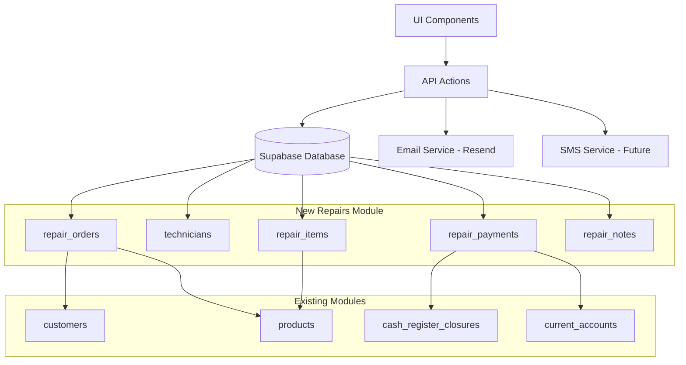

# Design Document: Gestión de Reparaciones de Dispositivos

## Overview

El módulo de gestión de reparaciones de dispositivos electrónicos es una extensión del ERP SaaS que permite a los comercios gestionar el ciclo completo de reparaciones desde el ingreso hasta la entrega. El módulo se integra profundamente con los sistemas existentes de clientes, productos, caja y cuentas corrientes, proporcionando una solución unificada para talleres de reparación.

### Key Design Decisions

1. **Arquitectura de integración**: El módulo se construye como una extensión del ERP existente, reutilizando la infraestructura de autenticación, RLS, y módulos base
2. **Gestión de técnicos independiente**: Los técnicos se gestionan como entidades separadas de los usuarios del sistema para mayor flexibilidad
3. **Estados de reparación como enum**: Los estados se implementan como tipo enum en la base de datos para garantizar consistencia
4. **Presupuesto flexible**: El presupuesto permite múltiples repuestos y mano de obra, calculando totales automáticamente
5. **Integración con inventario**: Los repuestos utilizados se descuentan automáticamente del inventario mediante movimientos de stock
6. **Sistema de notificaciones asíncrono**: Las notificaciones se envían de forma asíncrona para no bloquear operaciones críticas
7. **Restricción por plan**: El acceso se controla mediante verificación del Plan Pro Reparaciones en middleware y RLS

## Architecture

### System Components



### Data Flow

1. **Ingreso de dispositivo**: UI → API → repair_orders (nuevo registro) → Notificación al técnico
2. **Diagnóstico y presupuesto**: UI → API → repair_orders (actualización) + repair_items (repuestos)
3. **Aprobación**: UI → API → repair_orders (cambio de estado)
4. **Uso de repuestos**: UI → API → repair_items + stock_movements (descuento de inventario)
5. **Finalización**: UI → API → repair_orders (estado "Reparado") → Email/SMS al cliente
6. **Pago**: UI → API → repair_payments + cash_register_closures o current_accounts

### Integration Points

- **Clientes**: FK a `customers` table
- **Productos**: FK a `products` table para repuestos
- **Inventario**: Crea registros en `stock_movements` al usar repuestos
- **Caja**: Registra pagos en `cash_register_closures` mediante `repair_payments`
- **Cuentas corrientes**: Crea movimientos en `current_accounts` para ventas a cuenta
- **Notificaciones**: Usa servicio Resend existente para emails

## Components and Interfaces

### Database Schema

#### technicians table

```sql
CREATE TABLE technicians (
  id UUID PRIMARY KEY DEFAULT uuid_generate_v4(),
  company_id UUID NOT NULL REFERENCES companies(id) ON DELETE CASCADE,
  name VARCHAR(255) NOT NULL,
  specialty VARCHAR(255),
  is_active BOOLEAN DEFAULT true,
  created_at TIMESTAMPTZ DEFAULT NOW(),
  updated_at TIMESTAMPTZ DEFAULT NOW(),
  created_by UUID REFERENCES auth.users(id)
);

CREATE INDEX idx_technicians_company ON technicians(company_id);
CREATE INDEX idx_technicians_active ON technicians(company_id, is_active);
```

#### repair_orders table

```sql
CREATE TYPE repair_status AS ENUM (
  'received',
  'diagnosing',
  'waiting_parts',
  'repairing',
  'repaired',
  'delivered',
  'cancelled'
);

CREATE TABLE repair_orders (
  id UUID PRIMARY KEY DEFAULT uuid_generate_v4(),
  company_id UUID NOT NULL REFERENCES companies(id) ON DELETE CASCADE,
  order_number INTEGER NOT NULL,
  customer_id UUID NOT NULL REFERENCES customers(id) ON DELETE RESTRICT,
  technician_id UUID REFERENCES technicians(id) ON DELETE SET NULL,
  
  -- Device information
  device_type VARCHAR(100) NOT NULL,
  brand VARCHAR(100) NOT NULL,
  model VARCHAR(100) NOT NULL,
  serial_number VARCHAR(100),
  accessories TEXT,
  
  -- Problem and diagnosis
  reported_problem TEXT NOT NULL,
  diagnosis TEXT,
  diagnosis_date TIMESTAMPTZ,
  
  -- Status and dates
  status repair_status DEFAULT 'received',
  received_date TIMESTAMPTZ DEFAULT NOW(),
  estimated_delivery_date DATE,
  repair_completed_date TIMESTAMPTZ,
  delivered_date TIMESTAMPTZ,
  
  -- Budget and approval
  labor_cost DECIMAL(10,2) DEFAULT 0,
  budget_approved BOOLEAN,
  approval_date TIMESTAMPTZ,
  approval_notes TEXT,
  
  -- Photos (array of URLs)
  photos TEXT[],
  
  -- Internal notes
  internal_notes TEXT,
  
  -- Audit
  created_at TIMESTAMPTZ DEFAULT NOW(),
  updated_at TIMESTAMPTZ DEFAULT NOW(),
  created_by UUID REFERENCES auth.users(id),
  updated_by UUID REFERENCES auth.users(id),
  
  UNIQUE(company_id, order_number)
);

CREATE INDEX idx_repair_orders_company ON repair_orders(company_id);
CREATE INDEX idx_repair_orders_customer ON repair_orders(customer_id);
CREATE INDEX idx_repair_orders_technician ON repair_orders(technician_id);
CREATE INDEX idx_repair_orders_status ON repair_orders(company_id, status);
CREATE INDEX idx_repair_orders_dates ON repair_orders(company_id, received_date);
```

#### repair_items table

```sql
CREATE TABLE repair_items (
  id UUID PRIMARY KEY DEFAULT uuid_generate_v4(),
  repair_order_id UUID NOT NULL REFERENCES repair_orders(id) ON DELETE CASCADE,
  product_id UUID NOT NULL REFERENCES products(id) ON DELETE RESTRICT,
  quantity DECIMAL(10,2) NOT NULL CHECK (quantity > 0),
  unit_price DECIMAL(10,2) NOT NULL CHECK (unit_price >= 0),
  subtotal DECIMAL(10,2) GENERATED ALWAYS AS (quantity * unit_price) STORED,
  is_used BOOLEAN DEFAULT false,
  created_at TIMESTAMPTZ DEFAULT NOW()
);

CREATE INDEX idx_repair_items_order ON repair_items(repair_order_id);
CREATE INDEX idx_repair_items_product ON repair_items(product_id);
```

#### repair_payments table

```sql
CREATE TABLE repair_payments (
  id UUID PRIMARY KEY DEFAULT uuid_generate_v4(),
  repair_order_id UUID NOT NULL REFERENCES repair_orders(id) ON DELETE CASCADE,
  company_id UUID NOT NULL REFERENCES companies(id) ON DELETE CASCADE,
  amount DECIMAL(10,2) NOT NULL CHECK (amount > 0),
  payment_method VARCHAR(50) NOT NULL,
  payment_date TIMESTAMPTZ DEFAULT NOW(),
  cash_register_closure_id UUID REFERENCES cash_register_closures(id),
  current_account_movement_id UUID REFERENCES current_account_movements(id),
  notes TEXT,
  created_at TIMESTAMPTZ DEFAULT NOW(),
  created_by UUID REFERENCES auth.users(id)
);

CREATE INDEX idx_repair_payments_order ON repair_payments(repair_order_id);
CREATE INDEX idx_repair_payments_company ON repair_payments(company_id);
CREATE INDEX idx_repair_payments_closure ON repair_payments(cash_register_closure_id);
```

#### repair_notes table

```sql
CREATE TABLE repair_notes (
  id UUID PRIMARY KEY DEFAULT uuid_generate_v4(),
  repair_order_id UUID NOT NULL REFERENCES repair_orders(id) ON DELETE CASCADE,
  note TEXT NOT NULL,
  created_at TIMESTAMPTZ DEFAULT NOW(),
  created_by UUID REFERENCES auth.users(id),
  updated_at TIMESTAMPTZ,
  updated_by UUID REFERENCES auth.users(id)
);

CREATE INDEX idx_repair_notes_order ON repair_notes(repair_order_id);
```

### API Actions

#### Technicians Management

```typescript
// lib/actions/technicians.ts

interface Technician {
  id: string;
  company_id: string;
  name: string;
  specialty?: string;
  is_active: boolean;
  created_at: string;
  updated_at: string;
}

async function getTechnicians(companyId: string, activeOnly: boolean = true): Promise<Technician[]>
async function getTechnicianById(id: string): Promise<Technician | null>
async function createTechnician(data: CreateTechnicianInput): Promise<Technician>
async function updateTechnician(id: string, data: UpdateTechnicianInput): Promise<Technician>
async function deleteTechnician(id: string): Promise<void>
async function getTechnicianStats(technicianId: string): Promise<TechnicianStats>
```

#### Repair Orders Management

```typescript
// lib/actions/repair-orders.ts

interface RepairOrder {
  id: string;
  company_id: string;
  order_number: number;
  customer_id: string;
  technician_id?: string;
  device_type: string;
  brand: string;
  model: string;
  serial_number?: string;
  accessories?: string;
  reported_problem: string;
  diagnosis?: string;
  diagnosis_date?: string;
  status: RepairStatus;
  received_date: string;
  estimated_delivery_date?: string;
  repair_completed_date?: string;
  delivered_date?: string;
  labor_cost: number;
  budget_approved?: boolean;
  approval_date?: string;
  approval_notes?: string;
  photos?: string[];
  internal_notes?: string;
  created_at: string;
  updated_at: string;
  created_by: string;
  updated_by?: string;
}

async function getRepairOrders(filters: RepairOrderFilters): Promise<RepairOrder[]>
async function getRepairOrderById(id: string): Promise<RepairOrderWithDetails | null>
async function createRepairOrder(data: CreateRepairOrderInput): Promise<RepairOrder>
async function updateRepairOrder(id: string, data: UpdateRepairOrderInput): Promise<RepairOrder>
async function updateRepairStatus(id: string, status: RepairStatus, notes?: string): Promise<RepairOrder>
async function deleteRepairOrder(id: string): Promise<void>
async function getNextOrderNumber(companyId: string): Promise<number>
async function searchRepairOrders(query: string, companyId: string): Promise<RepairOrder[]>
```

#### Repair Items Management

```typescript
// lib/actions/repair-items.ts

interface RepairItem {
  id: string;
  repair_order_id: string;
  product_id: string;
  quantity: number;
  unit_price: number;
  subtotal: number;
  is_used: boolean;
  created_at: string;
}

async function getRepairItems(repairOrderId: string): Promise<RepairItemWithProduct[]>
async function addRepairItem(data: AddRepairItemInput): Promise<RepairItem>
async function updateRepairItem(id: string, data: UpdateRepairItemInput): Promise<RepairItem>
async function deleteRepairItem(id: string): Promise<void>
async function markItemAsUsed(id: string): Promise<void>
async function calculateRepairTotal(repairOrderId: string): Promise<RepairTotal>
```

#### Repair Payments Management

```typescript
// lib/actions/repair-payments.ts

interface RepairPayment {
  id: string;
  repair_order_id: string;
  company_id: string;
  amount: number;
  payment_method: string;
  payment_date: string;
  cash_register_closure_id?: string;
  current_account_movement_id?: string;
  notes?: string;
  created_at: string;
  created_by: string;
}

async function getRepairPayments(repairOrderId: string): Promise<RepairPayment[]>
async function createRepairPayment(data: CreateRepairPaymentInput): Promise<RepairPayment>
async function getRepairPaymentBalance(repairOrderId: string): Promise<PaymentBalance>
async function processRepairPayment(data: ProcessPaymentInput): Promise<RepairPayment>
```

#### Repair Reports

```typescript
// lib/actions/repair-reports.ts

interface RepairReport {
  pending_repairs: RepairOrder[];
  repairs_by_technician: TechnicianRepairStats[];
  repairs_by_status: StatusDistribution[];
  profitability: RepairProfitability[];
  average_repair_time: number;
}

async function getPendingRepairs(companyId: string): Promise<RepairOrder[]>
async function getRepairsByTechnician(companyId: string, dateRange?: DateRange): Promise<TechnicianRepairStats[]>
async function getRepairsByStatus(companyId: string): Promise<StatusDistribution[]>
async function getRepairProfitability(companyId: string, dateRange?: DateRange): Promise<RepairProfitability[]>
async function getAverageRepairTime(companyId: string, dateRange?: DateRange): Promise<number>
async function exportRepairsReport(filters: ReportFilters): Promise<Blob>
```

#### Notifications

```typescript
// lib/actions/repair-notifications.ts

async function sendRepairReadyNotification(repairOrderId: string): Promise<void>
async function sendRepairStatusNotification(repairOrderId: string, status: RepairStatus): Promise<void>
async function resendNotification(repairOrderId: string): Promise<void>
```

### UI Components

#### Main Pages

- `/dashboard/repairs` - Lista de reparaciones con filtros y búsqueda
- `/dashboard/repairs/new` - Formulario de ingreso de nueva reparación
- `/dashboard/repairs/[id]` - Detalle y edición de reparación
- `/dashboard/repairs/[id]/print` - Vista imprimible de orden de reparación
- `/dashboard/technicians` - Gestión de técnicos
- `/dashboard/repairs/reports` - Reportes de reparaciones

#### Key Components

```typescript
// components/dashboard/repair-order-form.tsx
<RepairOrderForm onSubmit={handleSubmit} initialData={order} />

// components/dashboard/repair-order-list.tsx
<RepairOrderList orders={orders} filters={filters} onFilterChange={handleFilterChange} />

// components/dashboard/repair-status-badge.tsx
<RepairStatusBadge status={status} />

// components/dashboard/repair-items-table.tsx
<RepairItemsTable items={items} onAddItem={handleAddItem} onRemoveItem={handleRemoveItem} />

// components/dashboard/repair-payment-modal.tsx
<RepairPaymentModal repairOrder={order} onPayment={handlePayment} />

// components/dashboard/repair-timeline.tsx
<RepairTimeline order={order} />

// components/dashboard/technician-selector.tsx
<TechnicianSelector value={technicianId} onChange={handleChange} />

// components/dashboard/repair-order-print.tsx
<RepairOrderPrint order={order} />

// components/dashboard/repair-reports-dashboard.tsx
<RepairReportsDashboard companyId={companyId} />
```

## Data Models

### Core Entities

#### Technician

```typescript
interface Technician {
  id: string;
  company_id: string;
  name: string;
  specialty?: string;
  is_active: boolean;
  created_at: string;
  updated_at: string;
  created_by: string;
}
```

#### RepairOrder

```typescript
type RepairStatus = 
  | 'received'
  | 'diagnosing'
  | 'waiting_parts'
  | 'repairing'
  | 'repaired'
  | 'delivered'
  | 'cancelled';

interface RepairOrder {
  id: string;
  company_id: string;
  order_number: number;
  customer_id: string;
  technician_id?: string;
  
  // Device info
  device_type: string;
  brand: string;
  model: string;
  serial_number?: string;
  accessories?: string;
  
  // Problem and diagnosis
  reported_problem: string;
  diagnosis?: string;
  diagnosis_date?: string;
  
  // Status and dates
  status: RepairStatus;
  received_date: string;
  estimated_delivery_date?: string;
  repair_completed_date?: string;
  delivered_date?: string;
  
  // Budget
  labor_cost: number;
  budget_approved?: boolean;
  approval_date?: string;
  approval_notes?: string;
  
  // Media
  photos?: string[];
  
  // Notes
  internal_notes?: string;
  
  // Audit
  created_at: string;
  updated_at: string;
  created_by: string;
  updated_by?: string;
}
```

#### RepairItem

```typescript
interface RepairItem {
  id: string;
  repair_order_id: string;
  product_id: string;
  quantity: number;
  unit_price: number;
  subtotal: number; // Computed: quantity * unit_price
  is_used: boolean;
  created_at: string;
}
```

#### RepairPayment

```typescript
interface RepairPayment {
  id: string;
  repair_order_id: string;
  company_id: string;
  amount: number;
  payment_method: string;
  payment_date: string;
  cash_register_closure_id?: string;
  current_account_movement_id?: string;
  notes?: string;
  created_at: string;
  created_by: string;
}
```

#### RepairNote

```typescript
interface RepairNote {
  id: string;
  repair_order_id: string;
  note: string;
  created_at: string;
  created_by: string;
  updated_at?: string;
  updated_by?: string;
}
```

### Computed Models

#### RepairOrderWithDetails

```typescript
interface RepairOrderWithDetails extends RepairOrder {
  customer: Customer;
  technician?: Technician;
  items: RepairItemWithProduct[];
  payments: RepairPayment[];
  notes: RepairNote[];
  total_parts: number;
  total_cost: number;
  total_paid: number;
  balance: number;
}
```

#### RepairItemWithProduct

```typescript
interface RepairItemWithProduct extends RepairItem {
  product: Product;
}
```

#### TechnicianStats

```typescript
interface TechnicianStats {
  technician_id: string;
  technician_name: string;
  active_repairs: number;
  completed_repairs: number;
  average_repair_time: number;
  total_revenue: number;
}
```

#### RepairProfitability

```typescript
interface RepairProfitability {
  repair_order_id: string;
  order_number: number;
  customer_name: string;
  parts_cost: number;
  labor_cost: number;
  total_cost: number;
  total_paid: number;
  profit_margin: number;
}
```

### Business Rules

1. **Order Number Generation**: Sequential per company, handled by database function
2. **Status Transitions**: 
   - received → diagnosing → waiting_parts/repairing → repaired → delivered
   - Any status → cancelled
3. **Budget Approval**: Required before changing status to "repairing"
4. **Stock Deduction**: Occurs when marking repair_item as "used"
5. **Payment Processing**: 
   - Cash/Card → Creates entry in cash_register_closures
   - Account → Creates movement in current_accounts
6. **Notification Triggers**: Automatic email/SMS when status changes to "repaired"
7. **Plan Verification**: Middleware checks for Plan Pro Reparaciones on all repair routes


## Correctness Properties

A property is a characteristic or behavior that should hold true across all valid executions of a system—essentially, a formal statement about what the system should do. Properties serve as the bridge between human-readable specifications and machine-verifiable correctness guarantees.

### Property 1: Order Creation with Initial State

*For any* valid device intake data, creating a repair order should result in a new order with status "received" and all required device information captured (device type, brand, model, reported problem).

**Validates: Requirements 1.1, 1.2, 1.3, 1.4**

### Property 2: Sequential Order Numbers

*For any* company, creating multiple repair orders should generate unique, sequential order numbers within that company's scope.

**Validates: Requirements 1.5**

### Property 3: Automatic Timestamps

*For any* repair order creation or status change, the system should automatically set the appropriate timestamp fields (received_date, updated_at, diagnosis_date, repair_completed_date, delivered_date) without manual input.

**Validates: Requirements 1.6, 4.2, 4.3, 4.4, 5.2, 6.4, 9.5**

### Property 4: Optional Fields Storage

*For any* repair order, optional fields (accessories, photos, serial_number) should be stored correctly when provided and remain null when not provided.

**Validates: Requirements 1.7, 1.8**

### Property 5: Technician Management

*For any* technician, the system should allow creation with required fields (name), editing of all fields, and toggling of active status, with all changes persisting correctly.

**Validates: Requirements 2.1, 2.2, 2.3**

### Property 6: Active Technician Filtering

*For any* company, querying technicians for assignment should return only technicians marked as active within that company.

**Validates: Requirements 2.4, 3.4**

### Property 7: Technician Assignment Count

*For any* technician, the count of assigned repairs should equal the number of repair orders where that technician is assigned and the order is not in "delivered" or "cancelled" status.

**Validates: Requirements 2.5**

### Property 8: Company Isolation for Technicians

*For any* two different companies, technicians created by one company should not be visible or accessible to the other company.

**Validates: Requirements 2.6**

### Property 9: Technician Name Validation

*For any* attempt to create or update a technician with an empty or whitespace-only name, the system should reject the operation with a validation error.

**Validates: Requirements 2.7**

### Property 10: Technician Assignment and Reassignment

*For any* repair order, the system should allow assigning a technician at creation, leaving it unassigned, or reassigning to a different technician, with the assignment persisting correctly.

**Validates: Requirements 3.1, 3.2, 3.3, 3.5**

### Property 11: Valid Status Transitions

*For any* repair order, updating the status to any of the valid enum values (received, diagnosing, waiting_parts, repairing, repaired, delivered, cancelled) should succeed and persist the new status.

**Validates: Requirements 4.1**

### Property 12: Closed Order Status

*For any* repair order with status "delivered" or "cancelled", the order should be considered closed and excluded from active repairs queries.

**Validates: Requirements 4.5**

### Property 13: Diagnosis Recording

*For any* repair order, setting the diagnosis field should automatically set the diagnosis_date timestamp and persist both values.

**Validates: Requirements 5.1, 5.2**

### Property 14: Budget Item Management

*For any* repair order, adding multiple repair items (parts) with quantity and unit price should store all items correctly and calculate subtotals as quantity × unit_price.

**Validates: Requirements 5.3, 5.5**

### Property 15: Budget Total Calculation

*For any* repair order with repair items and labor cost, the total cost should equal the sum of all item subtotals plus the labor cost.

**Validates: Requirements 5.4, 5.6**

### Property 16: Product Selection and Stock Display

*For any* repair item, the product must exist in the inventory, and the system should retrieve and display the current stock level for that product.

**Validates: Requirements 5.7, 5.8**

### Property 17: Budget Approval Recording

*For any* repair order, recording budget approval or rejection should set the budget_approved flag, approval_date timestamp, and optional approval_notes, with all values persisting correctly.

**Validates: Requirements 6.1, 6.4, 6.5**

### Property 18: Approval-Based State Transitions

*For any* repair order where budget is approved, the system should allow transitioning to "repairing" status; where budget is rejected, the system should allow transitioning to "cancelled" status.

**Validates: Requirements 6.2, 6.3**

### Property 19: Stock Deduction on Part Usage

*For any* repair item marked as used, the system should decrease the product's stock quantity by the item's quantity and create a stock movement record linked to the repair order.

**Validates: Requirements 7.2, 7.3, 13.1, 13.2**

### Property 20: Low Stock Warning

*For any* repair item where the requested quantity exceeds available stock, the system should display a warning but still allow the operation to proceed.

**Validates: Requirements 7.5**

### Property 21: Stock Reversal on Cancellation

*For any* cancelled repair order with used parts, the system should allow reversing the stock movements to restore inventory quantities.

**Validates: Requirements 13.3**

### Property 22: Product Validation

*For any* attempt to add a repair item with a non-existent product_id, the system should reject the operation with a validation error.

**Validates: Requirements 13.5**

### Property 23: Printable Document Generation

*For any* repair order, generating a printable document should produce a PDF containing all required fields: order number, dates, customer data, device data, problem, accessories, technician, and company information.

**Validates: Requirements 8.1, 8.2, 8.3, 8.4, 19.4**

### Property 24: Repair Ready Notification

*For any* repair order transitioning to "repaired" status, the system should trigger a notification to the customer using their registered email and/or phone number, including the order number and ready message.

**Validates: Requirements 9.1, 9.2, 9.3, 9.4**

### Property 25: Notification Error Handling

*For any* notification that fails to send, the system should log the error with timestamp and allow manual retry of the notification.

**Validates: Requirements 9.6**

### Property 26: Customer Repair History

*For any* customer, querying their repair history should return all repair orders for that customer sorted by received_date in descending order, with summary statistics (total count, total amount).

**Validates: Requirements 10.1, 10.2, 10.4, 10.5**

### Property 27: Repair Order Search

*For any* search query (order number, customer name, or device type), the system should return all repair orders matching the query within the company's scope.

**Validates: Requirements 11.1, 11.2, 11.3**

### Property 28: Repair Order Filtering

*For any* combination of filters (status, technician, date range), the system should return only repair orders matching all applied filters, with an accurate count of matching orders.

**Validates: Requirements 11.4, 11.5, 11.6, 11.8**

### Property 29: Customer Integration

*For any* repair order, the customer_id must reference an existing customer, and the system should allow creating a new customer inline if needed, maintaining referential integrity.

**Validates: Requirements 12.1, 12.2, 12.5**

### Property 30: Active Repairs Summary

*For any* customer, the count of active repairs should equal the number of repair orders for that customer not in "delivered" or "cancelled" status.

**Validates: Requirements 12.3**

### Property 31: Payment Recording

*For any* repair order, creating a payment should store the amount, method, and timestamp, and link the payment to either a cash register closure or current account movement based on the payment method.

**Validates: Requirements 14.1, 14.2, 14.3**

### Property 32: Payment Status Calculation

*For any* repair order, the payment status should be "Pendiente" when total_paid = 0, "Pagado parcial" when 0 < total_paid < total_cost, and "Pagado completo" when total_paid >= total_cost.

**Validates: Requirements 14.4**

### Property 33: Partial Payments and Balance

*For any* repair order, the system should allow multiple payment transactions, and the balance should always equal total_cost minus the sum of all payment amounts.

**Validates: Requirements 14.5, 14.6**

### Property 34: Current Account Integration

*For any* repair order paid on account, the system should create a current account movement for the customer, increase their balance, and respect the same credit limit rules as regular sales.

**Validates: Requirements 15.1, 15.2, 15.3, 15.4, 15.5, 15.6**

### Property 35: Plan-Based Access Control

*For any* company with Plan Pro Reparaciones active, the repairs module should be visible and accessible; for any company without this plan, the module should be hidden and API requests should be rejected with an appropriate error message.

**Validates: Requirements 16.1, 16.2, 16.3, 16.6, 21.1**

### Property 36: Plan Change Data Persistence

*For any* company that cancels Plan Pro Reparaciones, existing repair data should remain in the database but become inaccessible; when the plan is reactivated, all historical data should become accessible again.

**Validates: Requirements 16.4, 16.5**

### Property 37: Internal Notes Management

*For any* repair order, users should be able to add internal notes at any time with automatic timestamp and user tracking, view all notes in chronological order, and edit only their own notes.

**Validates: Requirements 17.1, 17.2, 17.3, 17.4**

### Property 38: Pending Repairs Report

*For any* company, the pending repairs report should include all repair orders not in "delivered" or "cancelled" status.

**Validates: Requirements 18.1**

### Property 39: Technician Performance Report

*For any* company and date range, the technician report should show accurate counts and status distribution of repairs assigned to each technician.

**Validates: Requirements 18.2**

### Property 40: Status Distribution Report

*For any* company, the status distribution report should show accurate counts of repair orders in each status.

**Validates: Requirements 18.3**

### Property 41: Profitability Calculation

*For any* repair order, profitability should be calculated as (total_paid - parts_cost - labor_cost) / total_paid, where parts_cost is the sum of all used repair items.

**Validates: Requirements 18.4**

### Property 42: Average Repair Time

*For any* company and date range, the average repair time should be calculated as the mean of (delivered_date - received_date) for all delivered orders in the range.

**Validates: Requirements 18.5**

### Property 43: Report Filtering and Export

*For any* report, applying date range filters should return only data within the specified range, and exporting should produce valid Excel or PDF files.

**Validates: Requirements 18.6, 18.7**

### Property 44: Estimated Delivery Date Management

*For any* repair order, the system should allow setting and updating the estimated_delivery_date, and should correctly identify orders as overdue when estimated_delivery_date < current_date and status is not "delivered" or "cancelled".

**Validates: Requirements 19.1, 19.2, 19.5, 19.6**

### Property 45: Required Field Validation

*For any* attempt to create a repair order without required fields (customer_id, device_type, brand, model, reported_problem), the system should reject the operation with specific error messages indicating which fields are missing.

**Validates: Requirements 20.1, 20.2**

### Property 46: Budget Validation

*For any* attempt to create a budget with no repair items and zero labor cost, the system should reject the operation with a validation error.

**Validates: Requirements 20.3**

### Property 47: Payment Validation

*For any* attempt to create a payment without amount or payment_method, or with a non-positive amount, the system should reject the operation with a validation error.

**Validates: Requirements 20.4, 20.5**

### Property 48: Date Validation

*For any* repair order, if estimated_delivery_date is set, it must be greater than or equal to received_date, otherwise the system should reject the operation with a validation error.

**Validates: Requirements 20.6**

### Property 49: Row Level Security Isolation

*For any* two different companies, repair orders, technicians, and related data created by one company should not be visible or accessible to users of the other company through any query or API endpoint.

**Validates: Requirements 21.2, 21.6**

### Property 50: Audit Trail

*For any* repair order, the created_by field should be set to the creating user's ID at creation, and the updated_by field should be set to the modifying user's ID on each update.

**Validates: Requirements 21.4, 21.5**

## Error Handling

### Validation Errors

- **Missing Required Fields**: Return 400 Bad Request with specific field names
- **Invalid Data Types**: Return 400 Bad Request with type mismatch details
- **Invalid Enum Values**: Return 400 Bad Request with list of valid values
- **Date Validation**: Return 400 Bad Request when estimated date is before received date
- **Negative Amounts**: Return 400 Bad Request for negative prices or quantities

### Business Logic Errors

- **Insufficient Stock**: Return 409 Conflict with warning message but allow operation
- **Non-existent References**: Return 404 Not Found for invalid customer_id, product_id, technician_id
- **Plan Restriction**: Return 403 Forbidden with upgrade message for non-Pro Reparaciones plans
- **Duplicate Order Number**: Return 409 Conflict (should not occur with proper sequence handling)
- **Permission Denied**: Return 403 Forbidden when user tries to edit others' notes

### Integration Errors

- **Email Send Failure**: Log error, store notification record with failed status, allow retry
- **SMS Send Failure**: Log error, store notification record with failed status, allow retry
- **Stock Movement Failure**: Return 500 Internal Server Error, rollback transaction
- **Payment Processing Failure**: Return 500 Internal Server Error, rollback transaction

### Database Errors

- **Foreign Key Violation**: Return 409 Conflict with relationship details
- **Unique Constraint Violation**: Return 409 Conflict with conflicting field
- **RLS Policy Violation**: Return 403 Forbidden
- **Connection Timeout**: Return 503 Service Unavailable with retry suggestion

## Testing Strategy

### Dual Testing Approach

The testing strategy combines unit tests for specific examples and edge cases with property-based tests for universal correctness properties. Both approaches are complementary and necessary for comprehensive coverage.

### Unit Testing

Unit tests should focus on:
- Specific examples that demonstrate correct behavior (e.g., creating a repair order with specific data)
- Edge cases (e.g., empty accessories, null technician, overdue dates)
- Error conditions (e.g., missing required fields, invalid references)
- Integration points between components (e.g., stock deduction, payment processing)

Unit tests should NOT be excessive. Property-based tests handle covering many input variations.

### Property-Based Testing

Property-based tests verify universal properties across all inputs using randomized test data.

**Configuration**:
- Library: fast-check (for TypeScript/JavaScript)
- Minimum iterations: 100 per property test
- Each property test must reference its design document property
- Tag format: `Feature: gestion-reparaciones-dispositivos, Property {number}: {property_text}`

**Property Test Examples**:

```typescript
// Property 1: Order Creation with Initial State
test('Feature: gestion-reparaciones-dispositivos, Property 1: Order Creation with Initial State', async () => {
  await fc.assert(
    fc.asyncProperty(
      fc.record({
        device_type: fc.string({ minLength: 1 }),
        brand: fc.string({ minLength: 1 }),
        model: fc.string({ minLength: 1 }),
        reported_problem: fc.string({ minLength: 1 }),
        customer_id: fc.uuid(),
      }),
      async (deviceData) => {
        const order = await createRepairOrder(deviceData);
        expect(order.status).toBe('received');
        expect(order.device_type).toBe(deviceData.device_type);
        expect(order.brand).toBe(deviceData.brand);
        expect(order.model).toBe(deviceData.model);
        expect(order.reported_problem).toBe(deviceData.reported_problem);
      }
    ),
    { numRuns: 100 }
  );
});

// Property 15: Budget Total Calculation
test('Feature: gestion-reparaciones-dispositivos, Property 15: Budget Total Calculation', async () => {
  await fc.assert(
    fc.asyncProperty(
      fc.array(fc.record({
        quantity: fc.float({ min: 0.01, max: 100 }),
        unit_price: fc.float({ min: 0, max: 10000 }),
      })),
      fc.float({ min: 0, max: 10000 }), // labor_cost
      async (items, laborCost) => {
        const order = await createRepairOrderWithItems(items, laborCost);
        const expectedTotal = items.reduce((sum, item) => 
          sum + (item.quantity * item.unit_price), 0) + laborCost;
        const actualTotal = await calculateRepairTotal(order.id);
        expect(actualTotal).toBeCloseTo(expectedTotal, 2);
      }
    ),
    { numRuns: 100 }
  );
});

// Property 33: Partial Payments and Balance
test('Feature: gestion-reparaciones-dispositivos, Property 33: Partial Payments and Balance', async () => {
  await fc.assert(
    fc.asyncProperty(
      fc.float({ min: 100, max: 10000 }), // total_cost
      fc.array(fc.float({ min: 10, max: 1000 }), { minLength: 1, maxLength: 5 }), // payments
      async (totalCost, payments) => {
        const order = await createRepairOrderWithCost(totalCost);
        for (const amount of payments) {
          await createRepairPayment(order.id, amount);
        }
        const balance = await getRepairPaymentBalance(order.id);
        const expectedBalance = totalCost - payments.reduce((sum, p) => sum + p, 0);
        expect(balance.balance).toBeCloseTo(expectedBalance, 2);
      }
    ),
    { numRuns: 100 }
  );
});
```

### Integration Testing

Integration tests should verify:
- Complete repair order lifecycle (create → diagnose → approve → repair → deliver)
- Stock deduction and reversal flows
- Payment processing with cash register and current accounts
- Notification sending (with mocked email/SMS services)
- Plan-based access control across all endpoints
- RLS isolation between companies

### Test Data Management

- Use database transactions for test isolation
- Create test companies with different plans
- Generate realistic test data using factories
- Clean up test data after each test suite
- Use separate test database or schema

### Coverage Goals

- Unit test coverage: >80% of business logic functions
- Property test coverage: All 50 correctness properties implemented
- Integration test coverage: All major user workflows
- Edge case coverage: All error conditions and validations
