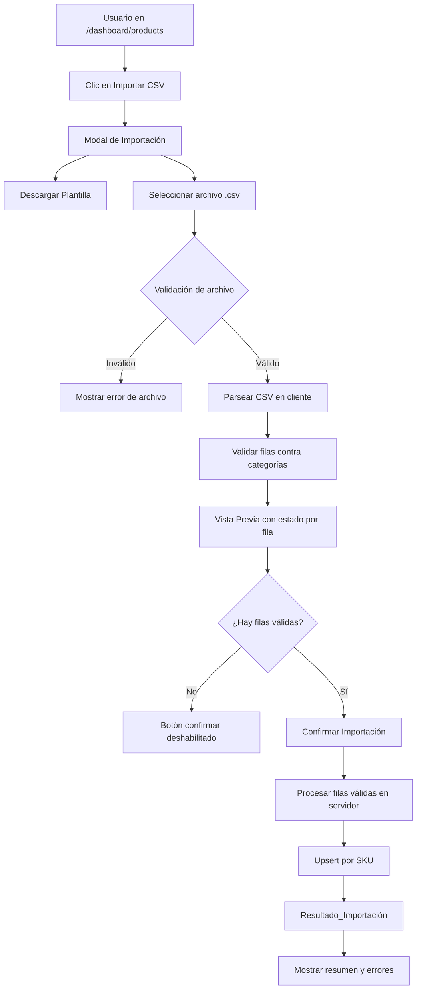

# Design Document: Importación Masiva de Productos por CSV

## Overview

Este diseño implementa la funcionalidad de importación masiva de productos mediante archivos CSV en el ERP SaaS. El flujo es: el usuario descarga una plantilla, prepara su CSV, lo sube, revisa la vista previa con validaciones fila por fila, y confirma la importación. El sistema ejecuta un upsert por SKU (crea si no existe, actualiza si existe) y reporta resultados detallados.

La implementación reutiliza las server actions existentes (`createProduct`, `updateProduct`, `getCategories`) y los tipos TypeScript de `lib/types/erp.ts`, sin modificar la base de datos ni el esquema existente.

## Architecture

### Flujo General



### Componentes Nuevos

```
components/dashboard/
  csv-import-modal.tsx          # Modal principal de importación
  csv-preview-table.tsx         # Tabla de vista previa con estado por fila

lib/actions/
  csv-import.ts                 # Server action para ejecutar el upsert masivo

lib/utils/
  csv-parser.ts                 # Utilidades de parseo y validación de CSV

app/dashboard/products/
  page.tsx                      # Agregar botón "Importar CSV" (modificación)
```

### Integración con Sistema Existente

El Importador NO crea nuevas tablas ni modifica el esquema. Reutiliza:
- `lib/actions/products.ts` → `createProduct`, `updateProduct`, `getProducts`
- `lib/actions/categories.ts` → `getCategories`
- `lib/types/erp.ts` → `ProductFormData`, `Category`, `Product`
- `lib/utils/export.ts` → patrón de referencia para generación de CSV en cliente

## Components and Interfaces

### Tipos TypeScript nuevos

```typescript
// lib/utils/csv-parser.ts

export interface CsvRow {
  rowNumber: number;           // Número de fila en el CSV (1-based, sin contar encabezado)
  rawData: Record<string, string>; // Datos crudos del CSV
}

export type ImportRowStatus = 'valid_create' | 'valid_update' | 'error';

export interface ParsedImportRow {
  rowNumber: number;
  status: ImportRowStatus;
  errors: string[];            // Lista de errores de validación
  productData?: ProductFormData; // Solo presente si status !== 'error'
  existingSku?: string;        // SKU existente si status === 'valid_update'
}

export interface CsvParseResult {
  rows: ParsedImportRow[];
  totalRows: number;
  validRows: number;
  errorRows: number;
}

export interface ImportResult {
  totalProcessed: number;
  created: number;
  updated: number;
  errors: Array<{ rowNumber: number; sku?: string; error: string }>;
}
```

### csv-parser.ts — Lógica de Parseo y Validación

```typescript
// Columnas esperadas del CSV
export const CSV_COLUMNS = [
  'nombre', 'descripcion', 'precio', 'precio_costo',
  'stock', 'sku', 'categoria', 'unidad', 'activo'
] as const;

// Límites
export const CSV_MAX_ROWS = 500;
export const CSV_MAX_SIZE_BYTES = 5 * 1024 * 1024; // 5 MB

/**
 * Parsea el texto de un CSV y retorna filas crudas.
 * Usa la primera fila como encabezados.
 */
export function parseCsvText(text: string): CsvRow[]

/**
 * Valida una fila cruda y la convierte a ParsedImportRow.
 * Requiere la lista de categorías para resolver nombres a IDs.
 * Requiere la lista de SKUs existentes para determinar create vs update.
 */
export function validateRow(
  row: CsvRow,
  categories: Category[],
  existingSkus: Set<string>
): ParsedImportRow

/**
 * Procesa todas las filas y retorna el resultado completo del parseo.
 */
export function parseAndValidateCsv(
  text: string,
  categories: Category[],
  existingSkus: Set<string>
): CsvParseResult

/**
 * Genera el contenido CSV de la plantilla de ejemplo.
 */
export function generateTemplateCsv(): string
```

### csv-import.ts — Server Action

```typescript
// lib/actions/csv-import.ts
"use server";

/**
 * Ejecuta el upsert masivo de productos.
 * Recibe las filas ya validadas en el cliente.
 * Procesa cada fila individualmente para aislar errores.
 */
export async function importProductsFromCsv(
  rows: Array<{
    productData: ProductFormData;
    existingProductId?: string; // Si existe, hace update; si no, hace create
  }>
): Promise<ImportResult>
```

### csv-import-modal.tsx — Componente Principal

Estados del modal:
1. `idle` — Pantalla inicial con instrucciones y botón de plantilla
2. `parsing` — Procesando el archivo seleccionado
3. `preview` — Mostrando Vista_Previa con tabla de filas
4. `importing` — Ejecutando la importación en servidor
5. `done` — Mostrando Resultado_Importación

```typescript
interface CsvImportModalProps {
  open: boolean;
  onOpenChange: (open: boolean) => void;
  onImportComplete: () => void; // Callback para refrescar lista de productos
}
```

### csv-preview-table.tsx — Tabla de Vista Previa

```typescript
interface CsvPreviewTableProps {
  rows: ParsedImportRow[];
  maxPreviewRows?: number; // Default: 100 (paginación para CSVs grandes)
}
```

Columnas de la tabla:
- Fila # (número de fila en el CSV)
- Estado (badge: "Crear" verde / "Actualizar" azul / "Error" rojo)
- Nombre
- SKU
- Precio
- Stock
- Categoría
- Error (descripción del error si aplica)

## Data Models

### Mapeo de Columnas CSV a ProductFormData

| Columna CSV    | Campo ProductFormData | Transformación                                      |
|----------------|-----------------------|-----------------------------------------------------|
| `nombre`       | `name`                | Trim, requerido                                     |
| `descripcion`  | `description`         | Trim, opcional                                      |
| `precio`       | `price`               | parseFloat, requerido > 0                           |
| `precio_costo` | `cost`                | parseFloat, opcional >= 0, default 0                |
| `stock`        | `stock_quantity`      | parseInt, opcional >= 0, default 0                  |
| `sku`          | `sku`                 | Trim, opcional                                      |
| `categoria`    | `category_id`         | Buscar por nombre en lista de categorías → UUID     |
| `unidad`       | `description` (nota)  | Almacenar como parte de descripción o ignorar       |
| `activo`       | `is_active`           | true/1/si → true; false/0/no → false; default true  |

Campos con valores por defecto en importación:
- `type`: siempre `'product'`
- `currency`: moneda de la empresa (obtenida de company settings)
- `tax_rate`: `0`
- `track_inventory`: `true`
- `has_variants`: `false`
- `min_stock_level`: `0`

### Resolución de Categorías

Las categorías se cargan una sola vez antes de la validación. La resolución es case-insensitive por nombre:

```typescript
function resolveCategoryId(
  categoryName: string,
  categories: Category[]
): string | undefined {
  return categories.find(
    c => c.name.toLowerCase().trim() === categoryName.toLowerCase().trim()
  )?.id;
}
```

### Detección de SKU Existente

Antes de mostrar la Vista_Previa, el sistema carga todos los productos existentes de la empresa para construir un mapa `sku → productId`:

```typescript
const existingSkuMap = new Map<string, string>(); // sku → product.id
```

Esto permite determinar en el cliente si cada fila será un `create` o un `update`, y pasar el `productId` al server action para el update.

## Correctness Properties


*Una propiedad es una característica o comportamiento que debe ser verdadero en todas las ejecuciones válidas del sistema. Las propiedades sirven como puente entre las especificaciones legibles por humanos y las garantías de corrección verificables por máquina.*

### Property 1: Parseo preserva conteo de filas

*Para cualquier* texto CSV válido con N filas de datos (sin contar encabezado), `parseCsvText` debe retornar exactamente N objetos `CsvRow`.

**Validates: Requirements 2.2, 2.3**

---

### Property 2: Validación no se detiene ante errores individuales

*Para cualquier* conjunto de filas CSV donde algunas son inválidas, `parseAndValidateCsv` debe retornar exactamente `totalRows` filas validadas (la suma de `validRows + errorRows` debe igualar `totalRows`), sin importar cuántas filas tengan errores.

**Validates: Requirements 3.7, 4.4**

---

### Property 3: Validación de campos requeridos y numéricos

*Para cualquier* fila CSV donde `nombre` esté vacío/solo espacios, o `precio` no sea un número positivo, o `stock` sea negativo o no entero, la fila debe tener `status === 'error'` con al menos un error en el array `errors`.

**Validates: Requirements 3.1, 3.2, 3.3, 3.4**

---

### Property 4: Resolución de categorías es case-insensitive

*Para cualquier* nombre de categoría en una fila CSV, si existe una categoría en la lista con el mismo nombre (ignorando mayúsculas/minúsculas y espacios), la fila debe resolverse con el `category_id` correcto. Si no existe ninguna categoría con ese nombre, la fila debe tener `status === 'error'`.

**Validates: Requirements 3.5, 5.6**

---

### Property 5: Upsert por SKU — crear vs actualizar

*Para cualquier* fila válida con un SKU que no existe en `existingSkuMap`, el status debe ser `'valid_create'`. *Para cualquier* fila válida con un SKU que sí existe en `existingSkuMap`, el status debe ser `'valid_update'`. *Para cualquier* fila válida sin SKU, el status debe ser `'valid_create'`.

**Validates: Requirements 4.5, 5.2, 5.3, 5.4**

---

### Property 6: Solo filas válidas se envían al servidor

*Para cualquier* `CsvParseResult`, el número de filas enviadas a `importProductsFromCsv` debe ser igual a `validRows`, nunca mayor.

**Validates: Requirements 5.1**

---

### Property 7: Invariante del resultado de importación

*Para cualquier* `ImportResult`, debe cumplirse que `created + updated + errors.length === totalProcessed`.

**Validates: Requirements 6.1, 6.5**

---

### Property 8: Aislamiento de errores en importación

*Para cualquier* conjunto de filas enviadas al servidor donde algunas fallan por error de base de datos, `totalProcessed` debe igualar el número de filas enviadas (los errores se registran pero no detienen el procesamiento de las demás filas).

**Validates: Requirements 6.5**

---

### Property 9: Límites de archivo son correctamente aplicados

*Para cualquier* archivo con tamaño > 5MB o con más de 500 filas de datos, la validación debe retornar un error antes de intentar parsear el contenido.

**Validates: Requirements 2.5, 2.6**

---

### Property 10: Valores de activo son parseados correctamente

*Para cualquier* valor de `activo` en el conjunto `{true, false, 1, 0, si, no}` (en cualquier combinación de mayúsculas/minúsculas), el campo debe parsearse a un booleano sin error. *Para cualquier* valor fuera de ese conjunto, la fila debe tener `status === 'error'`.

**Validates: Requirements 3.6**

---

## Error Handling

### Errores de Archivo (cliente)
- Extensión no `.csv` → mensaje: "Solo se aceptan archivos CSV (.csv)"
- Tamaño > 5MB → mensaje: "El archivo no puede superar 5 MB"
- Más de 500 filas → mensaje: "El archivo no puede contener más de 500 productos"
- CSV malformado → mensaje: "El archivo no es un CSV válido"
- Sin datos (vacío o solo encabezados) → mensaje: "El archivo no contiene datos para importar"

### Errores de Validación por Fila (cliente)
- `nombre` vacío → "El nombre es requerido"
- `precio` inválido → "El precio debe ser un número mayor a 0"
- `stock` inválido → "El stock debe ser un número entero mayor o igual a 0"
- `precio_costo` inválido → "El precio de costo debe ser un número mayor o igual a 0"
- `categoria` no encontrada → "La categoría '{valor}' no existe en el sistema"
- `activo` inválido → "El campo activo debe ser: true, false, 1, 0, si, no"

### Errores de Importación (servidor)
- Error de base de datos en fila individual → se registra en `ImportResult.errors` con número de fila y mensaje, continúa con las demás filas
- Límite de plan alcanzado → se registra como error en las filas que no pudieron crearse
- Error de autenticación → retorna error global, no se procesa ninguna fila

## Testing Strategy

### Enfoque Dual: Unit Tests + Property-Based Tests

**Unit Tests** (vitest) — para casos específicos y edge cases:
- Plantilla CSV contiene todas las columnas requeridas
- Parseo de CSV con 0 filas de datos retorna error
- Fila con todos los campos válidos retorna `status !== 'error'`
- Fila sin SKU retorna `status === 'valid_create'`
- Botón confirmar deshabilitado cuando `validRows === 0`
- Botón confirmar habilitado cuando `validRows > 0`
- `ImportResult` con 0 errores muestra estado de éxito

**Property-Based Tests** (vitest + fast-check) — para propiedades universales:
- Cada propiedad del diseño debe implementarse como un test de propiedad separado
- Mínimo 100 iteraciones por test
- Los generadores deben cubrir edge cases: strings vacíos, números negativos, valores límite

**Configuración de Tags**:
```typescript
// Ejemplo de tag para property test
// Feature: importacion-masiva-productos, Property 2: Validación no se detiene ante errores individuales
it.prop([fc.array(fc.record({ ... }))])(
  'validación no se detiene ante errores individuales',
  (rows) => { ... }
)
```

**Generadores fast-check sugeridos**:
```typescript
// Fila CSV válida
const validRowArb = fc.record({
  nombre: fc.string({ minLength: 1 }),
  precio: fc.float({ min: 0.01, max: 999999 }),
  stock: fc.integer({ min: 0, max: 99999 }),
  sku: fc.option(fc.string()),
  // ...
});

// Fila CSV inválida (nombre vacío)
const emptyNameRowArb = fc.record({
  nombre: fc.constant(''),
  precio: fc.float({ min: 0.01 }),
  // ...
});
```

**Archivos de test**:
- `__tests__/lib/utils/csv-parser.property.test.ts` — propiedades del parser
- `__tests__/lib/utils/csv-parser.unit.test.ts` — unit tests del parser
- `__tests__/lib/actions/csv-import.property.test.ts` — propiedades del server action
