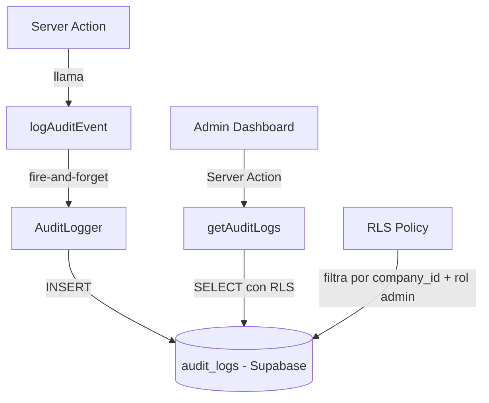

# Documento de Diseño: Log de Auditoría Centralizado

## Visión General

El sistema de log de auditoría centralizado provee trazabilidad completa de todas las operaciones del ERP. Se implementa como una capa transversal que intercepta las acciones existentes en `lib/actions/` y persiste registros inmutables en Supabase. Solo los administradores pueden consultar el log desde `/dashboard/audit-log`.

El diseño prioriza:
- **Resiliencia**: el fallo del log nunca interrumpe la operación principal
- **Mínima fricción**: integración con fire-and-forget en las acciones existentes
- **Seguridad**: RLS en Supabase garantiza aislamiento por empresa

---

## Arquitectura



El `AuditLogger` es una función utilitaria en `lib/actions/audit-log.ts`. Las acciones existentes la invocan con `void logAuditEvent(...)` para no bloquear el flujo principal.

---

## Componentes e Interfaces

### `lib/actions/audit-log.ts`

Módulo central con dos responsabilidades: escribir y leer el log.

```typescript
// Módulos del ERP
type AuditModule =
  | 'ventas' | 'devoluciones' | 'stock' | 'compras'
  | 'pagos' | 'reparaciones' | 'caja' | 'productos'
  | 'presupuestos' | 'clientes' | 'proveedores'

// Acciones posibles
type AuditAction =
  | 'crear' | 'modificar' | 'cancelar' | 'eliminar'
  | 'recibir' | 'abrir' | 'cerrar' | 'movimiento'
  | 'cambio_precio' | 'pagar' | 'procesar'

interface AuditEventInput {
  module: AuditModule
  action: AuditAction
  entityType: string       // e.g. 'sale', 'product', 'cash_closure'
  entityId: string
  metadata?: Record<string, unknown>  // snapshot antes/después, valores relevantes
}

// Escribe un evento — nunca lanza excepciones
async function logAuditEvent(input: AuditEventInput): Promise<void>

// Consulta el log (solo admin)
async function getAuditLogs(filters: AuditLogFilters): Promise<AuditLogEntry[]>

interface AuditLogFilters {
  module?: AuditModule
  action?: AuditAction
  userId?: string
  dateFrom?: string
  dateTo?: string
  page?: number           // default: 1
  pageSize?: number       // default: 50, max: 50
}

interface AuditLogEntry {
  id: string
  company_id: string
  user_id: string
  user_name?: string      // join con profiles
  module: AuditModule
  action: AuditAction
  entity_type: string
  entity_id: string
  metadata: Record<string, unknown> | null
  created_at: string
}
```

### Integración en acciones existentes

Patrón de integración en cada Server Action:

```typescript
// Ejemplo en lib/actions/sales.ts
export async function createSale(data: SaleFormData) {
  // ... lógica existente ...
  const { data: sale } = await supabase.from('sales').insert(...).select().single()

  // Fire-and-forget: no bloquea, no lanza error si falla
  void logAuditEvent({
    module: 'ventas',
    action: 'crear',
    entityType: 'sale',
    entityId: sale.id,
    metadata: { total: sale.total, customer_id: sale.customer_id }
  })

  return sale
}
```

### `app/dashboard/audit-log/page.tsx`

Página Server Component protegida por rol admin. Renderiza el componente cliente con los datos iniciales.

### `components/dashboard/audit-log-table.tsx`

Componente cliente con:
- Tabla paginada de entradas del log
- Filtros: módulo, acción, usuario, rango de fechas
- Panel de detalle (sheet/modal) con el `metadata` completo al hacer clic en una fila

---

## Modelo de Datos

### Tabla `audit_logs`

```sql
CREATE TABLE audit_logs (
  id          UUID PRIMARY KEY DEFAULT gen_random_uuid(),
  company_id  UUID NOT NULL REFERENCES companies(id) ON DELETE CASCADE,
  user_id     UUID NOT NULL REFERENCES auth.users(id),
  module      TEXT NOT NULL,
  action      TEXT NOT NULL,
  entity_type TEXT NOT NULL,
  entity_id   TEXT NOT NULL,
  metadata    JSONB,
  created_at  TIMESTAMPTZ NOT NULL DEFAULT NOW()
);

-- Índices para consultas frecuentes
CREATE INDEX idx_audit_logs_company_created ON audit_logs(company_id, created_at DESC);
CREATE INDEX idx_audit_logs_module ON audit_logs(company_id, module);
CREATE INDEX idx_audit_logs_user ON audit_logs(company_id, user_id);

-- RLS
ALTER TABLE audit_logs ENABLE ROW LEVEL SECURITY;

-- Solo admins pueden leer su propio company_id
CREATE POLICY "audit_logs_admin_read" ON audit_logs
  FOR SELECT
  USING (
    company_id = (
      SELECT company_id FROM profiles WHERE id = auth.uid()
    )
    AND (
      SELECT role FROM profiles WHERE id = auth.uid()
    ) = 'admin'
  );

-- Inserción permitida para cualquier usuario autenticado de la empresa
-- (el logger corre en server actions con el contexto del usuario)
CREATE POLICY "audit_logs_insert" ON audit_logs
  FOR INSERT
  WITH CHECK (
    company_id = (
      SELECT company_id FROM profiles WHERE id = auth.uid()
    )
  );

-- Sin UPDATE ni DELETE para garantizar inmutabilidad
```

### Campos de `metadata` por módulo (ejemplos)

| Módulo | Acción | Metadata relevante |
|--------|--------|--------------------|
| ventas | crear | `{ total, customer_id, items_count }` |
| ventas | cancelar | `{ reason, previous_status }` |
| productos | cambio_precio | `{ previous_price, new_price, product_name }` |
| caja | abrir | `{ initial_amount, shift }` |
| caja | cerrar | `{ total_sales, total_cash }` |
| stock | movimiento | `{ quantity, type, product_id }` |
| pagos | pagar | `{ amount, method, entity_type }` |

---

## Propiedades de Corrección

*Una propiedad es una característica o comportamiento que debe mantenerse verdadero en todas las ejecuciones válidas del sistema — esencialmente, una declaración formal sobre lo que el sistema debe hacer. Las propiedades sirven como puente entre especificaciones legibles por humanos y garantías de corrección verificables automáticamente.*

### Propiedades de Testing Basado en Propiedades

**Propiedad 1: Inmutabilidad del log**
*Para todo* evento de auditoría insertado, el registro no debe poder ser modificado ni eliminado por ningún usuario (incluyendo admin). La política RLS no debe incluir UPDATE ni DELETE.
**Valida: Requerimiento 2.5**

**Propiedad 2: Aislamiento por empresa**
*Para todo* par de empresas distintas (company_A, company_B), un admin de company_A no debe poder ver ninguna entrada de audit_logs con `company_id = company_B`.
**Valida: Requerimiento 3.2, 3.3**

**Propiedad 3: Resiliencia del logger**
*Para toda* operación principal del ERP, si `logAuditEvent` lanza una excepción internamente, la operación principal debe completarse exitosamente y retornar su resultado sin propagar el error.
**Valida: Requerimiento 5.1, 5.2**

**Propiedad 4: Completitud de campos obligatorios**
*Para todo* evento registrado en `audit_logs`, los campos `company_id`, `user_id`, `module`, `action`, `entity_type`, `entity_id` y `created_at` deben ser no nulos.
**Valida: Requerimiento 2.1, 2.2, 2.3**

**Propiedad 5: Filtrado correcto por módulo**
*Para toda* consulta con filtro `module = X`, todos los resultados retornados deben tener `module = X`. No debe aparecer ninguna entrada de otro módulo.
**Valida: Requerimiento 4.1**

**Propiedad 6: Orden descendente por fecha**
*Para toda* consulta sin ordenamiento explícito, el `created_at` de cada entrada debe ser mayor o igual al `created_at` de la entrada siguiente en la lista.
**Valida: Requerimiento 4.2**

**Propiedad 7: Paginación correcta**
*Para toda* consulta paginada con `pageSize = N`, la cantidad de resultados retornados debe ser menor o igual a N.
**Valida: Requerimiento 4.3**

---

## Manejo de Errores

- `logAuditEvent` captura todas las excepciones internamente con `try/catch`. En caso de error, hace `console.error` con el detalle y retorna sin lanzar.
- `getAuditLogs` lanza error si el usuario no es admin (error de autorización explícito).
- Si Supabase retorna error en el INSERT del log, se registra en consola pero no se propaga.
- Filtros con valores inválidos (módulo inexistente) retornan array vacío sin error.

---

## Estrategia de Testing

### Tests unitarios
- Verificar que `logAuditEvent` no lanza cuando Supabase falla (mock del cliente)
- Verificar que `getAuditLogs` lanza error de autorización para usuarios no-admin
- Verificar que los filtros de fecha se aplican correctamente en la query

### Tests basados en propiedades (property-based testing)
Usar **fast-check** (ya disponible en el stack TypeScript/Next.js).

Cada propiedad del diseño se implementa como un test con mínimo 100 iteraciones:

- **Propiedad 3** (resiliencia): generar inputs aleatorios de `AuditEventInput`, mockear Supabase para que falle, verificar que la función retorna sin lanzar.
- **Propiedad 4** (campos obligatorios): generar eventos aleatorios válidos, insertar en DB de test, verificar que todos los campos requeridos están presentes.
- **Propiedad 5** (filtrado por módulo): generar listas de entradas con módulos aleatorios, aplicar filtro, verificar que todos los resultados coinciden.
- **Propiedad 6** (orden descendente): generar listas de entradas con fechas aleatorias, verificar que el orden es correcto.
- **Propiedad 7** (paginación): generar N entradas, consultar con pageSize aleatorio ≤ 50, verificar que el resultado tiene ≤ pageSize entradas.

Tag format: `Feature: log-auditoria, Property {N}: {descripción}`

### Tests de integración
- Verificar RLS: usuario admin solo ve su empresa
- Verificar RLS: usuario no-admin no puede leer audit_logs
- Verificar que INSERT funciona desde server action con contexto de usuario autenticado
