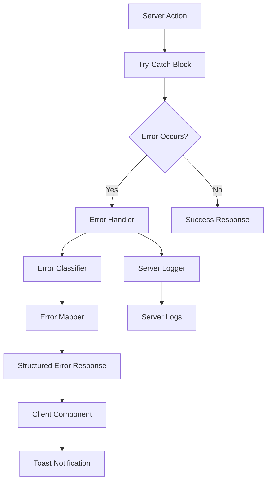
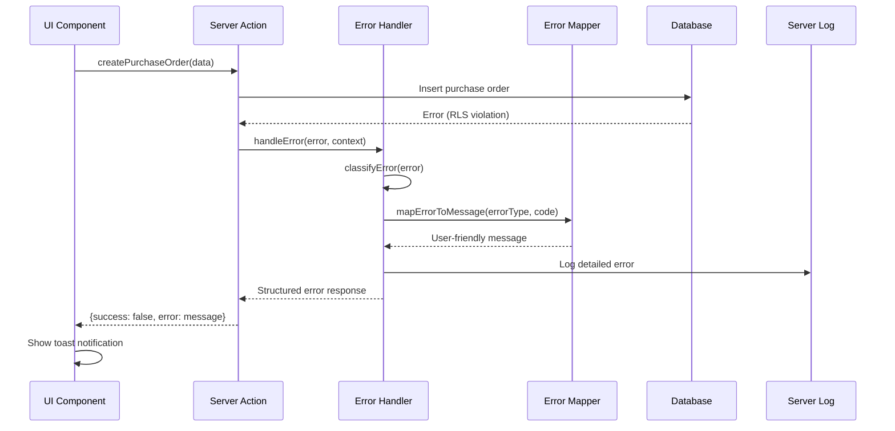

# Design Document: Mejora de Manejo de Errores en Órdenes de Compra

## Overview

Este diseño implementa un sistema robusto de manejo de errores para las server actions de Next.js, específicamente enfocado en la creación de órdenes de compra, pero diseñado para ser reutilizable en toda la aplicación.

El sistema consta de tres componentes principales:
1. **Error Handler Utility** - Función central que procesa y clasifica errores
2. **Error Mapper** - Mapea códigos de error técnicos a mensajes amigables en español
3. **Structured Response Pattern** - Formato consistente para respuestas de server actions

El flujo de manejo de errores es:
```
Error occurs → Error Handler classifies → Error Mapper translates → 
Server logs details → Client receives structured response → UI shows toast
```

## Architecture

### Component Diagram



### Error Flow Sequence



## Components and Interfaces

### 1. Error Handler Utility (`lib/utils/error-handler.ts`)

**Purpose:** Central utility for processing, classifying, and formatting errors.

**Interface:**
```typescript
interface ErrorContext {
  operation: string;        // e.g., "createPurchaseOrder"
  userId?: string;
  companyId?: string;
  entityId?: string;
  additionalInfo?: Record<string, any>;
}

interface StructuredErrorResponse {
  success: false;
  error: string;           // User-friendly message
  errorType: ErrorType;
  errorDetails?: {
    code?: string;
    hint?: string;
  };
}

type ErrorType = 
  | 'RLS_ERROR'
  | 'CONSTRAINT_ERROR'
  | 'VALIDATION_ERROR'
  | 'PLAN_LIMIT_ERROR'
  | 'UNKNOWN_ERROR';

function handleServerError(
  error: unknown,
  context: ErrorContext
): StructuredErrorResponse;
```

**Implementation Details:**
- Accepts any error type (unknown)
- Extracts error information from Supabase PostgrestError structure
- Classifies error based on PostgreSQL error codes
- Logs complete error details to console.error
- Returns structured response for client

**Error Code Classification:**
- `42501` → RLS_ERROR (insufficient privilege)
- `23505` → CONSTRAINT_ERROR (unique violation)
- `23503` → CONSTRAINT_ERROR (foreign key violation)
- `23502` → CONSTRAINT_ERROR (not null violation)
- Custom validation errors → VALIDATION_ERROR
- Plan limit errors → PLAN_LIMIT_ERROR
- All others → UNKNOWN_ERROR

### 2. Error Mapper (`lib/utils/error-mapper.ts`)

**Purpose:** Maps error types and codes to user-friendly Spanish messages.

**Interface:**
```typescript
interface ErrorMapping {
  errorType: ErrorType;
  code?: string;
  message: string;
}

function getErrorMessage(
  errorType: ErrorType,
  errorCode?: string
): string;
```

**Error Message Mappings:**

| Error Type | Code | Spanish Message |
|------------|------|-----------------|
| RLS_ERROR | 42501 | No tienes permisos para crear órdenes de compra. Contacta al administrador de tu empresa. |
| CONSTRAINT_ERROR | 23505 | Ya existe una orden de compra con este número. El sistema generará un nuevo número automáticamente. |
| CONSTRAINT_ERROR | 23503 | El proveedor o producto seleccionado no existe. Por favor, verifica los datos. |
| CONSTRAINT_ERROR | 23502 | Faltan campos obligatorios. Por favor, completa todos los campos requeridos. |
| PLAN_LIMIT_ERROR | - | Has alcanzado el límite de órdenes de compra de tu plan. Actualiza tu suscripción para continuar. |
| VALIDATION_ERROR | - | Los datos ingresados no son válidos. Por favor, verifica la información. |
| UNKNOWN_ERROR | - | Error al crear la orden de compra. Por favor, intenta nuevamente. |

### 3. Server Action Pattern (`lib/actions/purchase-orders.ts`)

**Current Implementation:**
```typescript
export async function createPurchaseOrder(data: PurchaseOrderInput) {
  try {
    // ... implementation
    return { success: true, data: result };
  } catch (error) {
    console.error('Error creating purchase order:', error);
    return { 
      success: false, 
      error: 'Error al crear la orden de compra' 
    };
  }
}
```

**New Implementation Pattern:**
```typescript
export async function createPurchaseOrder(data: PurchaseOrderInput) {
  try {
    // Get user and company context
    const supabase = createClient();
    const { data: { user } } = await supabase.auth.getUser();
    const { data: profile } = await supabase
      .from('profiles')
      .select('company_id')
      .eq('id', user?.id)
      .single();
    
    // ... implementation
    
    return { success: true, data: result };
  } catch (error) {
    return handleServerError(error, {
      operation: 'createPurchaseOrder',
      userId: user?.id,
      companyId: profile?.company_id,
      additionalInfo: { supplierIds: data.items.map(i => i.supplier_id) }
    });
  }
}
```

### 4. Client-Side Error Handling

**Current Pattern:**
```typescript
const result = await createPurchaseOrder(formData);
if (!result.success) {
  toast.error(result.error);
  return;
}
```

**Enhanced Pattern (no changes needed):**
```typescript
const result = await createPurchaseOrder(formData);
if (!result.success) {
  toast.error(result.error); // Now shows specific, actionable message
  return;
}
```

The client-side code remains unchanged because the structured response format is maintained. The improvement is transparent to the UI layer.

## Data Models

### Supabase Error Structure

```typescript
interface PostgrestError {
  message: string;      // Human-readable error message
  details: string;      // Additional error details
  hint: string;         // Suggestion for fixing the error
  code: string;         // PostgreSQL error code (e.g., "23505", "42501")
}
```

### Error Context Model

```typescript
interface ErrorContext {
  operation: string;        // Name of the operation that failed
  userId?: string;          // ID of the user who triggered the operation
  companyId?: string;       // ID of the company context
  entityId?: string;        // ID of the entity being operated on
  additionalInfo?: Record<string, any>; // Any other relevant context
}
```

### Structured Response Model

```typescript
// Success response
interface SuccessResponse<T> {
  success: true;
  data: T;
}

// Error response
interface ErrorResponse {
  success: false;
  error: string;           // User-friendly message in Spanish
  errorType: ErrorType;    // Classification for programmatic handling
  errorDetails?: {         // Optional technical details
    code?: string;         // PostgreSQL error code
    hint?: string;         // Database hint
  };
}

// Union type for all server action responses
type ServerActionResponse<T> = SuccessResponse<T> | ErrorResponse;
```

## Correctness Properties

*A property is a characteristic or behavior that should hold true across all valid executions of a system—essentially, a formal statement about what the system should do. Properties serve as the bridge between human-readable specifications and machine-verifiable correctness guarantees.*


### Property 1: Error Code Classification

*For any* database error with a PostgreSQL error code, the Error_Handler should correctly classify it into the appropriate error type (RLS_ERROR for 42501, CONSTRAINT_ERROR for 23505/23503/23502, etc.).

**Validates: Requirements 1.1, 1.2, 1.3, 1.4, 1.5**

### Property 2: Original Error Preservation

*For any* error object passed to the Error_Handler, all original error properties (message, stack, code, details, hint) should be preserved and included in the server log output.

**Validates: Requirements 1.6**

### Property 3: Spanish Language Messages

*For any* error type processed by the Error_Mapper, the returned message should be in Spanish (contain Spanish words/phrases and not contain English error terms like "error", "failed", "invalid").

**Validates: Requirements 2.7**

### Property 4: Structured Error Response Format

*For any* error handled by handleServerError, the returned response should have the structure: `{success: false, error: string, errorType: ErrorType, errorDetails?: object}`.

**Validates: Requirements 3.1, 3.2, 3.3, 3.4, 6.3**

### Property 5: Conditional Error Details Inclusion

*For any* error that contains PostgreSQL-specific information (code, hint, details), the structured response should include the errorDetails field; for errors without such information, errorDetails should be undefined or omitted.

**Validates: Requirements 3.5**

### Property 6: Consistent Response Structure

*For any* server action response (success or error), it should contain a 'success' boolean field that can be used as a discriminator.

**Validates: Requirements 3.6**

### Property 7: Error Logging Occurs

*For any* error processed by handleServerError, console.error should be called at least once with error information.

**Validates: Requirements 4.1**

### Property 8: Complete Log Information

*For any* error processed with context, the server log should include: error type classification, original error message, stack trace (if available), PostgreSQL error code (if available), and all provided context fields (operation, userId, companyId, etc.).

**Validates: Requirements 4.2, 4.3, 4.4, 4.5, 7.4, 8.1, 8.2, 8.3**

### Property 9: No Sensitive Data in Client Response

*For any* error containing sensitive information in its original form (stack traces, internal IDs, database details), the client response should not include this sensitive information in the error or errorDetails fields.

**Validates: Requirements 4.7, 8.4**

### Property 10: Toast Notification Triggered

*For any* server action that returns an error response in a UI component, the toast notification function should be called.

**Validates: Requirements 5.1**

### Property 11: Toast Shows User Message

*For any* error response displayed in the UI, the toast notification should be called with the exact user message from the response.error field.

**Validates: Requirements 5.2**

### Property 12: UI Shows Only User Message

*For any* error displayed via toast, the toast should be called with only the user-friendly message string, not the complete error object or technical details.

**Validates: Requirements 5.6**

### Property 13: Handles Multiple Error Types

*For any* error type (JavaScript Error, Supabase PostgrestError, string, plain object, undefined), the Error_Handler should process it without throwing and return a valid structured response.

**Validates: Requirements 6.2, 6.6, 7.5**

### Property 14: Supabase Error Field Extraction

*For any* Supabase PostgrestError object, the Error_Handler should correctly extract all available fields: code from error.code, message from error.message, details from error.details, and hint from error.hint.

**Validates: Requirements 7.1, 7.2, 7.3**

## Error Handling

### Error Handler Error Handling

The error handler itself must be resilient to malformed inputs:

1. **Null/Undefined Errors**: If error is null or undefined, classify as UNKNOWN_ERROR
2. **String Errors**: If error is a string, wrap in Error object
3. **Missing Properties**: Safely access error properties with optional chaining
4. **Circular References**: Use safe JSON stringification for logging
5. **Non-Error Objects**: Accept and process plain objects as errors

### Fallback Messages

If error mapping fails, use default fallback:
- Spanish: "Error al procesar la solicitud. Por favor, intenta nuevamente."
- English (for logs): "An unexpected error occurred"

### Logging Failures

If console.error fails (unlikely but possible in some environments):
- Fail silently to prevent cascading errors
- Still return structured response to client

## Testing Strategy

This feature requires both unit tests and property-based tests to ensure comprehensive coverage.

### Unit Tests

Unit tests will verify specific error mappings and edge cases:

1. **Specific Error Message Mappings** (Examples from Requirements 2.1-2.6):
   - RLS error (42501) → Spanish permission message
   - Unique constraint (23505) → Spanish duplicate message
   - Foreign key violation (23503) → Spanish reference message
   - Not-null violation (23502) → Spanish required fields message
   - Plan limit error → Spanish plan limit message
   - Unknown error → Spanish generic message

2. **Edge Cases**:
   - Null error input
   - Undefined error input
   - String error input
   - Error without code property
   - Error without message property
   - Empty context object

3. **Integration Points**:
   - Server action integration with error handler
   - UI component integration with toast notifications
   - Console.error is called with correct format

### Property-Based Tests

Property tests will verify universal behaviors across all inputs. Each test should run a minimum of 100 iterations.

**Test Configuration:**
- Library: fast-check (for TypeScript/JavaScript)
- Iterations: 100 minimum per property
- Tag format: `Feature: mejora-errores-ordenes-compra, Property {N}: {description}`

**Properties to Test:**

1. **Property 1: Error Code Classification**
   - Generate: Random PostgreSQL error codes
   - Verify: Correct error type classification
   - Tag: `Feature: mejora-errores-ordenes-compra, Property 1: Error Code Classification`

2. **Property 2: Original Error Preservation**
   - Generate: Random error objects with various properties
   - Verify: All properties appear in logs
   - Tag: `Feature: mejora-errores-ordenes-compra, Property 2: Original Error Preservation`

3. **Property 3: Spanish Language Messages**
   - Generate: Random error types
   - Verify: Messages contain Spanish, not English error terms
   - Tag: `Feature: mejora-errores-ordenes-compra, Property 3: Spanish Language Messages`

4. **Property 4: Structured Error Response Format**
   - Generate: Random errors
   - Verify: Response has required structure
   - Tag: `Feature: mejora-errores-ordenes-compra, Property 4: Structured Error Response Format`

5. **Property 5: Conditional Error Details Inclusion**
   - Generate: Errors with and without PostgreSQL details
   - Verify: errorDetails present only when appropriate
   - Tag: `Feature: mejora-errores-ordenes-compra, Property 5: Conditional Error Details Inclusion`

6. **Property 6: Consistent Response Structure**
   - Generate: Random success and error scenarios
   - Verify: All responses have 'success' discriminator
   - Tag: `Feature: mejora-errores-ordenes-compra, Property 6: Consistent Response Structure`

7. **Property 7: Error Logging Occurs**
   - Generate: Random errors
   - Verify: console.error called
   - Tag: `Feature: mejora-errores-ordenes-compra, Property 7: Error Logging Occurs`

8. **Property 8: Complete Log Information**
   - Generate: Random errors with context
   - Verify: Logs contain all expected fields
   - Tag: `Feature: mejora-errores-ordenes-compra, Property 8: Complete Log Information`

9. **Property 9: No Sensitive Data in Client Response**
   - Generate: Errors with sensitive data (stack traces, internal IDs)
   - Verify: Client response excludes sensitive data
   - Tag: `Feature: mejora-errores-ordenes-compra, Property 9: No Sensitive Data in Client Response`

10. **Property 13: Handles Multiple Error Types**
    - Generate: Various error types (Error, object, string, null, undefined)
    - Verify: Handler processes all without throwing
    - Tag: `Feature: mejora-errores-ordenes-compra, Property 13: Handles Multiple Error Types`

11. **Property 14: Supabase Error Field Extraction**
    - Generate: PostgrestError objects with various field combinations
    - Verify: All fields correctly extracted
    - Tag: `Feature: mejora-errores-ordenes-compra, Property 14: Supabase Error Field Extraction`

**UI Properties** (Properties 10-12) will be tested with integration tests using React Testing Library and mock server actions.

### Testing Approach

1. **Unit tests first**: Verify specific mappings and edge cases
2. **Property tests**: Verify universal behaviors across random inputs
3. **Integration tests**: Verify end-to-end flow from server action to UI
4. **Manual testing**: Verify actual database errors produce correct messages

### Test File Organization

```
__tests__/
  lib/
    utils/
      error-handler.unit.test.ts       # Unit tests for error handler
      error-handler.property.test.ts   # Property-based tests
      error-mapper.unit.test.ts        # Unit tests for error mapper
  lib/
    actions/
      purchase-orders.integration.test.ts  # Integration tests
  components/
    dashboard/
      purchase-order-form.ui.test.tsx  # UI integration tests
```
