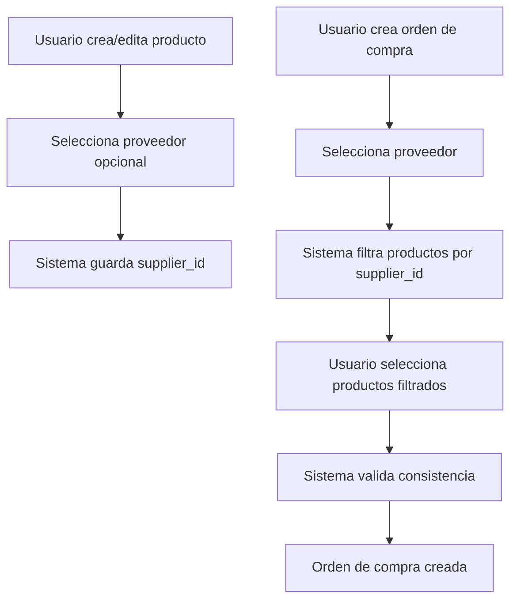

# Design Document: Relación Producto-Proveedor en Órdenes de Compra

## Overview

Esta funcionalidad implementa la relación entre productos y proveedores en el sistema ERP, permitiendo asociar productos con proveedores específicos y filtrar automáticamente los productos disponibles al crear órdenes de compra.

La base de datos ya cuenta con el campo `supplier_id` en la tabla `products`, por lo que el diseño se enfoca en:
1. Agregar el selector de proveedor en el formulario de productos
2. Mostrar el proveedor en el listado de productos
3. Implementar el filtrado dinámico de productos por proveedor en órdenes de compra
4. Validar la consistencia de la relación producto-proveedor

## Architecture

### Componentes Afectados

1. **Formulario de Productos** (`app/dashboard/products/new/page.tsx`)
   - Agregar selector de proveedor (opcional)
   - Mantener compatibilidad con productos sin proveedor

2. **Listado de Productos** (`app/dashboard/products/page.tsx`)
   - Agregar columna de proveedor
   - Mostrar indicador para productos sin proveedor

3. **Formulario de Órdenes de Compra** (`app/dashboard/purchase-orders/new/page.tsx`)
   - Implementar filtrado dinámico de productos según proveedor seleccionado
   - Validar consistencia al agregar productos

4. **Acciones de Productos** (`lib/actions/products.ts`)
   - Actualizar funciones CRUD para manejar `supplier_id`

5. **Acciones de Órdenes de Compra** (`lib/actions/purchase-orders.ts`)
   - Agregar función para obtener productos filtrados por proveedor
   - Agregar validación de consistencia producto-proveedor

### Flujo de Datos



## Components and Interfaces

### 1. Selector de Proveedor en Formulario de Productos

**Ubicación**: `app/dashboard/products/new/page.tsx` y `app/dashboard/products/[id]/page.tsx`

**Cambios**:
- Agregar campo `supplier_id` al estado del formulario
- Agregar componente `Select` para seleccionar proveedor
- Cargar lista de proveedores activos mediante `getSuppliers()`
- Incluir opción "Sin proveedor" (valor null)

**Interfaz del componente**:
```typescript
// Estado del formulario (agregar campo)
const [formData, setFormData] = useState({
  // ... campos existentes
  supplier_id: "", // Nuevo campo
});

// Cargar proveedores
const [suppliers, setSuppliers] = useState<Supplier[]>([]);

useEffect(() => {
  loadSuppliers();
}, []);

const loadSuppliers = async () => {
  const data = await getSuppliers();
  // Filtrar solo proveedores activos
  setSuppliers(data.filter(s => s.status === 'active'));
};
```

### 2. Columna de Proveedor en Listado de Productos

**Ubicación**: `app/dashboard/products/page.tsx`

**Cambios**:
- Agregar columna "Proveedor" en la tabla
- Mostrar nombre del proveedor o "Sin proveedor"
- Incluir información del proveedor en la consulta (JOIN)

**Renderizado**:
```typescript
<TableCell>
  {product.supplier?.name || (
    <span className="text-muted-foreground italic">
      Sin proveedor
    </span>
  )}
</TableCell>
```

### 3. Filtrado de Productos en Órdenes de Compra

**Ubicación**: `app/dashboard/purchase-orders/new/page.tsx`

**Lógica de filtrado**:
- Cuando `supplier_id` está seleccionado: mostrar solo productos con ese `supplier_id`
- Cuando `supplier_id` es null: mostrar todos los productos
- Excluir productos sin proveedor cuando hay proveedor seleccionado

**Implementación**:
```typescript
// Estado para productos filtrados
const [availableProducts, setAvailableProducts] = useState<Product[]>([]);

// Efecto que filtra productos cuando cambia el proveedor
useEffect(() => {
  if (formData.supplier_id) {
    // Filtrar productos del proveedor seleccionado
    const filtered = allProducts.filter(
      p => p.supplier_id === formData.supplier_id
    );
    setAvailableProducts(filtered);
  } else {
    // Mostrar todos los productos
    setAvailableProducts(allProducts);
  }
}, [formData.supplier_id, allProducts]);
```

### 4. Validación de Consistencia

**Ubicación**: `lib/actions/purchase-orders.ts`

**Función de validación**:
```typescript
function validateProductSupplierConsistency(
  supplierId: string,
  productId: string,
  products: Product[]
): { valid: boolean; error?: string } {
  const product = products.find(p => p.id === productId);
  
  if (!product) {
    return { valid: false, error: "Producto no encontrado" };
  }
  
  if (product.supplier_id !== supplierId) {
    return {
      valid: false,
      error: `El producto "${product.name}" no pertenece al proveedor seleccionado`
    };
  }
  
  return { valid: true };
}
```

## Data Models

### Product (Actualizado)

```typescript
export interface Product {
  id: string;
  company_id: string;
  category_id: string | null;
  supplier_id: string | null; // ← Campo existente que ahora se utilizará
  sku: string | null;
  name: string;
  description: string | null;
  type: 'product' | 'service';
  price: number;
  cost: number;
  currency: string;
  tax_rate: number;
  stock_quantity: number;
  min_stock_level: number;
  track_inventory: boolean;
  is_active: boolean;
  image_url: string | null;
  created_by: string | null;
  created_at: string;
  updated_at: string;
  category?: Category;
  supplier?: Supplier; // ← Relación que se incluirá en consultas
}
```

### ProductFormData (Actualizado)

```typescript
export interface ProductFormData {
  category_id?: string;
  supplier_id?: string; // ← Nuevo campo
  sku?: string;
  name: string;
  description?: string;
  type: 'product' | 'service';
  price: number;
  cost?: number;
  currency: string;
  tax_rate?: number;
  stock_quantity?: number;
  min_stock_level?: number;
  track_inventory: boolean;
  is_active: boolean;
  image_url?: string;
}
```

### Consultas de Base de Datos

**Obtener productos con información de proveedor**:
```sql
SELECT 
  p.*,
  s.id as "supplier.id",
  s.name as "supplier.name",
  s.status as "supplier.status"
FROM products p
LEFT JOIN suppliers s ON p.supplier_id = s.id
WHERE p.company_id = $1
ORDER BY p.name;
```

**Obtener productos filtrados por proveedor**:
```sql
SELECT p.*
FROM products p
WHERE p.company_id = $1
  AND p.supplier_id = $2
  AND p.is_active = true
ORDER BY p.name;
```

## Correctness Properties

*Una propiedad (property) es una característica o comportamiento que debe mantenerse verdadero en todas las ejecuciones válidas del sistema. Las propiedades sirven como puente entre las especificaciones legibles por humanos y las garantías de corrección verificables por máquina.*

### Property 1: Persistencia de relación producto-proveedor

*Para cualquier* producto con proveedor asignado, al guardarlo y luego recuperarlo de la base de datos, el proveedor asociado debe ser el mismo.

**Validates: Requirements 1.2, 1.4**

### Property 2: Visualización de proveedor en listado

*Para cualquier* producto con proveedor asignado en el listado, el nombre del proveedor debe aparecer en la columna correspondiente del renderizado.

**Validates: Requirements 2.1**

### Property 3: Filtrado de productos por proveedor

*Para cualquier* proveedor seleccionado en una orden de compra, todos los productos mostrados en el selector deben tener ese `supplier_id`.

**Validates: Requirements 3.1, 5.4**

### Property 4: Actualización dinámica del filtro

*Para cualquier* orden de compra, al cambiar el proveedor seleccionado, la lista de productos disponibles debe actualizarse para mostrar únicamente productos del nuevo proveedor.

**Validates: Requirements 3.2**

### Property 5: Validación de consistencia al agregar productos

*Para cualquier* intento de agregar un producto a una orden de compra, si el `supplier_id` del producto no coincide con el `supplier_id` de la orden, la operación debe ser rechazada.

**Validates: Requirements 4.1**

### Property 6: Validación al cambiar proveedor de orden

*Para cualquier* orden de compra existente con productos, al cambiar el proveedor, todos los productos deben ser validados contra el nuevo proveedor.

**Validates: Requirements 4.3**

### Property 7: Actualización de proveedor en producto

*Para cualquier* producto, al cambiar su proveedor asignado y persistir el cambio, la próxima consulta debe reflejar el nuevo proveedor.

**Validates: Requirements 6.2**

### Property 8: Integridad de datos históricos

*Para cualquier* producto que cambia de proveedor, las órdenes de compra existentes que contienen ese producto no deben verse afectadas (mantienen la referencia al producto pero no se actualizan retroactivamente).

**Validates: Requirements 6.4**

## Error Handling

### Errores de Validación

1. **Producto no pertenece al proveedor**
   - Mensaje: "El producto '[nombre]' no pertenece al proveedor seleccionado"
   - Acción: Rechazar la adición del producto
   - UI: Toast de error

2. **Proveedor sin productos**
   - Mensaje: "No hay productos disponibles para este proveedor"
   - Acción: Mostrar mensaje informativo en el selector
   - UI: Estado vacío con mensaje descriptivo

3. **Cambio de proveedor con productos incompatibles**
   - Mensaje: "Algunos productos no pertenecen al nuevo proveedor. ¿Desea continuar y removerlos?"
   - Acción: Solicitar confirmación del usuario
   - UI: Dialog de confirmación con lista de productos afectados

### Errores de Base de Datos

1. **Error al cargar proveedores**
   - Mensaje: "Error al cargar la lista de proveedores"
   - Acción: Mostrar selector deshabilitado
   - Fallback: Permitir continuar sin asignar proveedor

2. **Error al guardar relación**
   - Mensaje: "Error al guardar la relación con el proveedor"
   - Acción: Revertir cambios y mostrar error
   - Retry: Permitir reintentar la operación

## Testing Strategy

### Dual Testing Approach

La estrategia de testing combina dos enfoques complementarios:

1. **Unit Tests**: Verifican ejemplos específicos, casos edge y condiciones de error
2. **Property-Based Tests**: Verifican propiedades universales a través de múltiples inputs generados

Ambos tipos de tests son necesarios para cobertura completa. Los unit tests capturan bugs concretos y casos específicos, mientras que los property tests verifican corrección general.

### Property-Based Testing

**Librería**: `fast-check` (para TypeScript/JavaScript)

**Configuración**:
- Mínimo 100 iteraciones por test
- Cada test debe referenciar su propiedad del diseño
- Formato de tag: `Feature: producto-proveedor-ordenes, Property {N}: {descripción}`

**Tests de Propiedades**:

1. **Test de persistencia** (Property 1)
   - Generar: producto aleatorio con proveedor
   - Acción: guardar y recuperar
   - Verificar: supplier_id se mantiene

2. **Test de filtrado** (Property 3)
   - Generar: lista de productos con diferentes proveedores
   - Acción: filtrar por proveedor específico
   - Verificar: todos los resultados tienen el supplier_id correcto

3. **Test de validación** (Property 5)
   - Generar: orden con proveedor A, producto con proveedor B
   - Acción: intentar agregar producto
   - Verificar: operación rechazada con error

4. **Test de actualización** (Property 7)
   - Generar: producto con proveedor A
   - Acción: cambiar a proveedor B, guardar, recuperar
   - Verificar: supplier_id es B

5. **Test de integridad histórica** (Property 8)
   - Generar: orden con producto, cambiar proveedor del producto
   - Acción: recuperar orden original
   - Verificar: orden no modificada

### Unit Testing

**Tests de Ejemplos Específicos**:

1. **Selector de proveedor visible** (Requirement 1.1)
   - Renderizar formulario de producto
   - Verificar: componente Select de proveedor está presente

2. **Producto sin proveedor permitido** (Requirement 1.3)
   - Crear producto con supplier_id = null
   - Verificar: operación exitosa

3. **Indicador "Sin proveedor"** (Requirement 2.2)
   - Renderizar listado con producto sin proveedor
   - Verificar: texto "Sin proveedor" presente

4. **Todos los productos sin filtro** (Requirement 3.3)
   - Orden sin proveedor seleccionado
   - Verificar: todos los productos disponibles

5. **Mensaje de proveedor sin productos** (Requirement 3.4)
   - Seleccionar proveedor sin productos
   - Verificar: mensaje informativo mostrado

6. **Error al agregar producto incompatible** (Requirement 4.2)
   - Intentar agregar producto de proveedor diferente
   - Verificar: error mostrado, producto no agregado

7. **Advertencia al cambiar proveedor** (Requirement 4.4)
   - Cambiar proveedor con productos incompatibles
   - Verificar: dialog de confirmación mostrado

8. **Productos sin proveedor en listado** (Requirement 5.2)
   - Cargar listado completo
   - Verificar: productos con supplier_id null incluidos

9. **Todos los productos sin proveedor seleccionado** (Requirement 5.3)
   - Orden sin proveedor
   - Verificar: productos con y sin proveedor mostrados

10. **Campo proveedor editable** (Requirement 6.1)
    - Abrir formulario de edición
    - Verificar: selector de proveedor habilitado

11. **Remover proveedor** (Requirement 6.3)
    - Cambiar proveedor a "Sin proveedor"
    - Verificar: supplier_id = null en base de datos

### Integration Testing

1. **Flujo completo de creación de producto con proveedor**
   - Crear proveedor
   - Crear producto asociado
   - Verificar relación en base de datos

2. **Flujo completo de orden de compra**
   - Crear proveedor con productos
   - Crear orden de compra
   - Verificar filtrado y validación

3. **Flujo de actualización de proveedor**
   - Crear producto con proveedor A
   - Cambiar a proveedor B
   - Verificar actualización sin afectar órdenes existentes

### Test Coverage Goals

- **Funciones de negocio**: 90%+ cobertura
- **Componentes UI**: 80%+ cobertura
- **Validaciones**: 100% cobertura
- **Property tests**: Todas las propiedades implementadas

## Implementation Notes

### Consideraciones de Performance

1. **Carga de proveedores**: Cachear lista de proveedores activos en el cliente
2. **Filtrado de productos**: Realizar filtrado en el cliente para respuesta inmediata
3. **Consultas JOIN**: Usar índices en `supplier_id` (ya existe en schema)

### Compatibilidad con Datos Existentes

- Productos existentes sin `supplier_id` seguirán funcionando normalmente
- No se requiere migración de datos
- El campo es opcional por diseño

### Consideraciones de UX

1. **Selector de proveedor**: Colocar cerca del campo de categoría para agrupación lógica
2. **Indicador visual**: Usar texto en cursiva y color muted para "Sin proveedor"
3. **Filtrado dinámico**: Actualizar lista sin delay perceptible
4. **Mensajes de error**: Claros y accionables, indicando qué producto causa el problema

### Extensibilidad Futura

El diseño permite futuras extensiones:
- Múltiples proveedores por producto (relación many-to-many)
- Proveedor preferido vs proveedores alternativos
- Historial de cambios de proveedor
- Reportes de compras por proveedor
