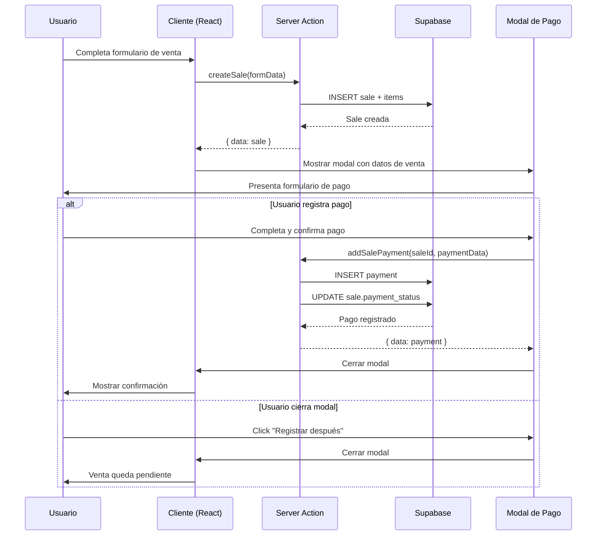

# Documento de Diseño

## Resumen

Este documento describe el diseño técnico para implementar un modal de registro rápido de pagos que aparece automáticamente después de crear una venta en la aplicación ERP SaaS. La solución permite a los usuarios registrar pagos inmediatamente sin navegar a la lista de ventas, manteniendo la funcionalidad existente como método alternativo.

## Arquitectura

### Visión General

La arquitectura sigue el patrón de Next.js 14 App Router con Server Actions para mutaciones de datos. El flujo principal es:

1. Usuario completa el formulario de nueva venta
2. Se ejecuta el server action `createSale`
3. Si la venta se crea exitosamente, se retorna el objeto `Sale` completo
4. El componente cliente detecta la creación exitosa y muestra el modal
5. Usuario puede registrar pago o cerrar el modal
6. Si registra pago, se ejecuta el server action `addSalePayment`
7. El estado de la venta se actualiza automáticamente

### Diagrama de Flujo



### Componentes Principales

1. **QuickPaymentModal**: Componente de diálogo que muestra el formulario de pago
2. **NewSalePage** (modificado): Página que integra el modal después de crear venta
3. **Server Actions** (existentes): `createSale` y `addSalePayment`
4. **PaymentManager** (referencia): Componente existente que se mantiene sin cambios

## Componentes e Interfaces

### 1. QuickPaymentModal Component

**Ubicación**: `components/dashboard/quick-payment-modal.tsx`

**Props**:
```typescript
interface QuickPaymentModalProps {
  sale: Sale;                    // Venta recién creada
  open: boolean;                 // Estado del modal
  onOpenChange: (open: boolean) => void;  // Callback para cambiar estado
  onPaymentSuccess: () => void;  // Callback después de pago exitoso
}
```

**Responsabilidades**:
- Mostrar información de la venta (número, cliente, monto total)
- Pre-llenar el formulario con el monto total de la venta
- Validar datos de entrada (monto, método de pago)
- Ejecutar el server action `addSalePayment`
- Manejar estados de carga y errores
- Cerrar automáticamente después de pago exitoso
- Proporcionar botón "Registrar después"

**Estado Interno**:
```typescript
interface PaymentFormState {
  amount: number;              // Monto del pago
  paymentMethod: string;       // Método seleccionado
  referenceNumber: string;     // Número de referencia opcional
  notes: string;               // Notas opcionales
}
```

**Validaciones**:
- Monto debe ser mayor a 0
- Monto no puede exceder el total de la venta (con advertencia, no bloqueo)
- Método de pago debe estar seleccionado
- Caracteres no numéricos en monto deben ser rechazados

### 2. NewSalePage (Modificado)

**Ubicación**: `app/dashboard/sales/new/page.tsx`

**Cambios Necesarios**:

1. **Agregar estado para el modal**:
```typescript
const [showPaymentModal, setShowPaymentModal] = useState(false);
const [createdSale, setCreatedSale] = useState<Sale | null>(null);
```

2. **Modificar handleSubmit**:
```typescript
const handleSubmit = async (e: React.FormEvent) => {
  e.preventDefault();
  
  if (formData.items.length === 0) {
    toast.error("Debes agregar al menos un item");
    return;
  }

  setLoading(true);

  try {
    const result = await createSale(formData);

    if (result.error) {
      toast.error(result.error);
    } else if (result.data) {
      toast.success("Venta creada exitosamente");
      
      // Mostrar modal de pago solo si la venta está completada
      if (result.data.status === 'completed') {
        setCreatedSale(result.data);
        setShowPaymentModal(true);
      } else {
        // Si es borrador, redirigir directamente
        router.push("/dashboard/sales");
        router.refresh();
      }
    }
  } catch (error) {
    toast.error("Error al crear la venta");
  } finally {
    setLoading(false);
  }
};
```

3. **Agregar callback de éxito de pago**:
```typescript
const handlePaymentSuccess = () => {
  setShowPaymentModal(false);
  router.push("/dashboard/sales");
  router.refresh();
};
```

4. **Agregar callback de cierre de modal**:
```typescript
const handleModalClose = (open: boolean) => {
  setShowPaymentModal(open);
  if (!open && createdSale) {
    // Usuario cerró sin pagar, redirigir a lista
    router.push("/dashboard/sales");
    router.refresh();
  }
};
```

5. **Renderizar el modal**:
```typescript
{createdSale && (
  <QuickPaymentModal
    sale={createdSale}
    open={showPaymentModal}
    onOpenChange={handleModalClose}
    onPaymentSuccess={handlePaymentSuccess}
  />
)}
```

### 3. Server Actions (Sin Cambios)

Los server actions existentes ya soportan la funcionalidad necesaria:

**`createSale`** (`lib/actions/sales.ts`):
- Ya retorna el objeto `Sale` completo con `{ data: sale }`
- Ya calcula correctamente subtotales, impuestos y total
- Ya establece `payment_status: "pending"` por defecto
- Ya crea notificación de nueva venta

**`addSalePayment`** (`lib/actions/sales.ts`):
- Ya acepta todos los parámetros necesarios
- Ya actualiza el `payment_status` correctamente (pending/partial/paid)
- Ya valida que la venta pertenezca a la empresa del usuario
- Ya crea notificación de pago recibido
- Ya revalida las rutas necesarias

### 4. Tipos TypeScript (Sin Cambios)

Los tipos existentes en `lib/types/erp.ts` ya cubren todas las necesidades:
- `Sale`: Incluye todos los campos necesarios
- `SalePayment`: Define la estructura de pagos
- `Customer`: Para mostrar información del cliente

## Modelos de Datos

### Tablas de Base de Datos (Sin Cambios)

Las tablas existentes ya soportan la funcionalidad:

**`sales`**:
- `id`: UUID (PK)
- `company_id`: UUID (FK)
- `customer_id`: UUID (FK, nullable)
- `sale_number`: VARCHAR (generado automáticamente)
- `status`: ENUM ('draft', 'completed', 'cancelled')
- `payment_status`: ENUM ('pending', 'partial', 'paid', 'refunded')
- `total`: DECIMAL
- `created_at`, `updated_at`: TIMESTAMP

**`sale_payments`**:
- `id`: UUID (PK)
- `sale_id`: UUID (FK)
- `amount`: DECIMAL
- `payment_method`: VARCHAR
- `payment_date`: TIMESTAMP (default: NOW())
- `reference_number`: VARCHAR (nullable)
- `notes`: TEXT (nullable)
- `created_by`: UUID (FK)
- `created_at`: TIMESTAMP

### Lógica de Actualización de Estado

El estado de pago se calcula en el server action `addSalePayment`:

```typescript
// Obtener total pagado
const paidAmount = (sale.payments || []).reduce(
  (sum, p) => sum + Number(p.amount), 
  0
);
const newPaidAmount = paidAmount + amount;

// Determinar nuevo estado
let paymentStatus: 'pending' | 'partial' | 'paid' = 'pending';
if (newPaidAmount >= sale.total) {
  paymentStatus = 'paid';
} else if (newPaidAmount > 0) {
  paymentStatus = 'partial';
}

// Actualizar venta
await supabase
  .from("sales")
  .update({ payment_status: paymentStatus })
  .eq("id", saleId);
```

## Propiedades de Corrección

*Una propiedad es una característica o comportamiento que debe mantenerse verdadero en todas las ejecuciones válidas del sistema - esencialmente, una declaración formal sobre lo que el sistema debe hacer. Las propiedades sirven como puente entre las especificaciones legibles por humanos y las garantías de corrección verificables por máquina.*

### Propiedad 1: Modal Automático Después de Crear Venta

*Para cualquier* venta con estado "completed" que se crea exitosamente, el sistema debe mostrar automáticamente el modal de pago rápido.

**Valida: Requisitos 1.1**

### Propiedad 2: Pre-llenado Correcto de Información

*Para cualquier* venta mostrada en el modal de pago, todos los campos del formulario deben estar pre-llenados con la información correcta de la venta (monto total, nombre del cliente, número de venta, fecha).

**Valida: Requisitos 1.2, 2.1, 2.2, 2.3, 2.4**

### Propiedad 3: Persistencia de Pago en Base de Datos

*Para cualquier* pago confirmado por el usuario, el sistema debe crear un registro en la tabla `sale_payments` con todos los campos requeridos (monto, método de pago, fecha, sale_id, created_by).

**Valida: Requisitos 3.2, 12.1, 12.2, 12.3**

### Propiedad 4: Cálculo Correcto de Estado de Pago

*Para cualquier* venta después de registrar un pago, el estado de pago debe reflejar correctamente la relación entre el monto total pagado y el monto total de la venta:
- Si monto pagado = 0, entonces estado = "pending"
- Si 0 < monto pagado < total, entonces estado = "partial"  
- Si monto pagado >= total, entonces estado = "paid"

**Valida: Requisitos 3.3, 7.1, 7.2, 7.3, 7.4**

### Propiedad 5: Cierre Automático Después de Pago Exitoso

*Para cualquier* pago registrado exitosamente, el modal de pago debe cerrarse automáticamente.

**Valida: Requisitos 3.4**

### Propiedad 6: Almacenamiento de Método de Pago

*Para cualquier* pago registrado, el método de pago seleccionado por el usuario debe almacenarse correctamente en el campo `payment_method` del registro.

**Valida: Requisitos 4.4**

### Propiedad 7: Cerrar Modal Sin Crear Pagos

*Para cualquier* venta cuando el usuario cierra el modal sin confirmar un pago (usando "Registrar después" o cerrando el diálogo), no debe crearse ningún registro en la tabla `sale_payments`.

**Valida: Requisitos 5.2**

### Propiedad 8: Estado Pendiente Al Cerrar Modal

*Para cualquier* venta cuando el usuario cierra el modal sin registrar un pago, el estado de pago de la venta debe permanecer como "pending".

**Valida: Requisitos 1.4, 5.3**

### Propiedad 9: Equivalencia Entre Métodos de Registro

*Para cualquier* venta y cualquier pago válido, registrar el pago desde el modal de pago rápido debe producir exactamente el mismo resultado (mismo registro en base de datos, mismo estado de venta) que registrarlo desde la lista de ventas usando el PaymentManager.

**Valida: Requisitos 6.3**

### Propiedad 10: Aceptación de Pagos Parciales

*Para cualquier* venta y cualquier monto válido mayor a 0 y menor al total de la venta, el sistema debe aceptar y registrar el pago parcial correctamente.

**Valida: Requisitos 8.1**

### Propiedad 11: Suma Correcta de Múltiples Pagos

*Para cualquier* venta con múltiples pagos registrados, la suma de todos los montos de pago debe calcularse correctamente y usarse para determinar el estado de pago.

**Valida: Requisitos 8.4**

### Propiedad 12: Validación en Servidor

*Para cualquier* intento de registrar un pago, el server action debe validar los datos (monto > 0, método de pago presente, venta existe) antes de realizar cualquier mutación en la base de datos.

**Valida: Requisitos 11.2**

### Propiedad 13: Mensajes de Error Descriptivos

*Para cualquier* error que ocurra durante el registro de un pago (validación fallida, error de base de datos, permisos insuficientes), el sistema debe retornar un mensaje de error descriptivo al cliente.

**Valida: Requisitos 11.4**

### Propiedad 14: Orden Cronológico de Pagos

*Para cualquier* venta con múltiples pagos, cuando se consultan los pagos asociados, deben retornarse ordenados cronológicamente por fecha de creación (más antiguos primero).

**Valida: Requisitos 12.4**


## Manejo de Errores

### Errores de Validación

**En el Cliente (QuickPaymentModal)**:

1. **Monto inválido**:
   - Condición: `amount <= 0`
   - Acción: Mostrar toast de error, prevenir envío
   - Mensaje: "El monto debe ser mayor a 0"

2. **Método de pago no seleccionado**:
   - Condición: `paymentMethod === ""`
   - Acción: Deshabilitar botón de confirmación
   - Mensaje: Campo marcado como requerido visualmente

3. **Monto excede saldo** (advertencia, no error):
   - Condición: `amount > sale.total`
   - Acción: Mostrar advertencia pero permitir registro
   - Mensaje: "El monto excede el total de la venta"

**En el Servidor (addSalePayment)**:

1. **Usuario no autenticado**:
   - Condición: `!user`
   - Respuesta: `{ error: "No autenticado" }`
   - Código HTTP: 401 (implícito en Next.js)

2. **Venta no encontrada**:
   - Condición: `!sale`
   - Respuesta: `{ error: "Venta no encontrada" }`

3. **Error de base de datos**:
   - Condición: Error en INSERT o UPDATE
   - Respuesta: `{ error: "Error al registrar el pago" }`
   - Log: Registrar error completo en consola del servidor

### Manejo de Estados de Carga

**Durante creación de venta**:
```typescript
setLoading(true);
try {
  const result = await createSale(formData);
  // ... manejar resultado
} finally {
  setLoading(false);
}
```

**Durante registro de pago**:
```typescript
setLoading(true);
try {
  const result = await addSalePayment(...);
  // ... manejar resultado
} finally {
  setLoading(false);
}
```

**UI durante carga**:
- Botones deshabilitados
- Texto del botón cambia a "Registrando..."
- Cursor de espera opcional

### Recuperación de Errores

**Si falla la creación de venta**:
- Usuario permanece en el formulario
- Datos del formulario se mantienen
- Puede corregir y reintentar

**Si falla el registro de pago**:
- Modal permanece abierto
- Datos del formulario se mantienen
- Usuario puede corregir y reintentar
- Venta ya está creada, solo falta el pago

**Si el usuario cierra el navegador después de crear venta pero antes de pagar**:
- Venta queda en estado "pending"
- Usuario puede registrar pago posteriormente desde la lista de ventas
- No se pierde información

## Estrategia de Testing

### Enfoque Dual: Unit Tests + Property-Based Tests

La estrategia de testing combina dos enfoques complementarios:

1. **Unit Tests**: Para casos específicos, ejemplos concretos y casos borde
2. **Property-Based Tests**: Para propiedades universales que deben cumplirse con cualquier entrada válida

Ambos tipos de tests son necesarios para una cobertura completa. Los unit tests validan comportamientos específicos y casos conocidos, mientras que los property tests verifican que las propiedades se mantengan con entradas generadas aleatoriamente.

### Configuración de Property-Based Testing

**Librería**: `fast-check` (para TypeScript/JavaScript)

**Instalación**:
```bash
npm install --save-dev fast-check
```

**Configuración de tests**:
- Mínimo 100 iteraciones por property test
- Cada test debe referenciar su propiedad del documento de diseño
- Formato de tag: `Feature: registro-rapido-pagos, Property {N}: {descripción}`

### Tests del Componente QuickPaymentModal

**Unit Tests**:

1. **Renderizado inicial**:
   - Verifica que el modal muestra la información de la venta
   - Verifica que el monto está pre-llenado con el total
   - Verifica que existe el botón "Registrar después"
   - Verifica que existen todos los métodos de pago requeridos

2. **Validación de formulario**:
   - Monto cero debe mostrar error
   - Monto negativo debe mostrar error
   - Sin método de pago debe deshabilitar botón
   - Monto mayor al total debe mostrar advertencia

3. **Interacciones de usuario**:
   - Click en "Registrar después" cierra el modal
   - Envío exitoso cierra el modal
   - Envío fallido mantiene el modal abierto

**Property-Based Tests**:

1. **Property 2: Pre-llenado correcto**:
   ```typescript
   // Feature: registro-rapido-pagos, Property 2: Pre-llenado correcto de información
   fc.assert(
     fc.property(
       fc.record({
         id: fc.uuid(),
         total: fc.float({ min: 0.01, max: 1000000 }),
         customer: fc.record({ name: fc.string() }),
         sale_number: fc.string(),
       }),
       (sale) => {
         // Renderizar modal con venta generada
         // Verificar que campos contienen datos correctos
       }
     ),
     { numRuns: 100 }
   );
   ```

2. **Property 7: Cerrar sin crear pagos**:
   ```typescript
   // Feature: registro-rapido-pagos, Property 7: Cerrar modal sin crear pagos
   fc.assert(
     fc.property(
       generateRandomSale(),
       async (sale) => {
         // Abrir modal
         // Cerrar sin confirmar
         // Verificar que no se llamó addSalePayment
       }
     ),
     { numRuns: 100 }
   );
   ```

### Tests de Server Actions

**Unit Tests**:

1. **addSalePayment - casos específicos**:
   - Pago completo actualiza estado a "paid"
   - Pago parcial actualiza estado a "partial"
   - Usuario no autenticado retorna error
   - Venta no encontrada retorna error

2. **Validación de permisos**:
   - Usuario sin permisos no puede registrar pagos
   - Usuario de otra empresa no puede registrar pagos

**Property-Based Tests**:

1. **Property 3: Persistencia en base de datos**:
   ```typescript
   // Feature: registro-rapido-pagos, Property 3: Persistencia de pago en base de datos
   fc.assert(
     fc.asyncProperty(
       generateRandomPayment(),
       async (payment) => {
         const result = await addSalePayment(
           payment.saleId,
           payment.amount,
           payment.method
         );
         
         // Verificar que el pago existe en la base de datos
         const savedPayment = await getPayment(result.data.id);
         expect(savedPayment).toBeDefined();
         expect(savedPayment.amount).toBe(payment.amount);
         expect(savedPayment.payment_method).toBe(payment.method);
       }
     ),
     { numRuns: 100 }
   );
   ```

2. **Property 4: Cálculo correcto de estado**:
   ```typescript
   // Feature: registro-rapido-pagos, Property 4: Cálculo correcto de estado de pago
   fc.assert(
     fc.asyncProperty(
       fc.record({
         saleTotal: fc.float({ min: 100, max: 10000 }),
         paymentAmount: fc.float({ min: 0, max: 15000 }),
       }),
       async ({ saleTotal, paymentAmount }) => {
         // Crear venta con total específico
         const sale = await createTestSale({ total: saleTotal });
         
         // Registrar pago
         await addSalePayment(sale.id, paymentAmount, "efectivo");
         
         // Obtener venta actualizada
         const updatedSale = await getSale(sale.id);
         
         // Verificar estado correcto
         if (paymentAmount === 0) {
           expect(updatedSale.payment_status).toBe("pending");
         } else if (paymentAmount < saleTotal) {
           expect(updatedSale.payment_status).toBe("partial");
         } else {
           expect(updatedSale.payment_status).toBe("paid");
         }
       }
     ),
     { numRuns: 100 }
   );
   ```

3. **Property 11: Suma correcta de múltiples pagos**:
   ```typescript
   // Feature: registro-rapido-pagos, Property 11: Suma correcta de múltiples pagos
   fc.assert(
     fc.asyncProperty(
       fc.record({
         saleTotal: fc.float({ min: 1000, max: 10000 }),
         payments: fc.array(
           fc.float({ min: 10, max: 500 }),
           { minLength: 2, maxLength: 10 }
         ),
       }),
       async ({ saleTotal, payments }) => {
         // Crear venta
         const sale = await createTestSale({ total: saleTotal });
         
         // Registrar múltiples pagos
         for (const amount of payments) {
           await addSalePayment(sale.id, amount, "efectivo");
         }
         
         // Obtener venta actualizada
         const updatedSale = await getSale(sale.id);
         
         // Calcular suma esperada
         const expectedTotal = payments.reduce((sum, p) => sum + p, 0);
         
         // Verificar que el estado refleja la suma correcta
         if (expectedTotal >= saleTotal) {
           expect(updatedSale.payment_status).toBe("paid");
         } else if (expectedTotal > 0) {
           expect(updatedSale.payment_status).toBe("partial");
         }
       }
     ),
     { numRuns: 100 }
   );
   ```

4. **Property 14: Orden cronológico**:
   ```typescript
   // Feature: registro-rapido-pagos, Property 14: Orden cronológico de pagos
   fc.assert(
     fc.asyncProperty(
       fc.array(
         fc.record({
           amount: fc.float({ min: 10, max: 500 }),
           delay: fc.integer({ min: 0, max: 1000 }), // ms
         }),
         { minLength: 3, maxLength: 10 }
       ),
       async (payments) => {
         // Crear venta
         const sale = await createTestSale({ total: 10000 });
         
         // Registrar pagos con delays
         for (const payment of payments) {
           await addSalePayment(sale.id, payment.amount, "efectivo");
           await sleep(payment.delay);
         }
         
         // Obtener venta con pagos
         const updatedSale = await getSale(sale.id);
         
         // Verificar orden cronológico
         const dates = updatedSale.payments.map(p => new Date(p.created_at));
         for (let i = 1; i < dates.length; i++) {
           expect(dates[i].getTime()).toBeGreaterThanOrEqual(dates[i-1].getTime());
         }
       }
     ),
     { numRuns: 100 }
   );
   ```

### Tests de Integración

**Flujo completo**:

1. **Crear venta → Mostrar modal → Registrar pago → Verificar estado**:
   - Simula el flujo completo del usuario
   - Verifica que todos los componentes funcionan juntos
   - Valida que el estado se actualiza correctamente en la UI

2. **Crear venta → Cerrar modal → Registrar desde lista**:
   - Verifica que el método alternativo funciona
   - Valida la equivalencia entre ambos métodos (Property 9)

### Generadores para Property-Based Testing

**Generador de ventas**:
```typescript
const generateRandomSale = () => fc.record({
  id: fc.uuid(),
  company_id: fc.uuid(),
  customer_id: fc.option(fc.uuid(), { nil: null }),
  sale_number: fc.string({ minLength: 5, maxLength: 20 }),
  status: fc.constantFrom('draft', 'completed', 'cancelled'),
  sale_date: fc.date(),
  total: fc.float({ min: 0.01, max: 1000000, noNaN: true }),
  currency: fc.constant('ARS'),
  payment_status: fc.constantFrom('pending', 'partial', 'paid'),
  customer: fc.option(
    fc.record({ name: fc.string({ minLength: 1 }) }),
    { nil: null }
  ),
});
```

**Generador de pagos**:
```typescript
const generateRandomPayment = () => fc.record({
  saleId: fc.uuid(),
  amount: fc.float({ min: 0.01, max: 100000, noNaN: true }),
  method: fc.constantFrom(
    'efectivo',
    'transferencia',
    'tarjeta_debito',
    'tarjeta_credito',
    'cheque',
    'mercadopago'
  ),
  referenceNumber: fc.option(fc.string(), { nil: undefined }),
  notes: fc.option(fc.string(), { nil: undefined }),
});
```

### Cobertura de Testing

**Objetivo de cobertura**:
- Líneas: > 80%
- Ramas: > 75%
- Funciones: > 90%

**Áreas críticas que requieren 100% de cobertura**:
- Cálculo de estado de pago
- Validación de datos de pago
- Persistencia en base de datos
- Actualización de estado de venta

## Consideraciones de Diseño Responsivo

### Breakpoints

**Mobile** (< 640px):
- Modal ocupa 95% del ancho de pantalla
- Padding reducido
- Campos de formulario en una sola columna
- Botones apilados verticalmente

**Tablet** (640px - 1024px):
- Modal ocupa 80% del ancho de pantalla
- Padding estándar
- Algunos campos en dos columnas
- Botones en fila

**Desktop** (> 1024px):
- Modal con ancho máximo de 600px
- Padding amplio
- Campos optimizados para dos columnas
- Botones en fila con espaciado

### Atributos de Accesibilidad

**Input de monto**:
```typescript
<Input
  type="number"
  inputMode="decimal"
  step="0.01"
  min="0.01"
  aria-label="Monto del pago"
  aria-required="true"
/>
```

**Select de método de pago**:
```typescript
<Select
  aria-label="Método de pago"
  aria-required="true"
>
  {/* opciones */}
</Select>
```

**Botones**:
```typescript
<Button
  type="submit"
  disabled={loading}
  aria-busy={loading}
>
  {loading ? "Registrando..." : "Registrar Pago"}
</Button>
```

## Consideraciones de Rendimiento

### Optimizaciones

1. **Evitar re-renders innecesarios**:
   - Usar `React.memo` para QuickPaymentModal si es necesario
   - Memoizar callbacks con `useCallback`

2. **Validación eficiente**:
   - Validar en el cliente antes de enviar al servidor
   - Debounce en validaciones costosas (si las hay)

3. **Carga de datos**:
   - La venta ya está cargada (viene del resultado de createSale)
   - No se requieren queries adicionales para mostrar el modal

4. **Revalidación selectiva**:
   - Solo revalidar `/dashboard/sales` después de operaciones exitosas
   - Evitar revalidaciones innecesarias

### Métricas de Rendimiento

**Tiempo de respuesta esperado**:
- Mostrar modal: < 100ms (instantáneo)
- Registrar pago: < 500ms (depende de latencia de red)
- Actualizar UI: < 100ms

## Migración y Compatibilidad

### Cambios Requeridos

**Archivos nuevos**:
- `components/dashboard/quick-payment-modal.tsx`

**Archivos modificados**:
- `app/dashboard/sales/new/page.tsx`

**Archivos sin cambios**:
- `lib/actions/sales.ts` (ya tiene toda la funcionalidad necesaria)
- `components/dashboard/payment-manager.tsx` (se mantiene como está)
- `lib/types/erp.ts` (tipos existentes son suficientes)

### Compatibilidad con Funcionalidad Existente

**PaymentManager**:
- No requiere modificaciones
- Continúa funcionando exactamente igual
- Ambos métodos (modal y lista) usan el mismo server action

**Lista de ventas**:
- No requiere modificaciones
- Continúa mostrando todas las ventas
- Permite registrar pagos como siempre

**Flujo de trabajo existente**:
- Usuarios que prefieren el método antiguo pueden seguir usándolo
- No hay cambios breaking
- Es una mejora aditiva, no un reemplazo

## Decisiones de Diseño

### ¿Por qué mostrar el modal solo para ventas "completed"?

Las ventas en estado "draft" son borradores que el usuario aún está editando. No tiene sentido registrar pagos para borradores. Solo las ventas completadas requieren registro de pago inmediato.

### ¿Por qué permitir montos mayores al total?

En algunos casos de negocio, un cliente puede pagar de más (por ejemplo, para cubrir futuras compras o por error). El sistema muestra una advertencia pero permite el registro para dar flexibilidad al usuario.

### ¿Por qué no modificar los server actions existentes?

Los server actions actuales (`createSale` y `addSalePayment`) ya implementan toda la lógica necesaria correctamente. Modificarlos sería innecesario y podría introducir bugs. El principio de "no tocar código que funciona" aplica aquí.

### ¿Por qué usar el mismo server action para ambos métodos?

Usar el mismo server action garantiza consistencia. No importa desde dónde se registre el pago (modal o lista), el comportamiento es idéntico. Esto simplifica el mantenimiento y reduce la posibilidad de inconsistencias.

### ¿Por qué no hacer el modal obligatorio?

Forzar al usuario a registrar el pago inmediatamente sería una mala experiencia de usuario. Algunos usuarios pueden necesitar verificar información, consultar con el cliente, o simplemente preferir registrar el pago más tarde. El botón "Registrar después" respeta la autonomía del usuario.
