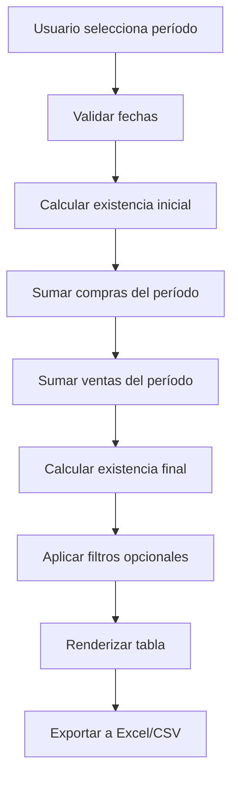

# Design Document: Reporte de Liquidación de Inventario

## Overview

El reporte de liquidación de inventario es un sistema de consulta y análisis que calcula el movimiento de productos durante un período específico. El diseño se basa en consultas SQL optimizadas sobre las tablas existentes (stock_movements, purchase_orders, sales, sale_items, products, product_variants) para generar un reporte preciso y auditable.

El sistema sigue una arquitectura de tres capas:
1. **Capa de presentación**: Componente React con filtros y tabla de resultados
2. **Capa de lógica**: Server actions que orquestan las consultas y cálculos
3. **Capa de datos**: Consultas SQL optimizadas con agregaciones

## Architecture

### Component Structure

```
app/dashboard/inventory-report/
  └── page.tsx                    # Página principal del reporte

components/dashboard/
  └── inventory-liquidation-report.tsx  # Componente principal
  └── inventory-report-filters.tsx      # Filtros de fecha, categoría, producto
  └── inventory-report-table.tsx        # Tabla de resultados

lib/actions/
  └── inventory-report.ts         # Server actions para cálculos
```

### Data Flow



## Components and Interfaces

### 1. InventoryLiquidationReport Component

Componente principal que orquesta el reporte.

**Props:**
```typescript
interface InventoryLiquidationReportProps {
  companyId: string;
}
```

**State:**
```typescript
interface ReportState {
  startDate: Date | null;
  endDate: Date | null;
  categoryFilter: string | null;
  productFilter: string | null;
  reportData: InventoryReportRow[];
  isLoading: boolean;
  error: string | null;
}
```

### 2. InventoryReportFilters Component

Componente de filtros para el reporte.

**Props:**
```typescript
interface InventoryReportFiltersProps {
  startDate: Date | null;
  endDate: Date | null;
  categoryFilter: string | null;
  productFilter: string | null;
  categories: Category[];
  products: Product[];
  onStartDateChange: (date: Date | null) => void;
  onEndDateChange: (date: Date | null) => void;
  onCategoryChange: (categoryId: string | null) => void;
  onProductChange: (productId: string | null) => void;
  onGenerateReport: () => void;
  onExport: () => void;
  isLoading: boolean;
}
```

### 3. InventoryReportTable Component

Tabla que muestra los resultados del reporte.

**Props:**
```typescript
interface InventoryReportTableProps {
  data: InventoryReportRow[];
  isLoading: boolean;
}
```

### 4. Server Actions

**generateInventoryReport:**
```typescript
async function generateInventoryReport(
  companyId: string,
  startDate: Date,
  endDate: Date,
  categoryId?: string,
  productId?: string
): Promise<InventoryReportRow[]>
```

**exportInventoryReport:**
```typescript
async function exportInventoryReport(
  data: InventoryReportRow[],
  startDate: Date,
  endDate: Date,
  companyName: string,
  format: 'excel' | 'csv' | 'pdf'
): Promise<Blob>
```

## Data Models

### InventoryReportRow

Representa una fila del reporte de liquidación.

```typescript
interface InventoryReportRow {
  productId: string;
  productName: string;
  variantId: string | null;
  variantName: string | null;
  categoryName: string;
  
  // Unidades
  initialStockUnits: number;
  purchasesUnits: number;
  salesUnits: number;
  finalStockUnits: number;
  
  // Valores monetarios
  initialStockValue: number;
  purchasesValue: number;
  salesValue: number;
  finalStockValue: number;
  
  // Metadatos
  averageCost: number;
}
```

### Calculation Logic

**Existencia Inicial:**
```sql
SELECT 
  product_id,
  variant_id,
  SUM(quantity_change) as initial_stock
FROM stock_movements
WHERE company_id = $1
  AND movement_date < $2  -- Antes de la fecha inicio
GROUP BY product_id, variant_id
```

**Compras del Período:**
```sql
SELECT 
  poi.product_id,
  poi.variant_id,
  SUM(poi.quantity) as purchases_units,
  SUM(poi.quantity * poi.unit_cost) as purchases_value
FROM purchase_order_items poi
JOIN purchase_orders po ON poi.purchase_order_id = po.id
WHERE po.company_id = $1
  AND po.status = 'received'
  AND po.received_date >= $2  -- Fecha inicio
  AND po.received_date <= $3  -- Fecha fin
GROUP BY poi.product_id, poi.variant_id
```

**Ventas del Período:**
```sql
SELECT 
  si.product_id,
  si.variant_id,
  SUM(si.quantity) as sales_units,
  SUM(si.quantity * si.unit_cost) as sales_value
FROM sale_items si
JOIN sales s ON si.sale_id = s.id
WHERE s.company_id = $1
  AND s.status IN ('completed', 'paid')
  AND s.sale_date >= $2  -- Fecha inicio
  AND s.sale_date <= $3  -- Fecha fin
GROUP BY si.product_id, si.variant_id
```

**Existencia Final:**
```
final_stock_units = initial_stock_units + purchases_units - sales_units
final_stock_value = initial_stock_value + purchases_value - sales_value
```

### Database Schema Reference

El reporte utiliza las siguientes tablas existentes:

- **stock_movements**: Historial completo de movimientos de inventario
- **purchase_orders**: Órdenes de compra
- **purchase_order_items**: Items de órdenes de compra
- **sales**: Ventas realizadas
- **sale_items**: Items de ventas
- **products**: Catálogo de productos
- **product_variants**: Variantes de productos
- **categories**: Categorías de productos


## Correctness Properties

*A property is a characteristic or behavior that should hold true across all valid executions of a system—essentially, a formal statement about what the system should do. Properties serve as the bridge between human-readable specifications and machine-verifiable correctness guarantees.*

### Property 1: Date Validation

*For any* pair of dates (start_date, end_date), if start_date > end_date, then the validation function should return false and prevent report generation.

**Validates: Requirements 1.2, 1.3**

### Property 2: Initial Stock Calculation

*For any* product and any start date, the initial stock should equal the sum of all stock movements with movement_date < start_date.

**Validates: Requirements 2.1**

### Property 3: Variant-Level Calculations

*For any* product with variants, all calculations (initial stock, purchases, sales, final stock) should be performed independently for each variant, never aggregated at the product level.

**Validates: Requirements 2.3, 3.3, 4.3, 5.3**

### Property 4: Data Completeness

*For any* row in the report, it should contain both unit quantities and monetary values for initial stock, purchases, sales, and final stock (8 numeric fields total).

**Validates: Requirements 2.4, 3.4, 4.4, 5.4**

### Property 5: Purchase Filtering

*For any* period, only purchase orders with status = 'received' and received_date within the period should be included in the purchases calculation.

**Validates: Requirements 3.2, 9.2**

### Property 6: Sales Filtering

*For any* period, only sales with status IN ('completed', 'paid') and sale_date within the period should be included in the sales calculation.

**Validates: Requirements 4.2, 9.3**

### Property 7: Final Stock Formula (Invariant)

*For any* product/variant in the report, the following invariant must hold:
```
final_stock_units = initial_stock_units + purchases_units - sales_units
final_stock_value = initial_stock_value + purchases_value - sales_value
```

**Validates: Requirements 5.1**

### Property 8: Current Period Consistency

*For any* report where end_date = today, the calculated final_stock_units for each product/variant should equal the current stock in the database.

**Validates: Requirements 5.2**

### Property 9: Product Inclusion Completeness

*For any* product that has at least one movement (purchase or sale) in the period OR has non-zero initial stock, it should appear in the report.

**Validates: Requirements 6.1, 6.2**

### Property 10: Variant Row Structure

*For any* product with N variants, the report should contain exactly N rows for that product (one per variant), never a single aggregated row.

**Validates: Requirements 6.3**

### Property 11: Alphabetical Sorting

*For any* generated report, the products should be sorted alphabetically by product name, and within each product, variants should be sorted alphabetically by variant name.

**Validates: Requirements 6.4**

### Property 12: Category Filter Correctness

*For any* category filter applied, all rows in the filtered report should belong to products in that category, and all products in that category with movements should be present.

**Validates: Requirements 7.1**

### Property 13: Product Filter Correctness

*For any* product filter applied, the filtered report should contain only rows for that specific product and its variants, and all variants of that product should be present.

**Validates: Requirements 7.2**

### Property 14: Filter Calculation Invariance

*For any* report with filters applied, the calculated values (initial stock, purchases, sales, final stock) for each row should be identical to the values in the unfiltered report for the same product/variant.

**Validates: Requirements 7.3**

### Property 15: Export Data Completeness

*For any* exported file (Excel, CSV, or PDF), it should contain all rows from the displayed report with all fields: product name, variant name, category, initial stock (units & value), purchases (units & value), sales (units & value), final stock (units & value).

**Validates: Requirements 8.2**

### Property 16: Export Metadata Presence

*For any* exported file (Excel, CSV, or PDF), it should include metadata: period start date, period end date, and generation timestamp.

**Validates: Requirements 8.3**

### Property 17: PDF Format Quality

*For any* PDF export, it should be professionally formatted with proper table structure, readable fonts, and company branding (logo if available).

**Validates: Requirements 8.4**

### Property 18: No Duplicate Movements

*For any* calculation (initial stock, purchases, sales), each stock movement, purchase order item, or sale item should be counted exactly once, never duplicated.

**Validates: Requirements 9.4**

## Error Handling

### Validation Errors

1. **Invalid Date Range**: If start_date > end_date, return error message "La fecha de inicio debe ser anterior o igual a la fecha de fin"
2. **Missing Dates**: If start_date or end_date is null, return error message "Debe seleccionar ambas fechas"
3. **Future Dates**: If end_date > today, show warning "El período incluye fechas futuras, los datos pueden ser incompletos"

### Data Errors

1. **No Data Found**: If no products have movements in the period, show message "No se encontraron movimientos en el período seleccionado"
2. **Calculation Mismatch**: If final_stock != current_stock for current period, log warning for audit
3. **Missing Product Data**: If a product referenced in movements doesn't exist, skip and log error

### Export Errors

1. **Export Failure**: If file generation fails, show error "Error al generar el archivo. Intente nuevamente"
2. **Large Dataset**: If report has > 10,000 rows, show warning "El reporte es muy grande, la exportación puede tardar varios minutos"
3. **PDF Generation Failure**: If PDF library fails, show error "Error al generar el PDF. Intente con Excel o CSV"

## Testing Strategy

### Unit Tests

Unit tests will focus on specific examples and edge cases:

1. **Date validation edge cases**:
   - Equal dates (start_date = end_date) should be valid
   - Null dates should be rejected
   - Future dates should show warning

2. **Empty data scenarios**:
   - Product with no movements should show zeros
   - Product with only initial stock (no movements in period)
   - Period with no data at all

3. **Variant handling examples**:
   - Product with 3 variants should generate 3 rows
   - Product without variants should generate 1 row
   - Mixed products (some with variants, some without)

4. **Filter combinations**:
   - Category filter alone
   - Product filter alone
   - Both filters together
   - Clear filters

5. **Export format validation**:
   - Excel file structure
   - CSV file structure
   - PDF file structure and formatting
   - Metadata headers in all formats

### Property-Based Tests

Property-based tests will verify universal properties across randomized inputs. Each test should run a minimum of 100 iterations.

1. **Property 1: Date Validation** (Requirements 1.2, 1.3)
   - Generate random date pairs
   - Verify validation logic

2. **Property 2: Initial Stock Calculation** (Requirements 2.1)
   - Generate random stock movements
   - Verify sum before start_date

3. **Property 3: Variant-Level Calculations** (Requirements 2.3, 3.3, 4.3, 5.3)
   - Generate products with random variants
   - Verify calculations are per-variant

4. **Property 4: Data Completeness** (Requirements 2.4, 3.4, 4.4, 5.4)
   - Generate random reports
   - Verify all 8 numeric fields present

5. **Property 5: Purchase Filtering** (Requirements 3.2, 9.2)
   - Generate purchase orders with random statuses
   - Verify only 'received' included

6. **Property 6: Sales Filtering** (Requirements 4.2, 9.3)
   - Generate sales with random statuses
   - Verify only 'completed'/'paid' included

7. **Property 7: Final Stock Formula** (Requirements 5.1)
   - Generate random initial stock, purchases, sales
   - Verify formula: final = initial + purchases - sales

8. **Property 8: Current Period Consistency** (Requirements 5.2)
   - Generate report for period ending today
   - Verify final stock matches current stock

9. **Property 9: Product Inclusion Completeness** (Requirements 6.1, 6.2)
   - Generate products with various movement patterns
   - Verify all with movements or initial stock appear

10. **Property 10: Variant Row Structure** (Requirements 6.3)
    - Generate products with N variants
    - Verify exactly N rows generated

11. **Property 11: Alphabetical Sorting** (Requirements 6.4)
    - Generate random product names
    - Verify sorted alphabetically

12. **Property 12: Category Filter Correctness** (Requirements 7.1)
    - Generate random categories and products
    - Verify filter includes only correct category

13. **Property 13: Product Filter Correctness** (Requirements 7.2)
    - Generate random products
    - Verify filter includes only selected product

14. **Property 14: Filter Calculation Invariance** (Requirements 7.3)
    - Generate report with and without filters
    - Verify calculations unchanged for same items

15. **Property 15: Export Data Completeness** (Requirements 8.2)
    - Generate random reports
    - Verify export contains all data in all formats

16. **Property 16: Export Metadata Presence** (Requirements 8.3)
    - Generate random exports
    - Verify metadata fields present in all formats

17. **Property 17: PDF Format Quality** (Requirements 8.4)
    - Generate PDF exports
    - Verify professional formatting and structure

18. **Property 18: No Duplicate Movements** (Requirements 9.4)
    - Generate movements with potential duplicates
    - Verify each counted exactly once

**Testing Library**: For TypeScript/JavaScript, we will use **fast-check** for property-based testing.

**Test Configuration**:
- Minimum 100 iterations per property test
- Each test tagged with: `Feature: reporte-liquidacion-inventario, Property N: [property text]`
- Tests organized in `__tests__/lib/actions/inventory-report.property.test.ts`

**Dual Testing Approach**:
- Unit tests validate specific examples and edge cases
- Property tests validate universal correctness across all inputs
- Together they provide comprehensive coverage
